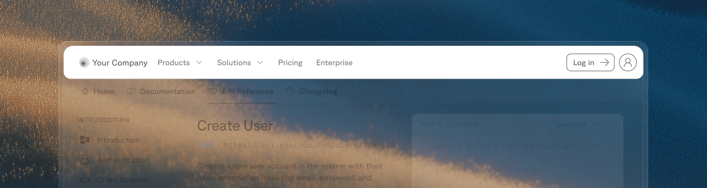

<Markdown src="/snippets/enterprise-plan.mdx"/>

Replace Fern's default header or footer with your own React components. Components are server-side rendered for better SEO and performance, with no layout shifts.

<Frame>

</Frame>

## Replace the header or footer

<Steps>
  ### Create your component

  Your component file must have a default export returning a React component. Tailwind CSS classes are available, including the `dark:` prefix for dark mode styles:

  ```tsx components/CustomHeader.tsx
  export default function CustomHeader() {
      return (
          <header className="w-full py-4 px-6 bg-white dark:bg-gray-900 border-b border-gray-200 dark:border-gray-800">
              <div className="max-w-7xl mx-auto flex items-center justify-between">
                  <span className="font-semibold text-lg">Plant Store</span>
                  <nav className="flex gap-4">
                      <a href="/products">Products</a>
                      <a href="/solutions">Solutions</a>
                      <a href="/enterprise">Enterprise</a>
                  </nav>
              </div>
          </header>
      );
  }
  ```

  ```tsx components/CustomFooter.tsx
  export default function CustomFooter() {
      return (
          <footer className="w-full py-8 px-6 bg-gray-100 dark:bg-gray-900">
              <div className="max-w-7xl mx-auto text-sm text-gray-500">
                  © 2026 Plant Store. All rights reserved.
              </div>
          </footer>
      );
  }
  ```

  ### Add the component paths to `docs.yml`

  ```yaml docs.yml
  header: ./components/CustomHeader.tsx
  footer: ./components/CustomFooter.tsx
  ```

  ### Specify your components directory in `docs.yml`

  Add your components directory to `docs.yml` so that the Fern CLI can scan your components directory and upload them to the server.

  ```yml docs.yml
  experimental:
    mdx-components:
      - ./components
  ```
</Steps>

## Enhance your components

Your custom components can use Fern's built-in UI primitives, React hooks, or both.

<AccordionGroup>
<Accordion title="Reuse built-in Fern components">

Instead of building every element from scratch, you can reuse Fern's built-in primitives like search, navigation, and theme switching. Custom header and footer components receive a `Fern` prop containing these built-in UI components:

```tsx components/CustomHeader.tsx
export default function CustomHeader({ Fern }) {
    return (
        <header className="w-full py-4 px-6 flex items-center justify-between">
            <Fern.Logo />
            <Fern.Search />
            <nav className="flex items-center gap-4">
                <Fern.NavbarLinks />
                <Fern.ThemeSwitch />
            </nav>
        </header>
    );
}
```

The following components are available on the `Fern` prop:

| Component | Description |
| --- | --- |
| `<Fern.Logo />` | Your site [logo](/learn/docs/configuration/site-level-settings#logo-configuration) as configured in `docs.yml`. Links to the homepage. You can target this component with `document.querySelector('#fern-header [data-fern-logo]')`. |
| `<Fern.Search />` | The [search](/learn/docs/customization/search) bar, including the AI search trigger if enabled. |
| `<Fern.ProductSwitcher />` | Dropdown to switch between [products](/learn/docs/configuration/products). |
| `<Fern.VersionSwitcher />` | Dropdown to switch between [versions](/learn/docs/configuration/versions). |
| `<Fern.LanguageSwitcher />` | Dropdown to switch the active [SDK language](/learn/docs/configuration/site-level-settings#default-language). |
| `<Fern.NavbarLinks />` | The [navigation links](/learn/docs/configuration/site-level-settings#navbar-links-configuration) configured under `navbar-links` in `docs.yml`. |
| `<Fern.LoginButton />` | The login/signup button for [authenticated docs](/learn/docs/authentication/overview). |
| `<Fern.ThemeSwitch />` | Toggle between [light and dark mode](/learn/docs/configuration/site-level-settings#theme-configuration). |
| `<Fern.HamburgerMenu />` | Fern's built-in mobile sidebar toggle button. Shows a hamburger/close icon and opens the dismissible sidebar. Only visible on mobile viewports. |
</Accordion>
<Accordion title="Use React hooks">

Whether you build from scratch or use built-in Fern components, your custom header and footer components support standard React hooks. For example, you can use `useState` to build a drop-down menu that opens on click:

```tsx components/CustomHeader.tsx
import { useState } from "react";

export default function CustomHeader() {
    const [isOpen, setIsOpen] = useState(false);

    return (
        <header className="w-full py-4 px-6 bg-white dark:bg-gray-900 border-b border-gray-200 dark:border-gray-800">
            <div className="max-w-7xl mx-auto flex items-center justify-between">
                <span className="font-semibold text-lg">Plant Store</span>
                <nav className="flex items-center gap-6">
                    <div className="relative">
                        <button
                            onClick={() => setIsOpen(!isOpen)}
                            className="flex items-center gap-1 hover:text-green-600 dark:hover:text-green-400"
                        >
                            Products
                            <svg
                                className={`w-4 h-4 transition-transform ${isOpen ? "rotate-180" : ""}`}
                                fill="none"
                                stroke="currentColor"
                                viewBox="0 0 24 24"
                            >
                                <path strokeLinecap="round" strokeLinejoin="round" strokeWidth={2} d="M19 9l-7 7-7-7" />
                            </svg>
                        </button>
                        {isOpen && (
                            <div className="absolute top-full left-0 mt-2 w-48 rounded-md shadow-lg bg-white dark:bg-gray-800 border border-gray-200 dark:border-gray-700">
                                <a href="/products/indoor" className="block px-4 py-2 hover:bg-gray-100 dark:hover:bg-gray-700">
                                    Indoor Plants
                                </a>
                                <a href="/products/outdoor" className="block px-4 py-2 hover:bg-gray-100 dark:hover:bg-gray-700">
                                    Outdoor Plants
                                </a>
                                <a href="/products/succulents" className="block px-4 py-2 hover:bg-gray-100 dark:hover:bg-gray-700">
                                    Succulents
                                </a>
                            </div>
                        )}
                    </div>
                    <a href="/solutions" className="hover:text-green-600 dark:hover:text-green-400">Solutions</a>
                    <a href="/enterprise" className="hover:text-green-600 dark:hover:text-green-400">Enterprise</a>
                </nav>
            </div>
        </header>
    );
}
```
</Accordion>
<Accordion title="Mobile sidebar toggle">

Use `<Fern.HamburgerMenu />` to render Fern's built-in mobile sidebar toggle button in your custom header. This opens the same dismissible sidebar that the default header uses, including any navigation links, version/product switchers, and search.

```tsx components/CustomHeader.tsx
export default function CustomHeader({ Fern }) {
    return (
        <header className="w-full py-4 px-6 bg-white dark:bg-gray-900 border-b border-gray-200 dark:border-gray-800">
            <div className="max-w-7xl mx-auto flex items-center justify-between">
                <Fern.Logo />

                {/* Desktop navigation */}
                <nav className="hidden lg:flex items-center gap-6">
                    <Fern.NavbarLinks />
                    <Fern.ThemeSwitch />
                </nav>

                {/* Mobile: Fern's built-in hamburger menu toggle */}
                <Fern.HamburgerMenu />
            </div>
        </header>
    );
}
```

The button automatically shows a hamburger icon when the sidebar is closed and a close icon when open. It's only visible on mobile viewports (`< 1024px`).

</Accordion>
<Accordion title="Custom mobile menu">

If you need a fully custom mobile navigation instead of Fern's built-in sidebar, you can disable the default mobile sidebar and build your own panel using React state and Tailwind classes.

The example below demonstrates how to:

1. Use a `useEffect` hook to inject a style that hides Fern's default mobile swipe panel
2. Render a hamburger button (visible only on mobile) that toggles a custom side panel

```tsx components/CustomHeader.tsx
import { useEffect, useState } from "react";

export default function CustomHeader({ Fern }) {
    const [menuOpen, setMenuOpen] = useState(false);

    // Hide Fern's default mobile swipe panel
    useEffect(() => {
        const style = document.createElement("style");
        style.textContent = `
            #fern-sidebar[data-viewport="mobile"],
            #fern-sidebar-overlay {
                display: none !important;
            }
        `;
        document.head.appendChild(style);
        return () => {
            style.remove();
        };
    }, []);

    return (
        <header className="relative w-full py-4 px-6 bg-white dark:bg-gray-900 border-b border-gray-200 dark:border-gray-800">
            <div className="max-w-7xl mx-auto flex items-center justify-between">
                <Fern.Logo />

                {/* Desktop navigation */}
                <nav className="hidden lg:flex items-center gap-6">
                    <Fern.NavbarLinks />
                    <Fern.ThemeSwitch />
                </nav>

                {/* Mobile menu button - visible only on small screens */}
                <button
                    className="lg:hidden p-2 rounded-md hover:bg-gray-100 dark:hover:bg-gray-800"
                    onClick={() => setMenuOpen(!menuOpen)}
                    aria-label="Toggle menu"
                >
                    <svg className="w-6 h-6" fill="none" stroke="currentColor" viewBox="0 0 24 24">
                        {menuOpen ? (
                            <path strokeLinecap="round" strokeLinejoin="round" strokeWidth={2} d="M6 18L18 6M6 6l12 12" />
                        ) : (
                            <path strokeLinecap="round" strokeLinejoin="round" strokeWidth={2} d="M4 6h16M4 12h16M4 18h16" />
                        )}
                    </svg>
                </button>
            </div>

            {/* Custom mobile side panel */}
            <div
                className={`
                    fixed top-[var(--header-height)] right-0 bottom-0 w-72
                    bg-white dark:bg-gray-900 border-l border-gray-200 dark:border-gray-800
                    transform transition-transform duration-300 ease-in-out z-50
                    ${menuOpen ? "translate-x-0" : "translate-x-full"}
                    lg:hidden
                `}
            >
                <nav className="flex flex-col p-6 gap-4">
                    <Fern.NavbarLinks />
                    <div className="border-t border-gray-200 dark:border-gray-700 pt-4">
                        <Fern.ThemeSwitch />
                    </div>
                </nav>
            </div>

            {/* Overlay when mobile menu is open */}
            {menuOpen && (
                <div
                    className="fixed inset-0 top-[var(--header-height)] bg-black/40 z-40 lg:hidden"
                    onClick={() => setMenuOpen(false)}
                />
            )}
        </header>
    );
}
```

<Note>
The `useEffect` hook injects a CSS rule targeting `#fern-sidebar[data-viewport="mobile"]` and `#fern-sidebar-overlay` to hide Fern's default mobile sidebar. This prevents the built-in swipe-to-open gesture from displaying Fern's sidebar, so your custom panel is the only mobile navigation.
</Note>
</Accordion>
</AccordionGroup>
