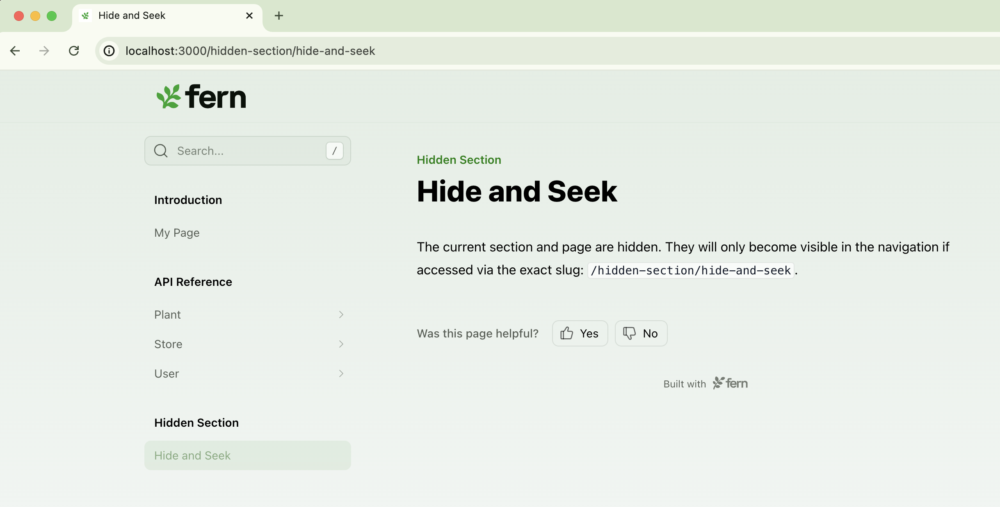

Fern gives you two main tools for controlling content visibility: `hidden: true` in `docs.yml` removes content from your site's sidebar and search results, while `noindex: true` in page frontmatter excludes a page from search without affecting navigation.

## Hiding a page

### Accessible only by direct URL

Set `hidden: true` in `docs.yml` to remove a page from the sidebar, search results, and [llms.txt](/learn/docs/ai-features/llms-txt) while keeping it accessible via direct link. This is useful for sharing draft documentation with reviewers or linking from external tools like support tickets. There's no need to also set `noindex` — `hidden: true` handles both automatically.

```yaml title="docs.yml" {4}
navigation:
  - section: Introduction
    contents:
      - page: My Page
        path: ./pages/my-page.mdx
      - page: Hide and Seek
        hidden: true
        path: ./pages/hide-and-seek.mdx
  - api: API Reference
```

<Card title="See it in action" icon="eye" href="/learn/docs/customization/hidden-page">
This page is hidden from the sidebar and search engines, but you can access it by direct link.
</Card>

### Excluded from search only

Set `noindex: true` in a page's frontmatter to exclude it from search engines and [llms.txt](/learn/docs/ai-features/llms-txt) while keeping it discoverable on your site. This is useful for early access documentation or content you want readers to find through navigation but not through search or AI tools.

```mdx title="early-access-feature.mdx" {3}
---
title: Early access feature
noindex: true
---
```

For more SEO-related options, see [SEO metadata](/learn/docs/seo/setting-seo-metadata).

## Hiding an API endpoint

Set `hidden: true` in the endpoint's layout configuration in `docs.yml` to hide it from the sidebar. Like page-level `hidden`, hidden endpoints are automatically excluded from search engine indexing so there's no need to set `noindex: true`.

```yaml title="docs.yml" {6}
navigation:
  - api: API Reference
    layout:
      - plants:
          - endpoint: POST /plants/{plantId}
            hidden: true
```

For full configuration details including examples for OpenAPI and WebSocket endpoints, see [Hiding endpoints](/learn/docs/api-references/customize-api-reference-layout#hiding-endpoints).

## Hiding a section, tab, tab variant, or version

Hide an entire [section](/learn/docs/configuration/navigation), [tab](/learn/docs/configuration/tabs), [tab variant](/learn/docs/configuration/tabs#tab-variants), or [version](/learn/docs/configuration/versions) from navigation — for example, a legacy API version, an internal tab, or a section of internal tooling docs.

Unlike hiding a page or endpoint, hiding a section, tab, tab variant, or version only removes the group from navigation. The individual pages within it remain indexed by search engines and AI because `hidden` applies to the grouping, not to each page. To also exclude individual pages from search results, add `noindex: true` to each page's frontmatter.

<Tabs>
<Tab title="Section">
```yaml title="docs.yml" {8}
navigation:
  - section: Introduction
    contents:
      - page: My Page
        path: ./pages/my-page.mdx
  - api: API Reference
  - section: Hidden Section
    hidden: true
    contents:
      - page: Hide and Seek
        path: ./pages/hide-and-seek.mdx
```

<Frame>

</Frame>
</Tab>
<Tab title="Tab">
```yaml title="docs.yml" {3}
navigation:
  - tab: api
    hidden: true
    layout:
      - section: API Reference
        contents:
          - page: Plant endpoints
            path: ./pages/plant-endpoints.mdx
  - tab: help
    layout:
      - section: Help center
        contents:
          - page: Contact us
            path: ./pages/contact-us.mdx
```
</Tab>
<Tab title="Tab variant">
```yaml title="docs.yml" {5}
navigation:
  - tab: help
    variants:
      - title: For developers
        hidden: true
        layout:
          - section: Getting started
            contents:
              - page: Quick start
                path: ./pages/dev-quickstart.mdx
      - title: For product managers
        layout:
          - section: Getting started
            contents:
              - page: Overview
                path: ./pages/pm-overview.mdx
```
</Tab>
<Tab title="Version">
```yaml title="docs.yml" {8}
versions:
  - display-name: v3
    path: ./versions/v3.yml
  - display-name: v2
    path: ./versions/v2.yml
  - display-name: v1 (Legacy)
    path: ./versions/v1.yml
    hidden: true
```

<Info>The default version (the first version in your `versions` list) can't be hidden.</Info>
</Tab>
</Tabs>

