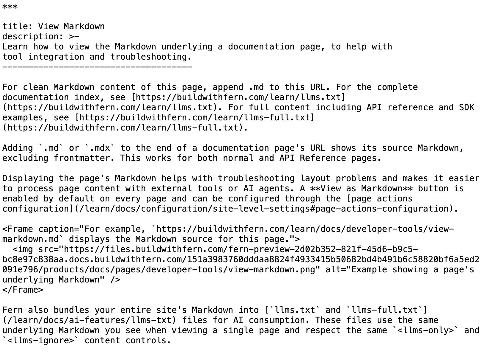

Adding `.md` or `.mdx` to the end of a documentation page's URL shows its source Markdown, excluding frontmatter. This works for both normal and API Reference pages.

Displaying the page's Markdown helps with troubleshooting layout problems and makes it easier to process page content with external tools or AI agents. A **View as Markdown** button is enabled by default on every page and can be configured through the [page actions configuration](/learn/docs/configuration/site-level-settings#page-actions-configuration).

<Frame caption="For example, `https://buildwithfern.com/learn/docs/developer-tools/view-markdown.md` displays the Markdown source for this page.">
  
</Frame>

Fern also bundles your entire site's Markdown into [`llms.txt` and `llms-full.txt`](/learn/docs/ai-features/llms-txt/overview) files for AI consumption. These files use the same underlying Markdown you see when viewing a single page and respect the same `<llms-only>` and `<llms-ignore>` content controls.

A [default per-page directive](/learn/docs/ai-features/llms-txt/per-page-directives) is automatically prepended to every page's Markdown output when served to AI agents, pointing them to your `.md` URLs, `llms.txt`, and `llms-full.txt`. You can [override or disable this directive](/learn/docs/configuration/site-level-settings#agents-configuration) in `docs.yml`. The directive is only visible to agents — human-facing documentation is unaffected.
