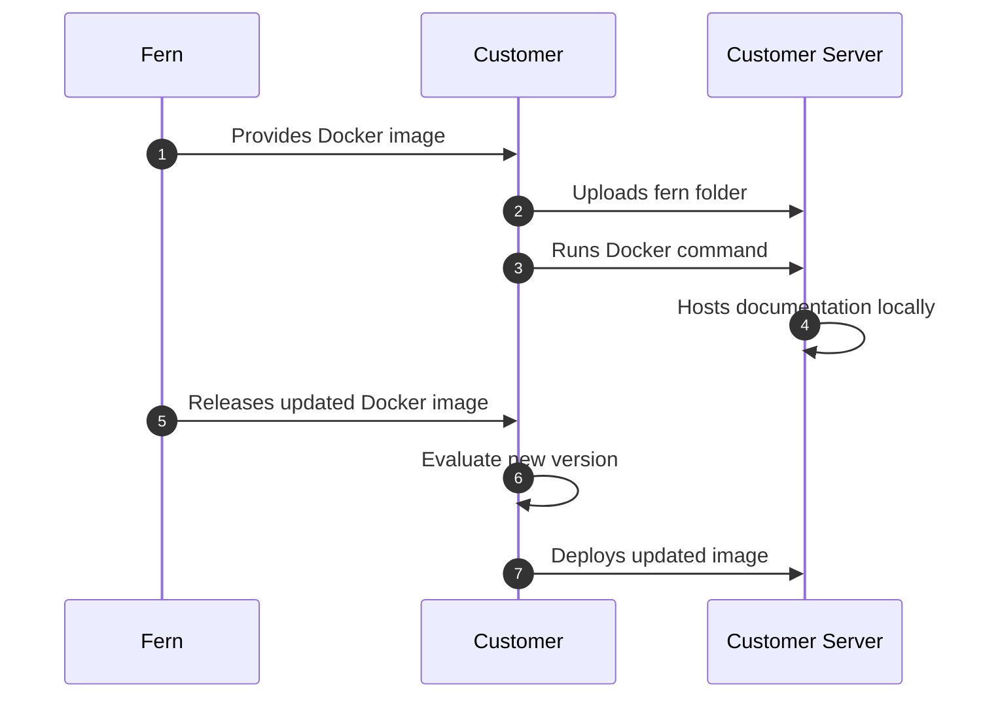

<Markdown src="/snippets/enterprise-plan.mdx" />

Fern documentation websites are hosted on Fern's infrastructure by default. Self-hosting allows you to deploy your documentation site on your own infrastructure to meet specific [security](/learn/docs/security/overview) or compliance requirements.

## When to use self-hosting

Self-hosting is typically required for organizations that operate without internet access, have strict compliance requirements, or need full control over their documentation servers.

When you self-host, you're responsible for server setup, security, maintenance, and deciding how to make the documentation accessible to your users.

<Warning>
Unless you have specific requirements that prevent using Fern's default hosting, we recommend **using our managed hosting solution** for easier setup and maintenance.
</Warning>

### Feature support

Self-hosted deployments include core Fern documentation website features like auto-generated API references, interactive documentation, SDK code snippets, search, and customizable branding. 

However, features requiring external connections aren't supported, including [Ask Fern](/ask-fern/getting-started/what-is-ask-fern) (AI chat), [analytics](/docs/integrations/overview), [live API key population](/docs/authentication/api-key-injection), and [SSO integrations](/docs/authentication/sso).

<Info title="Extended feature support">
**PDF export** and **offline AI chat functionality** are not yet available on any plan but are in development for enterprise self-hosted deployments. [Email us](mailto:support@buildwithfern.com) if you're interested in these features.
</Info>

## Setup process

Fern provides your documentation site as a ready-to-run Docker container that you can deploy on your own infrastructure.

1. **Download the Docker image** - Fern provides the location of the most up-to-date Docker image containing the documentation frontend
1. **Upload your fern folder** - Add your documentation source files to the container
1. **Run the container** - Spin up your local server using standard Docker commands
1. **Configure hosting** - Set up your server environment and decide how to publish/share the documentation
1. **Receive updated Docker images** - Fern releases new versions of the Docker image that your team can evaluate and deploy when ready.

### Architecture diagram

## Monitoring and health checks

The self-hosted container includes [health check endpoints](./health-check-endpoints) on port 8081 for Kubernetes and Helm deployments. 

