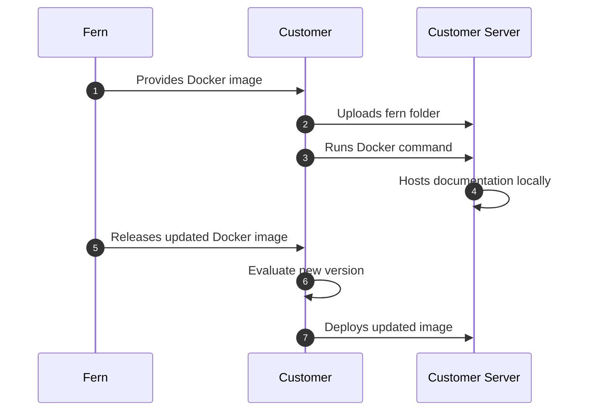

<Markdown src="/snippets/enterprise-plan.mdx" />

Fern documentation websites are hosted on Fern's infrastructure by default. Self-hosting allows you to deploy your documentation site on your own infrastructure to meet specific [security](/learn/docs/security/overview) or compliance requirements.

## When to use self-hosting

Self-hosting is typically required for organizations that operate without internet access, have strict compliance requirements, or need full control over their documentation servers.

When you self-host, you're responsible for server setup, security, maintenance, and deciding how to make the documentation accessible to your users.

<Warning>
Unless you have specific requirements that prevent using Fern's default hosting, we recommend **using our managed hosting solution** for easier setup and maintenance.
</Warning>

### Feature support

Self-hosted deployments include core Fern documentation website features. However, features that require external connections to Fern's cloud services are not available in self-hosted environments.

| Feature | Supported | Notes |
|---|---|---|
| **Documentation & content** | | |
| Markdown content & components | Yes | |
| Reusable snippets | Yes | |
| Custom CSS & JS | Yes | |
| Custom React components | Yes | |
| Header and footer customization | Yes | |
| Announcement banner | Yes | |
| Embedded mode | Yes | |
| Changelog pages | Yes | |
| Dark / light mode | Yes | |
| Versions | Yes | |
| Tabs and products | Yes | |
| **API References** | | |
| Auto-generated API references | Yes | REST, WebSocket, GraphQL, OpenRPC, Webhooks |
| [API Explorer](/learn/docs/api-references/api-explorer) (Try it) | Yes | Requires [CORS proxy configuration](/learn/docs/self-hosted/set-up#cross-origin-resource-sharing-cors-proxy) |
| [SDK code snippets](/learn/docs/api-references/sdk-snippets) | Yes | |
| [HTTP snippets](/learn/docs/api-references/http-snippets) | Yes | |
| **Search & navigation** | | |
| Search | Yes | Built-in search included |
| Navigation and sidebar | Yes | |
| **Customization & branding** | | |
| Custom domain | Yes | |
| Custom branding and theming | Yes | |
| SEO metadata | Yes | |
| Redirects | Yes | |
| **Authentication** | | |
| [Password protection](/learn/docs/self-hosted/authentication) | Yes | Via environment variables |
| [JWT-based authentication](/learn/docs/self-hosted/authentication) | Yes | Basic token verification with custom login flow |
| [API key injection](/learn/docs/authentication/features/api-key-injection) | Yes | |
| Page-level access control | Yes | Allowlist and denylist via environment variables |
| [SSO](/learn/docs/authentication/setup/sso) | No | Requires Fern's cloud auth infrastructure |
| [OAuth](/learn/docs/authentication/setup/oauth) | No | Requires Fern's cloud auth infrastructure |
| [RBAC](/learn/docs/authentication/features/rbac) | No | Requires Fern's cloud auth infrastructure |
| **AI features** | | |
| [Ask Fern](/learn/docs/ai-features/ask-fern/overview) (AI chat) | No | Requires external connection to Fern's AI services |
| [Fern Writer](/learn/docs/ai-features/fern-writer) | No | Requires external connection to Fern's AI services |
| [AI-generated examples](/learn/docs/ai-features/ai-examples) | No | Requires external connection to Fern's AI services |
| [llms.txt](/learn/docs/ai-features/llms-txt) | No | Requires Fern's cloud infrastructure |
| **Analytics & integrations** | | |
| [Analytics integrations](/learn/docs/integrations/overview) | No | Google, PostHog, Fullstory, Segment, Mixpanel |
| [Intercom](/learn/docs/integrations/support/intercom) | No | Requires external connection |
| On-page feedback | No | Requires Fern's cloud infrastructure |
| **Infrastructure** | | |
| [Health check endpoints](/learn/docs/self-hosted/health-check-endpoints) | Yes | Kubernetes and Helm ready |
| Cache warmup | Yes | Pre-fetch pages on startup |
| Configurable caching proxy | Yes | |

<Info title="Extended feature support">
**PDF export** and **offline AI chat functionality** are not yet available on any plan but are in development for enterprise self-hosted deployments. [Email us](mailto:support@buildwithfern.com) if you're interested in these features.
</Info>

## Setup process

Fern provides your documentation site as a ready-to-run Docker container that you can deploy on your own infrastructure. For detailed instructions, see [Set up self-hosted documentation](/learn/docs/self-hosted/set-up).

1. **Download the Docker image** - Fern provides the location of the most up-to-date Docker image containing the documentation frontend
1. **Upload your fern folder** - Add your documentation source files to the container
1. **Run the container** - Spin up your local server using standard Docker commands
1. **Configure hosting** - Set up your server environment and decide how to publish/share the documentation
1. **Receive updated Docker images** - Fern releases new versions of the Docker image that your team can evaluate and deploy when ready.

### Architecture diagram

## Monitoring and health checks

The self-hosted container includes [health check endpoints](./health-check-endpoints) on port 8081 for Kubernetes and Helm deployments.                

