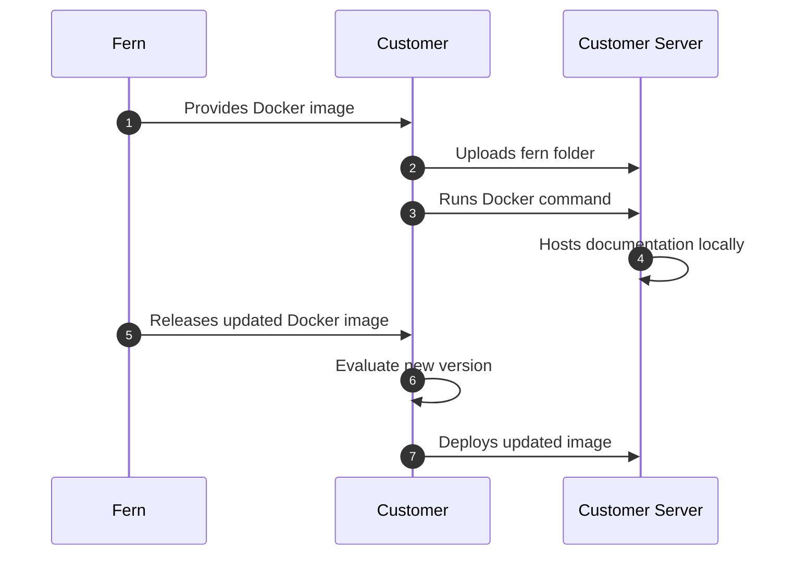

<Markdown src="/snippets/enterprise-plan.mdx" />

Fern documentation websites are hosted on Fern's infrastructure by default. Self-hosting allows you to deploy your documentation site on your own infrastructure to meet specific security or compliance requirements.

## When to use self-hosting

Self-hosting is typically required for organizations that operate without internet access, have strict compliance requirements, or need full control over their documentation servers.

When you self-host, you're responsible for server setup, security, maintenance, and deciding how to make the documentation accessible to your users.

<Warning>
Unless you have specific requirements that prevent using Fern's default hosting, we recommend **using our managed hosting solution** for easier setup and maintenance.
</Warning>

### Feature support

Self-hosted deployments include core Fern documentation website features like auto-generated API references, interactive documentation, SDK code snippets, search, and customizable branding. 

However, features requiring external connections aren't supported, including [Ask Fern](/ask-fern/getting-started/what-is-ask-fern) (AI chat), [analytics](/docs/integrations/overview), [live API key population](/docs/authentication/api-key-injection), and [SSO integrations](/docs/authentication/sso).

<Info title="Extended feature support">
**PDF export** and **offline AI chat functionality** are not yet available on any plan but are in development for enterprise self-hosted deployments. [Email us](mailto:support@buildwithfern.com) if you're interested in these features.
</Info>

## Setup process

Fern provides your documentation site as a ready-to-run Docker container that you can deploy on your own infrastructure.

1. **Download the Docker image** - Fern provides the location of the most up-to-date Docker image containing the documentation frontend
1. **Upload your fern folder** - Add your documentation source files to the container
1. **Run the container** - Spin up your local server using standard Docker commands
1. **Configure hosting** - Set up your server environment and decide how to publish/share the documentation
1. **Receive updated Docker images** - Fern releases new versions of the Docker image that your team can evaluate and deploy when ready.

### Architecture diagram



## Health check endpoints

The self-hosted container exposes health check endpoints for Kubernetes and Helm deployments on port 8081. These endpoints help you monitor the container's health and ensure proper startup behavior.

### Liveness probe

**Endpoint:** `/liveness`

Checks if all critical service processes are still running by verifying their PIDs. This endpoint helps distinguish between unrecoverable failures (process died) and slow startups.

**Usage:**
```bash
curl http://localhost:8081/liveness
```

**Response:**
- `200 OK` - All critical processes are alive
- `503 Service Unavailable` - One or more critical processes have died (container should be restarted)

**Checked services:**
- PostgreSQL
- MinIO
- FDR server
- Next.js docs server
- MeiliSearch (warning only, non-critical)

### Readiness probe

**Endpoint:** `/readiness`

Checks if all services are healthy and ready to serve traffic by testing their health endpoints. This endpoint only returns success when all services are fully initialized and responsive.

**Usage:**
```bash
curl http://localhost:8081/readiness
```

**Response:**
- `200 OK` - All services are ready to serve traffic
- `503 Service Unavailable` - One or more services are not ready (wait longer)

**Checked services:**
- PostgreSQL (via `pg_isready`)
- MinIO (via `/minio/health/live`)
- FDR server (via `/health`)
- Next.js docs server (via root endpoint)
- MeiliSearch (warning only, non-critical)

### Legacy health endpoint

**Endpoint:** `/health`

Provides backward compatibility with existing deployments. Returns the same status as the readiness probe.

**Usage:**
```bash
curl http://localhost:8081/health
```

### Kubernetes and Helm configuration

Configure your deployment to use these probes:

```yaml
livenessProbe:
  httpGet:
    path: /liveness
    port: 8081
  initialDelaySeconds: 60
  periodSeconds: 10
  timeoutSeconds: 5
  failureThreshold: 3

readinessProbe:
  httpGet:
    path: /readiness
    port: 8081
  initialDelaySeconds: 30
  periodSeconds: 5
  timeoutSeconds: 5
  failureThreshold: 3
```

**Benefits:**
- **Liveness probe**: Detects unrecoverable failures and triggers container restart
- **Readiness probe**: Prevents traffic routing to containers that are still starting up
- **Independent of startup time**: Deployments no longer need arbitrary timeouts like `--wait --timeout 15m0s`


