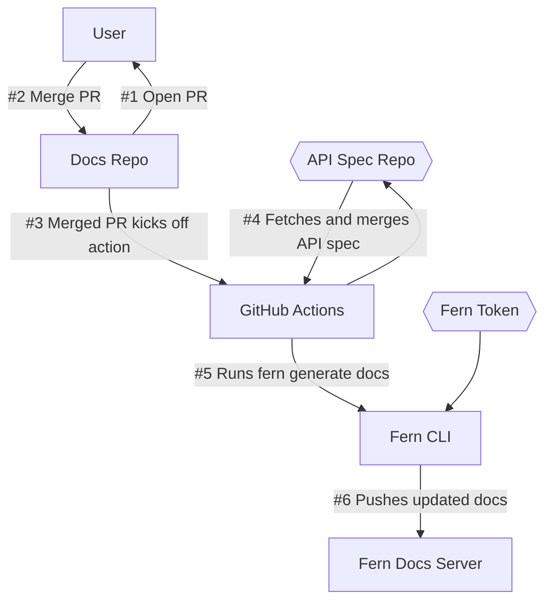
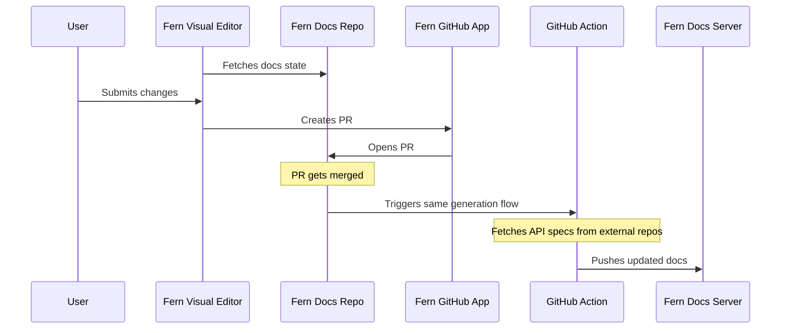

Fern reads your docs.yml configuration file along with API specifications (OpenAPI, AsyncAPI, etc.) and markdown files from your GitHub repository. It processes these sources to generate a cohesive documentation site that combines API references with your custom content.

When changes are merged to your documentation repository, GitHub Actions automatically trigger the Fern CLI to regenerate and deploy your updated documentation site.

the Fern Visual Editor provides a user-friendly interface to edit documentation pages, which automatically creates pull requests for review and deployment.

Main inputs
- ID.me GitHub repo with Fern Docs config: docs.yaml, Markdown files (landing pages, guides, etc)
- Additional repos with API specs

Main flow
- User opens a PR in Docs repo
- Once user approves and merges PR, Fern Docs Repo kicks off github action that fetches the spec. Then, Fern CLI generates docs (`fern generate --docs`). Needs a Fern token to run this. Pushes content to Fern Docs Server

GitHub Action merges API specs (input is API specs and GitHub token to read specs in other repos)

Visual editor
- Fern Visual Editor fetches docs state from Fern Docs repo
- User submits a change to a docs page
- Fern GitHub App opens a PR
- Same flow after merging

## How a GitHub PR works

text

## How the Visual Editor flow works

text

