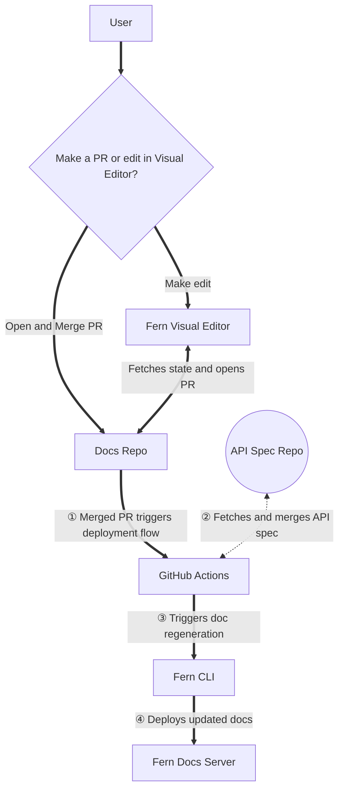

Fern combines your API specifications, static Markdown files (like how-to guides and tutorials), media assets (images, videos, etc.), and custom settings defined in your `docs.yml` file to generate a beautiful, interactive documentation site hosted on Vercel.

This process is built around two major workflows: editing and deploying your documentation.

## Editing workflow

You can update your documentation in two ways:

- **Direct editing**: Open a pull request directly in the [GitHub repository that contains your docs](/learn/docs/getting-started/project-structure) (including your `docs.yml` configuration and Markdown files). 
- **Visual Editor**: Use Fern's [Visual Editor](/learn/docs/writing-content/visual-editor) to modify your docs without touching code. The Fern GitHub App fetches the current state from your docs repository and passes it to the Visual Editor. When you submit changes, the Fern GitHub App automatically opens a pull request for review. 

After the update goes through your review process, an approver can merge it. 

## Deployment workflow

When a pull request is merged into your docs repository:

1. **GitHub Action triggers and fetches API specs**: The merged PR triggers a Fern GitHub Action. The action retrieves your API specification from a separate repository using secure token authentication. The GitHub Action only has access to the specific docs repository from which it's running.
2. **Fern CLI generates updated documentation**: [The Fern CLI](/learn/cli-api-reference/cli-reference/overview) runs `fern generate --docs` to merge API specs with your documentation and process it into a static site. During this process, Fern also indexes your content to enable search functionality across your documentation. The CLI uses a Fern token to authenticate and run the generation process.
3. **Deploy to hosting platform**: The Fern CLI deploys your generated content to the Fern Docs Server, which is hosted on Vercel.

This automated pipeline ensures your documentation stays synchronized with your API changes while maintaining a smooth developer workflow.

<Accordion title="Architecture diagram">

</Accordion>