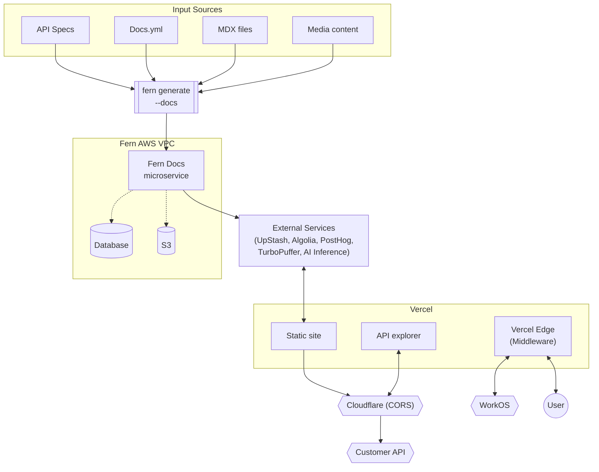
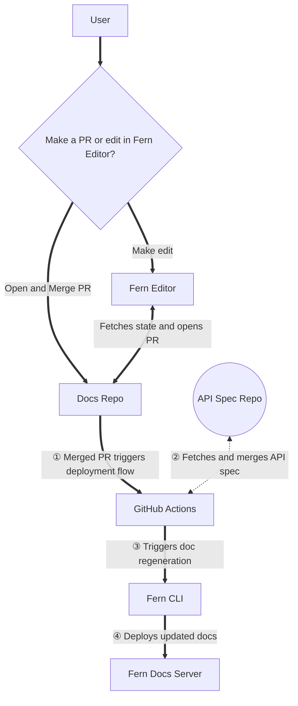

Fern combines your API specifications, static Markdown files (like how-to guides and tutorials), media assets (images, videos, etc.), and custom settings defined in your `docs.yml` file to generate a beautiful, interactive hosted documentation site. 

This process is built around two major workflows: **editing** and **deploying** your documentation.

<Accordion title="System architecture">

This diagram shows the technical infrastructure that powers the documentation generation process.

</Accordion>

## Content workflows

You can update your documentation in two ways:

- **Direct editing**: Open a pull request directly in the [GitHub repository that contains your docs](/learn/docs/getting-started/project-structure) (including your `docs.yml` configuration and Markdown files). 
- **Fern Editor**: Use the [Fern Editor](/learn/docs/writing-content/fern-editor) to modify your docs without touching code. The Fern GitHub App fetches the current state from your docs repository and passes it to the Fern Editor. When you submit changes, the Fern GitHub App automatically opens a pull request for review. 

After the update goes through your review process, an approver can merge it. 

<Info>
    You can use the [Fern Dashboard](http://dashboard.buildwithfern.com) to manage your GitHub repository connection, organization members (add or remove), domains, and Fern CLI version.
</Info>

## Deployment workflows

When a pull request is merged into your docs repository, an automated pipeline transforms your content into a live documentation site and syncs it with your API changes in three main stages:

<Steps>

### Trigger GitHub Action and fetch API specs

The merged PR triggers a Fern GitHub Action. The action retrieves your API specification from a separate repository using secure token authentication. The GitHub Action only has access to the specific docs repository from which it's running.

### Generate and process content
[The Fern CLI](/learn/cli-api-reference/cli-reference/overview) runs `fern generate --docs` to merge your API specs with documentation content. Behind the scenes, this process involves several key components:

- **Input processing**: The system combines your API specification files, `docs.yml` configuration file, `.mdx` files, and media content. 
- **Core infrastructure**: The generation process runs on Fern's AWS VPC infrastructure, where the Fern Docs microservice acts as the central orchestrator. This microservice coordinates content processing while connecting to a database for storing indexed content and S3 for asset storage.
- **Content indexing**: During generation, Fern automatically indexes your documentation content to enable search functionality across your entire site. This indexing integrates with external services: [Algolia](/learn/docs/customization/search) for advanced search capabilities, UpStash for caching, PostHog for analytics, TurboPuffer for vector storage, and AI inference services (Bedrock, Claude) for intelligent content processing.

### Deploy to hosting platform

The processed content is deployed to Vercel as a documentation site with an embedded [API Explorer](/learn/docs/api-references/api-explorer) that allows users to test endpoints directly within the documentation. 

Vercel Edge middleware handles the underlying routing, authentication, and performance optimization.

The deployed documentation site integrates with external systems like Cloudflare for CORS management and WorkOS for enterprise authentication. 

</Steps>

<Accordion title="Editing and deployment workflows">

This diagram shows how content flows from editing to deployment.

</Accordion>

## Optimize performance

A page's load and navigation speed depend on how much content it ships and how it's rendered. To keep your site fast:

- **Right-size pages, navigation, and API specs.** Large pages, deeply nested navigation, and oversized API specifications increase render time and payload size. Split long pages into focused ones, and remove unused endpoints and schemas from your specs.
- **Optimize media assets.** Compress images and serve files at the size they're displayed. Prefer video (MP4) over animated GIFs, and add [`noZoom`](/learn/docs/writing-content/markdown-media) to images that don't need zoom. See [Rich media in Markdown](/learn/docs/writing-content/markdown-media) for supported formats.
- **Limit custom client-side JavaScript and embeds.** [Custom React components](/learn/docs/customization/custom-react-components) are server-side rendered, but heavy client-side JavaScript, [custom scripts](/learn/docs/customization/custom-css-js), and third-party embeds such as analytics, widgets, and iframes run in the browser and slow interaction. Include only what your docs need.

### Diagnose slow pages

Isolate where the slowness comes from before changing content:

- **First load:** A slow initial visit or a top loading bar on the first navigation points to a cold cache or first render, which speeds up on later requests.
- **Client-side navigation:** Slow movement between pages after the site has loaded reflects page or navigation size.
- **Content weight:** Large images and long pages affect every load and appear in the browser's network tab.

If pages stay slow after you right-size content and assets, or a whole site is unavailable or serving stale content, the cause points to a Fern-side caching or runtime issue rather than your content. Contact Fern through your dedicated Slack channel or [email](mailto:support@buildwithfern.com) with the affected URLs.
