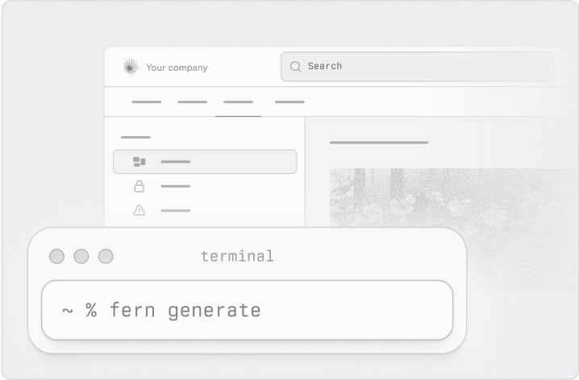
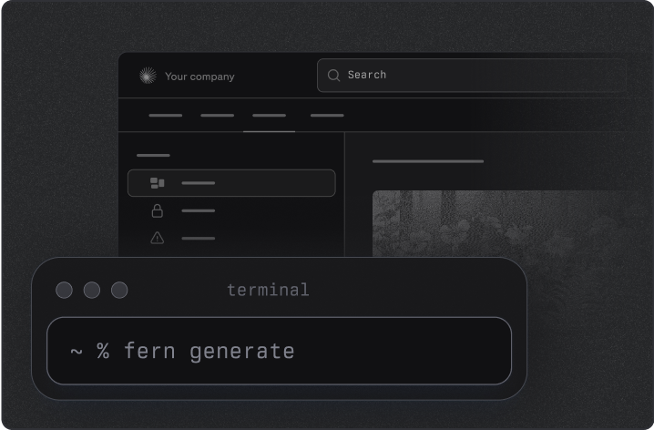
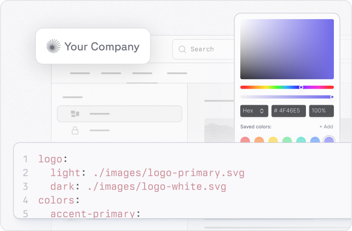
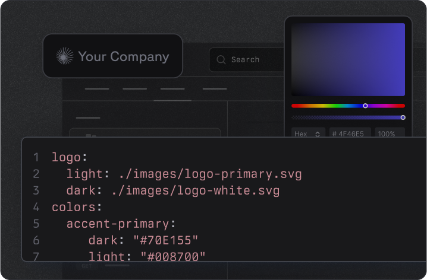
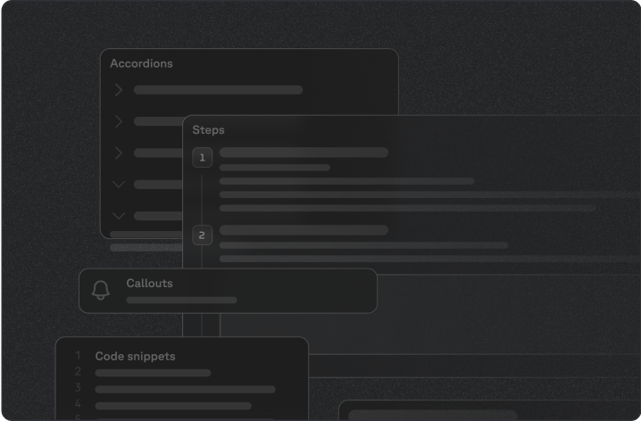
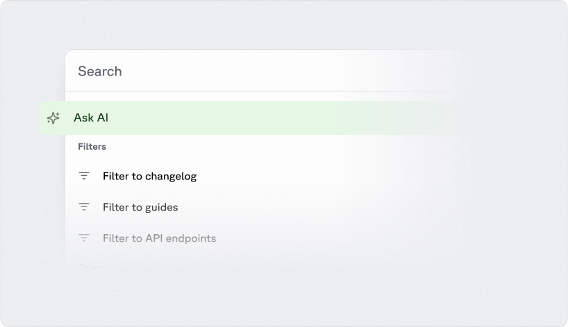
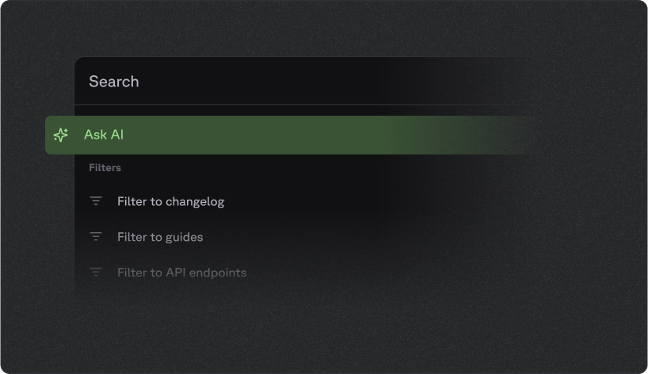

<llms-ignore>

  {/* Dashed Pattern - Left Side */}
  

  {/* Dashed Pattern - Right Side */}
  

  <h2>Get started</h2>
  
Build a docs site quickly by importing your existing styling and specs.

  <CardGroup cols={2}>
    <a class="fern-card interactive not-prose relative block p-6 text-base" href="/docs/getting-started/quickstart">
      

        
        
        

          

            Quickstart
            
            
          

          

            
Set up a documentation site in under 5 minutes.

          

        

      

    </a>
    
    <a class="fern-card interactive not-prose rounded-3 relative block border p-6 text-base" href="/docs/configuration/site-level-settings">
      

        
        
        

          

            Configure with ease
            
            
          

          

            
Use one simple file to generate documentation that fits your brand.

          

        

      

    </a>
  </CardGroup>

  <h2>Features</h2>
  
Components, generated API references, AI features, authentication, localization, self-hosting, and more.

  <CardGroup cols={2}>
    <a class="fern-card interactive not-prose rounded-3 relative block border p-6 text-base" href="/docs/getting-started/capabilities">
      

        
        
        

          

            All capabilities
            
            
          

          

            
Everything Fern Docs can do, on one page.

          

        

      

    </a>

    <a class="fern-card interactive not-prose rounded-3 relative block border p-6 text-base" href="/docs/ai-features/overview">
      

        
        
        

          

            AI features
            
            
          

          

            
Ask Fern, MCP, agent-ready Markdown, and AI-generated examples.

          

        

      

    </a>

  </CardGroup>

</llms-ignore>

<llms-only>
## Get started

Build a docs site by importing your existing styling and specs.

- [Quickstart](/docs/getting-started/quickstart): Set up a documentation site in under 5 minutes.
- [Configure with ease](/docs/configuration/site-level-settings): Use one simple file to generate documentation that fits your brand.

## Features

Components, generated API references, AI features, authentication, localization, self-hosting, and more.

- [All capabilities](/docs/getting-started/capabilities): Everything Fern Docs can do, on one page.
- [AI features](/docs/ai-features/overview): Ask Fern, MCP, agent-ready Markdown, and AI-generated examples.
</llms-only>
