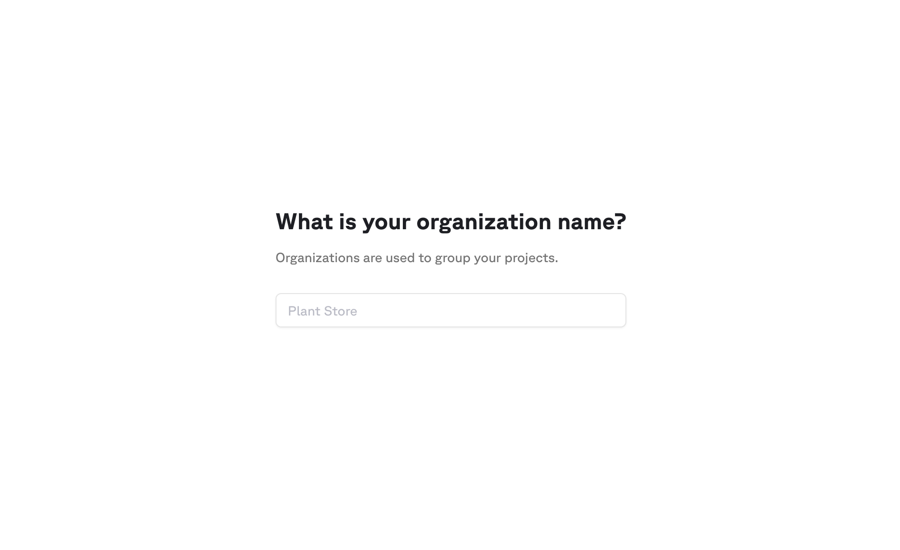
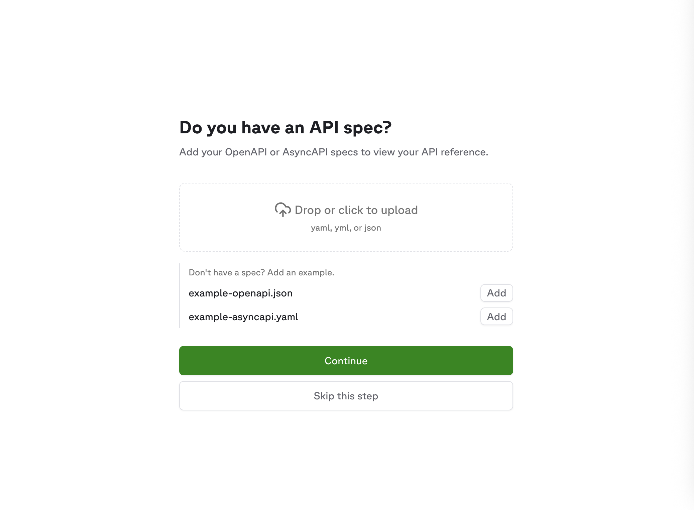
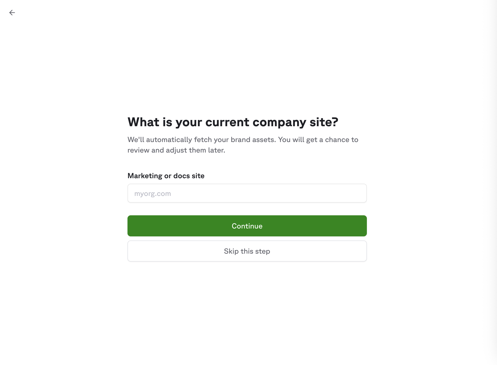
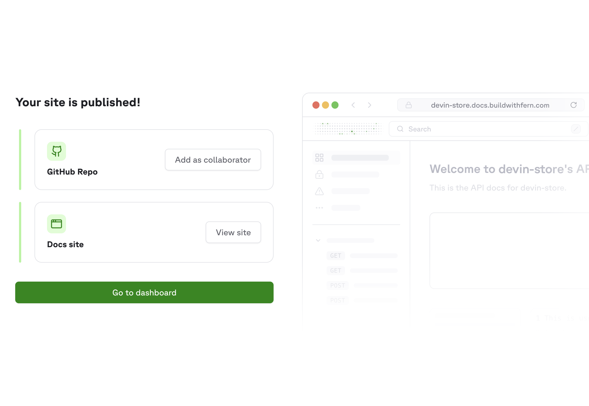

The [self-service workflow](https://dashboard.buildwithfern.com/get-started) guides you through creating a new Fern Docs site in a few steps. If you're looking for an existing site you've already set up, [search for your organization](https://dashboard.buildwithfern.com/get-started/search) instead.

<Note>
Prefer to set things up manually using the CLI? See the [Quickstart](/learn/docs/getting-started/quickstart) instead.
</Note>

## What gets created

When you complete the self-service workflow, Fern publishes your documentation to a brand-new site and creates a GitHub repository containing your site configuration (`docs.yml`), Markdown pages, and any API specifications. Your repo includes a `CLAUDE.md` file pre-populated with Fern documentation in [llms-full.txt format](/learn/docs/ai/llms-txt), giving AI coding assistants context for working with Fern.

The setup process also creates and configures:

- **Organization**: An organization using your org ID, with you as a member.
- **Fern API key**: A `FERN_TOKEN` in your repository's GitHub secrets that authenticates the [Fern CLI](/learn/cli-api-reference/cli-reference/overview) in your CI/CD workflows, scoped to your organization.
- **GitHub Action**: A workflow that runs [`fern generate --docs`](/learn/cli-api-reference/cli-reference/commands#fern-generate---docs) whenever you push changes to your main branch, automatically rebuilding and publishing your documentation.

After setup, you have full ownership of this repository. Push changes to your main branch to trigger an automatic rebuild and publish of your docs, or manage settings through the [Fern Dashboard](https://dashboard.buildwithfern.com).

## Setup steps

<Steps>
<Step title="Enter your organization name">
Choose a unique identifier for your organization. This will be used in your docs URL and to identify your project in the Dashboard.

<Frame>

</Frame>
</Step>
<Step title="Upload your API spec (optional)">
Upload an OpenAPI specification to generate API Reference documentation. You can skip this step if you don't have a spec or want to add one later.

<Frame>

</Frame>
</Step>
<Step title="Configure your branding">
Enter an existing website URL (like your marketing site or blog) so Fern can automatically match your brand style. Alternatively, pick a primary color and upload a logo manually.

<Frame>

</Frame>
</Step>
<Step title="Your site is live!">
Fern publishes your documentation to a live URL you can visit immediately. Add your GitHub account as a collaborator to take ownership of the repository. From there, you can edit files, push changes, and open pull requests just like any other Git repo. Each push to the main branch triggers the GitHub Action to rebuild and publish your docs automatically. You can also manage your site settings in the [Dashboard](/learn/dashboard/getting-started/overview).
<Frame>

</Frame>
</Step>
</Steps>

## Next steps

Start writing content and customizing your site:

<CardGroup cols={3}>
<Card
    title="How Fern Docs work"
    icon="regular circle-info"
    href="/learn/docs/getting-started/how-it-works"
>
    Understand the content and deployment workflows powering your site.
</Card>
<Card
    title="Write your docs"
    icon="regular pen-to-square"
    href="/learn/docs/writing-content/markdown-basics"
>
    Learn Markdown basics and use components to create rich documentation.
</Card>
<Card
    title="Configure your site"
    icon="regular sliders"
    href="/learn/docs/configuration/site-level-settings"
>
    Set colors, typography, navigation, and more in your `docs.yml` file.
</Card>
</CardGroup>

## Monitoring builds

Your documentation rebuilds automatically whenever you push changes to your main branch. To check the status of a build, go to the **Actions** tab in your GitHub repository. Each workflow run shows whether the build succeeded, along with any errors or warnings.

### Troubleshooting

<AccordionGroup>
<Accordion title="Fern API key issues">

If your documentation build fails with an authentication error, the `FERN_TOKEN` may not be set correctly. To resolve this:

1. Install the Fern CLI if you haven't already:
   ```bash
   npm install -g fern-api
   ```

2. Add yourself as a collaborator to the repository if needed, then clone it locally.

3. Run the following command from within your Fern project directory to generate a new token:
   ```bash
   fern token
   ```
   This generates an API key scoped to your organization (as defined in `fern.config.json`).

4. Copy the API key and add it as a [repository secret](https://docs.github.com/en/actions/security-guides/using-secrets-in-github-actions#creating-secrets-for-a-repository) named `FERN_TOKEN`.

5. Go to the **Actions** tab in your repository and re-run the failed workflow.
</Accordion>
<Accordion title="API spec errors">

If your build fails due to issues parsing your API specification, you can troubleshoot locally:

1. Clone your documentation repository locally if you haven't already.

2. Install the Fern CLI:
   ```bash
   npm install -g fern-api
   ```

3. Run the following command to see detailed validation errors with line numbers:
   ```bash
   fern check --from-openapi
   ```
   This command prints validation errors directly from your OpenAPI specification, including the line numbers where the errors originate.

Once you've resolved the errors in your API spec, commit and push the changes to trigger a new build.
</Accordion>
</AccordionGroup>
