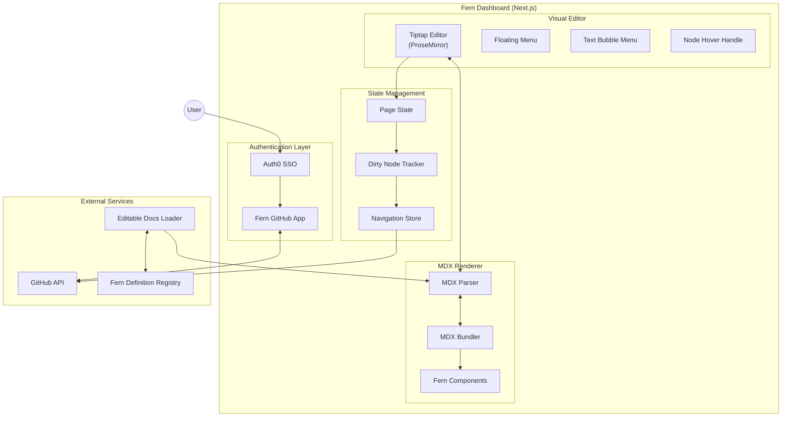
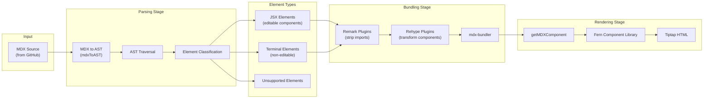

This page provides internal engineering documentation for the Fern Editor, a browser-based WYSIWYG documentation editor that integrates with GitHub for version control.

## Overview

The Fern Editor is built as part of the Fern Dashboard application (`packages/fern-dashboard`) and enables non-technical users to edit documentation without learning Markdown or Git. It uses a GitHub-backed workflow where all changes are committed as pull requests.

The editor is built on three core technologies: Tiptap (a headless rich-text editor built on ProseMirror), MDX (Markdown with JSX components), and the Fern component library. The rendering pipeline transforms content bidirectionally between these formats.

## System architecture

The Fern Editor consists of several interconnected systems that work together to provide a seamless editing experience.

## Rendering pipeline

The rendering pipeline is the core of the Fern Editor, handling the bidirectional transformation between MDX source content and the Tiptap editor's HTML representation.

### Pipeline stages

The rendering pipeline operates in two directions: MDX to HTML (for display) and HTML to MDX (for saving).

### Element classification

The parser (`parse.ts`) classifies MDX elements into three categories that determine how they're rendered and edited.

**Rich text components** are fully editable within the Tiptap editor. These include Callout, Card, Button, Tab, Accordion, Step, StepGroup, Info, Warning, Success, Error, Note, Tip, Check, LaunchNote, and ParamField. Users can modify the content inside these components using the rich-text editing interface.

**Components without children** are editable but don't contain nested content. These include embed, img, EndpointRequestSnippet, EndpointResponseSnippet, and EndpointSchemaSnippet. Users can modify their attributes but not add child content.

**Boundary elements** (div, span, section, article, body, aside) mark the boundary of editable regions. These elements and their children are treated as terminal (non-editable) unless they contain unsupported components that need special handling.

**Terminal elements** are rendered as read-only previews. This includes standard Markdown elements (paragraphs, headings, lists, code blocks) and any elements that don't match the editable component patterns.

### MDX bundling

The bundling process (`bundle.ts`) transforms MDX source into executable JavaScript code using mdx-bundler. The process applies several plugins.

**Remark plugins** run first and include `remarkStripImports`, which removes import statements since they can't be resolved in the editor environment.

**Rehype plugins** transform the HTML AST and include `rehypeMdxClassStyle` (converts HTML attributes to JSX format), `rehypeCodeBlock` (transforms pre/code elements into CodeBlock components), `rehypeEndpointSchemaSnippets` and `rehypeEndpointExampleSnippets` (resolve API Reference snippets using the docs loader), and `rehypeEditorComponents` (reverses component name transformations for editor compatibility).

The `rehypeEditorComponents` plugin performs specific name mappings: Cards becomes CardGroup, Accordions becomes AccordionGroup, Tabs becomes TabGroup, embed becomes Embed, and img becomes Image.

### HTML to MDX conversion

When users make changes in the Tiptap editor, the HTML must be converted back to MDX for storage. This process uses `htmlToMdx` from the `@fern-docs/mdx` package.

The conversion preserves formatting details like bullet style (asterisk or hyphen) and applies proper indentation for nested content. The `buildMdxElement` function reconstructs JSX elements with their attributes and children.

## Tiptap editor configuration

The Tiptap editor (`TiptapEditor.tsx`) is configured with a comprehensive set of extensions that enable rich-text editing.

### Core extensions

The editor uses StarterKit as its foundation, configured with custom dropcursor color, heading levels 1-6, and disabled gapcursor, codeBlock, and link (replaced with custom implementations).

Additional extensions include Link (with autolink and linkOnPaste), TaskList and TaskItem (for checkbox lists), InlineMath and BlockMath (for LaTeX rendering with KaTeX), and Table extensions (Table, TableRow, TableCell, TableHeader) with custom node views.

### Custom extensions

The editor includes several custom extensions. `FVEAttributesExtension` sets data attributes on nodes for tracking changes. `MarkdownPasteExtension` handles pasting Markdown content. `SelectBlockExtension` enables block-level selection. `CustomElement` and `InlineCustomElement` render Fern components within the editor. `ConditionalPlaceholder` shows contextual placeholder text. `ShikiPlugin` provides syntax highlighting for code blocks. `ConfiguredMediaUploadNode` and `ConfiguredFileHandler` handle image and file uploads.

### Editor menus

The editor provides three types of menus. The **Floating Menu** appears when the cursor is on an empty line and offers component insertion options. The **Text Bubble Menu** appears when text is selected and provides formatting options. The **Node Hover Handle** appears when hovering over blocks and enables drag-and-drop reordering.

## State management

The editor uses a combination of React context and refs for state management.

### Navigation store

The `useNavigation` hook provides access to the navigation store, which tracks page content, dirty nodes, and commit state. Key functions include `updatePageHtml` (updates page content and tracks changed nodes), `subscribePageSaveEvent` (listens for save events), `subscribeNestedEditorUpdate` (handles updates from nested editors), and `handleCommitSuccess` (clears dirty state after successful commit).

### Dirty node tracking

The editor tracks which nodes have been modified during an editing session using a `dirtyNodeIds` ref. The `getChangedNodesFromHtml` function compares HTML snapshots to identify changed nodes. Once a node is marked as dirty, it remains dirty for the session to prevent accidental reversion of edits.

### Page state

Each page maintains its own state including the raw MDX source, the current HTML representation, the parsed element structure, and the commit status.

## GitHub integration

The editor integrates with GitHub through the Fern GitHub App for authentication and the GitHub API for commits and pull requests.

### Authentication flow

Users authenticate via Auth0 SSO, which provides access tokens for the GitHub App. The `assertAuthAndFetchGithubUrl` function validates the session and retrieves the repository URL.

### Commit workflow

The commit process (`CommitButton.tsx`) follows these steps: validate that there are changes to commit, attempt to commit files using `postGitCommit`, if the branch doesn't exist create it using `createBranchMutation`, on success show a celebration modal (first commit only), and if no PR exists create one using `handleCreatePr`.

### File handling

Files are tracked in the navigation store with their original content, current content, and change status. The `files.forCommit` property provides the list of files ready for commit, and `files.hasChangesToCommit` indicates whether there are pending changes.

## Component rendering

The `FernEditorMDXRenderer` component handles the rendering of parsed MDX elements within the editor.

### JSX element renderer

For editable JSX elements, the renderer creates a nested structure. The `EditorComponentProvider` wraps the element and provides attribute editing capabilities. The `EditorComponentChildrenProvider` handles child content and the `appendChildrenMdx` function. For rich-text children, a nested `TiptapEditor` instance is created. For allowed children (non-rich-text), a recursive `FernEditorMDXRendererInternal` is used.

### Terminal element renderer

Terminal elements are rendered using the `MDXRenderer` component, which bundles the MDX and renders it as a read-only preview. The `cachedBundleMDX` function provides caching for performance.

### Error handling

The renderer includes error boundaries at multiple levels. `CustomErrorFallback` displays a fallback UI for bundling errors. `UnsupportedContent` and `UnsupportedContentInline` handle unsupported component types. The `ErrorBoundary` component catches runtime errors during rendering.

## Performance optimizations

The editor implements several performance optimizations.

**Debounced updates** use a 100ms delay with a 300ms max wait to batch rapid changes. **Cached MDX bundling** stores bundled results to avoid re-bundling unchanged content. **Parallel processing** bundles multiple MDX sources concurrently using `Promise.all`. **Incremental dirty tracking** only marks changed nodes as dirty rather than the entire document. **Lazy rendering** uses `immediatelyRender={false}` to defer initial render.

## File structure

The editor code is organized within the fern-dashboard package.

The main editor components are located in `src/components/editor/`, including `TiptapEditor.tsx` (main editor component), `FloatingMenu.tsx` (component insertion menu), `TextBubbleMenu.tsx` (text formatting menu), `NodeHoverHandle.tsx` (drag handle), and the `editor-mdx-renderer/` directory containing `FernEditorMDXRenderer.tsx`, `parse.ts`, and `cache.ts`.

The MDX bundling code is in `src/editor/mdx/`, including `bundle.ts` (MDX bundler configuration) and the `plugins/` directory with `rehype-editor-components.ts`, `rehype-endpoint-example-snippets.ts`, and `rehype-endpoint-schema-snippets.ts`.

The page routes are in `src/app/[orgName]/(visual-editor)/editor/[docsUrl]/[branch]/[...slug]/`, including `page.tsx` (main page component), `PageEditor.tsx` (page editor wrapper), `PageNode.tsx` (page node renderer), `bundleEditorMdx.ts` (server action for bundling), and `layout.tsx` (editor layout).

State management code is in `src/state/`, including `useCommitToGitHubMutation.ts` and `useCreateBranchMutation.ts`.

## Related documentation

For user-facing documentation about the Fern Editor, see the [Fern Editor page](/learn/docs/writing-content/fern-editor). For information about the broader Fern Docs architecture, see [How Fern Docs work](/learn/docs/getting-started/how-it-works).
