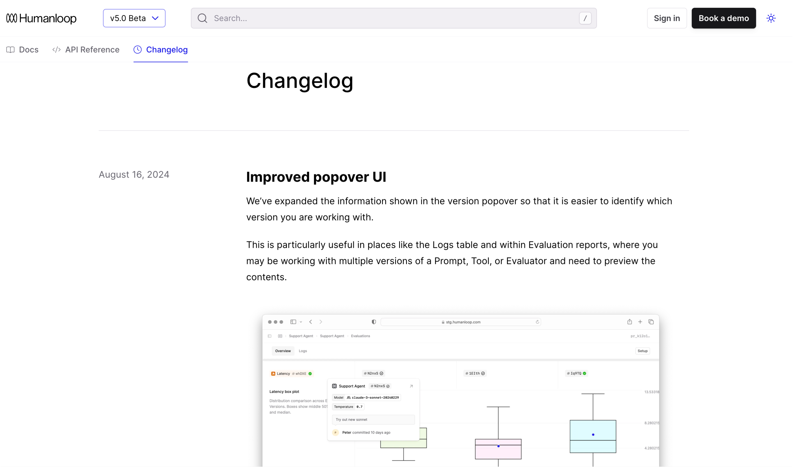

<Markdown src="/snippets/agent-directive.mdx"/>

Keep a record of how your project has changed by writing changelog entries that users can sort by tag. The changelog will automatically populate with the files contained within the `changelog` folder.

<Frame
    caption="Keep your users updated as your project evolves"
    background="subtle"
  >
      
  </Frame>

## Configure your changelog

Add a `changelog` folder to your project. This folder must be named `changelog` exactly — Fern won't recognize it under any other name.

<Files>
  <Folder name="fern" defaultOpen>
    <File name="fern.config.json" />
    <File name="docs.yml" />
    <Folder name="changelog" defaultOpen highlighted>
      <File name="07-08-24.md" highlighted />
      <File name="08-21-24.mdx" highlighted />
    </Folder>
  </Folder>
</Files>

<Note>
Subdirectories within the `changelog` folder aren't supported. All changelog entry files must be placed directly in the root of the `changelog` folder.
</Note>

Then, reference it in your `docs.yml`. You can place the changelog as its own tab or as a section within your navigation.

<Tabs>
<Tab title="As a tab">
<CodeBlock title="docs.yml">
```yaml {8-11,17}
tabs:
  guides:
    display-name: Guides
    icon: light book-open
  api:
    display-name: API Reference
    icon: light code
  changelog:
    display-name: Changelog
    icon: light clock
    changelog: ./changelog

navigation:
  - tab: guides
    layout:
      ...
  - tab: changelog
```
</CodeBlock>

[View an example](https://elevenlabs.io/docs/changelog) of how this renders in the ElevenLabs Changelog.
</Tab>
<Tab title="As a section">
<CodeBlock title="docs.yml">
```yaml {9-11}
navigation:
  - section: Introduction
    contents:
      - page: Authentication
        path: ./pages/authentication.mdx
      - page: Versioning
        path: ./pages/versioning.mdx
  - api: API Reference
  - changelog: ./changelog
    title: Release Notes
    slug: api-release-notes
```
</CodeBlock>

<Note>
Section-level changelogs **can't** be nested within an `api` entry.
</Note>
</Tab>
</Tabs>

## Write a changelog entry

Create a new changelog entry by writing a Markdown file. You can use `.md` or `.mdx` files. The benefit of using `.mdx` is that you can leverage Fern's built-in [component library](/learn/docs/content/components/overview) within an entry.

<Markdown src="/snippets/changelog-example.mdx" />

### Entry date 

Changelog entries are automatically sorted chronologically by the date specific in the file name. Specify the date of your entry using one of the following formats:

- MM-DD-YYYY (e.g., 10-06-2024)
- MM-DD-YY (e.g., 10-06-24)
- YYYY-MM-DD (e.g., 2024-04-21)

### Tags

Add tags to changelog entries to help users filter and find relevant updates. Tags are defined in the frontmatter of your changelog entry as an array of strings:

<CodeBlock>
```mdx
---
tags: ["plants-api", "breaking-change", "inventory-management"]
---
```
</CodeBlock>

When you have multiple changelog entries, users can filter the changelog page by selecting specific tags. Use specific, descriptive tags that your users would naturally search for. Consider tagging by feature type, product area, release stage, affected platform, or user impact.

<Note>
Customize the filter UI using [changelog filter CSS selectors](/learn/docs/customization/css-selectors-reference#changelog-filter-components). These selectors only apply when tags are configured.
</Note>

### Linking to an entry

Each changelog entry has a unique URL you can direct users to. For example, `https://elevenlabs.io/docs/changelog/2025/3/31`

### Overview page

Add an `overview.mdx` file to your `changelog` folder to include a high-level overview at the top of your changelog. This is useful for summarizing major themes, linking to external release notes, or giving users context before diving into specific entries. If present, it will automatically appear above the list of changelog entries.

### RSS feed

Changelogs automatically come with an RSS feed so users can subscribe to updates. Navigate to the RSS feed by appending `.rss` to the changelog path. For example, `https://elevenlabs.io/docs/changelog.rss`
