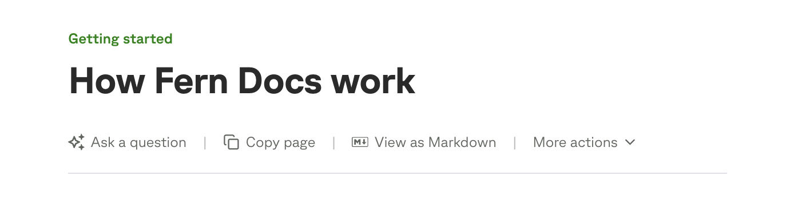
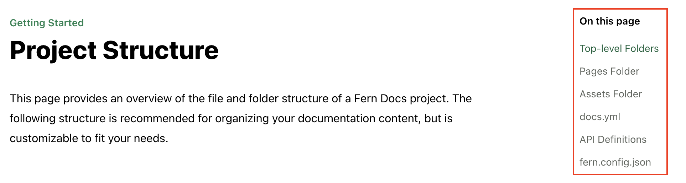
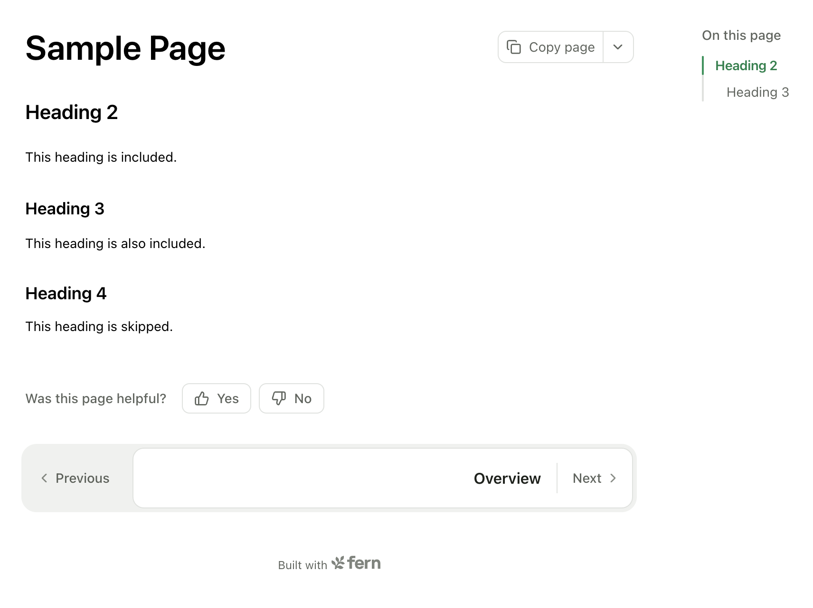
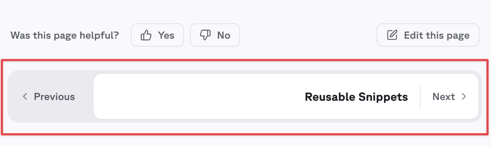

You can optionally use frontmatter to set each page's title, slug override, meta description, a URL to suggest edits to the page, and its OpenGraph image. You can also use frontmatter to disable certain page elements like the table of contents, on-page feedback, and page actions. 

<Tip>
  For advanced styling and functionality customizations beyond frontmatter options, see [custom CSS and JavaScript](/learn/docs/customization/custom-css-js). 
</Tip>

## Frontmatter syntax

Frontmatter must be added to the top of a `.md` or `.mdx` file, before the rest of the content. Use sets of three dashes to indicate the beginning and end of your frontmatter, as shown:

<CodeBlock title="Example frontmatter">
```mdx
---
title: Customize content using frontmatter
subtitle: Set titles, add meta descriptions, and more 
slug: frontmatter
description: Use frontmatter to set the page title, subtitle, slug, meta description, its OpenGraph image, and a URL to suggest edits.
keywords: frontmatter, seo, customization, metadata
og:site_name: Your Company Inc.
og:title: SEO Metadata Title
---
```
</CodeBlock>

### Special characters

Frontmatter uses YAML syntax, but values are also processed as MDX. Some characters need quoting, while others need backslash escaping.

| Characters | Solution | Example |
|------------|----------|---------|
| `:` `#` `&` `*` `!` `%` | Wrap in quotes | `title: "OAuth: A guide"` |
| `{` `}` `<` `>` | Escape with `\` | `title: "Using \<Callout\>"` |
| `"` `'` | Opposite style or `\` | `title: 'The "best" practices'` |

<llms-only>
### Common errors

#### Failed to parse frontmatter

If `fern check` reports `Failed to parse frontmatter`, the [YAML](#frontmatter-syntax) between the `---` markers is invalid. The most common cause is an unquoted value containing one of the [special characters](#special-characters). Wrap the value in quotes or escape the character and re-run `fern check`.
</llms-only>

## Title

<ParamField path="title" type="string" required={false} default="Page name from docs.yml">
  Sets the page's [`<title>` element](https://web.dev/learn/html/document-structure#document_title). This appears in browser tabs, bookmarks, and search results.
</ParamField>

The page title can be set in two ways:

1. In the page's frontmatter:
```mdx title="welcome.mdx"
---
title: Welcome to our docs
---
```

2. From the page name in docs.yml (used if no frontmatter title is set):
```yaml title="docs.yml"
title: Fern | Documentation  # Site-wide title suffix
navigation:
  - page: Welcome          # This becomes the page title
    path: ./pages/welcome.mdx
```

The final title will include the site-wide suffix. For example:
- With frontmatter: "Welcome to our docs - Fern | Documentation"
- Without frontmatter: "Welcome - Fern | Documentation"

## Sidebar title

<ParamField path="sidebar-title" type="string" required={false} default="Page name from docs.yml">
  Sets the title displayed in the sidebar navigation. This takes precedence over sidebar titles defined in `docs.yml`. Use this when you want a shorter navigation label while keeping a descriptive page title.
</ParamField>

The sidebar title can be set in two ways:

1. In the page's frontmatter:
```mdx title="authentication.mdx"
---
title: Getting started with authentication # Browser tab and page header
sidebar-title: Authentication # Shorter version for sidebar only
---
```

2. From the page name in docs.yml (used if no frontmatter `sidebar-title` is set):
```yaml title="docs.yml" 
navigation:
  - page: Authentication guide # Displays in sidebar if no frontmatter override
    path: ./pages/authentication.mdx
```

## Subtitle and description

`subtitle` and `description` are closely related but serve different purposes: `subtitle` is visible on the page, while `description` is metadata for search engines and social previews. When `description` is missing, Fern falls back to `subtitle` for the metadata; a missing `subtitle` simply renders nothing.

<Tabs>
<Tab title="MDX">
<CodeBlock title="Example subtitle and description">
```mdx
---
title: Page-level settings
subtitle: Set titles, descriptions, slugs, layout, and visibility using frontmatter
description: Use frontmatter to set a variety of page properties and metadata.
---
```
</CodeBlock>
</Tab>
<Tab title="Rendered">
<Frame>
  
</Frame>
</Tab>
</Tabs>

<ParamField path="subtitle" type="string" required={false}>
  Renders as visible text below the page title — readers see it directly on the page. When `description` is not set, `subtitle` is also used as the HTML meta description and in [`llms.txt`](/learn/docs/ai-features/llms-txt#page-descriptions).
</ParamField>

<ParamField path="description" type="string" required={false}>
  Sets the HTML [meta description](https://web.dev/learn/html/metadata#description) for [SEO](https://developers.google.com/search/docs/appearance/snippet#meta-descriptions). This text appears in search engine result snippets and in [`llms.txt`](/learn/docs/ai-features/llms-txt#page-descriptions). Unlike `subtitle`, `description` is not visible on the page itself.

  When `description` is not set, Fern uses `subtitle` as the meta description. When [`og:description`](#seo-metadata) is not set, Fern uses `description` as the OpenGraph description for social sharing previews.
</ParamField>


## Last updated

<ParamField path="last-updated" type="string" required={false}>
  Displays a "Last updated" timestamp in the page footer. Use this to show readers when the content was last modified. The value is displayed as-is, so you can use any date format you prefer.

  This field is separate from the timestamps in your [sitemap](/learn/docs/seo/overview#what-fern-handles-automatically), which are managed automatically and used exclusively by search engines.
</ParamField>

<CodeBlock title="Example last-updated">
```mdx
---
title: API Reference
last-updated: December 9, 2025
---
```
</CodeBlock>

<Tip>
Want to automatically update the `last-updated` field when MDX files change? See [Auto-update last updated dates](/learn/docs/developer-tools/auto-update-last-updated-dates) to set up a GitHub Action workflow.
</Tip>

## Slug

<ParamField path="slug" type="string" required={false}>
  Overrides the page's URL path, replacing the section and folder hierarchy while preserving any product or version prefix. Takes precedence over a slug set in `docs.yml`. See [configuring slugs](/learn/docs/seo/configuring-slugs#override-with-a-frontmatter-slug) for detailed examples, including behavior within products and versions.
</ParamField>

## Edit this page

<ParamField path="edit-this-page-url" type="string" required={false}>
  Provide the absolute link to the source `.md` or `.mdx` file in GitHub. Fern uses it to add an `Edit this page` link to the page, which users of your documentation can use to suggest corrections or additions. You can also configure this globally instead of page-by-page - see [global configuration](/learn/docs/configuration/site-level-settings#edit-this-page-configuration).

  This URL works with both [launch modes](/learn/docs/user-feedback#edit-this-page). With `launch: github`, it's the primary link for the edit button. With `launch: dashboard`, it's passed as a fallback so users can also navigate to the source on GitHub from the dashboard screen.
</ParamField>

<CodeBlock title="Example edit-this-page-url">
```mdx
---
title: API Reference
edit-this-page-url: https://github.com/your-org/docs/blob/main/content/api-reference.mdx
---
```
</CodeBlock>

<Frame>
  
</Frame>

## Meta image

<ParamField path="image" type="string" required={false}>
  Configure the OpenGraph image metadata for a page using an absolute URL to an image hosted online. This image appears when your documentation links are shared on social media platforms, using the [OpenGraph](https://ogp.me/) metadata protocol. For more information, see the [web.dev explanation of OpenGraph](https://web.dev/learn/html/metadata#open_graph).
</ParamField>

## Table of contents
### Hide table of contents
<ParamField path="hide-toc" type="boolean" required={false} default={false}>
  Controls the conditional rendering of the table of contents feature on the right-side of the page. Set to `true` to disable this feature.
</ParamField>

<CodeBlock title="Example hide-toc">
```mdx
---
title: Landing Page
hide-toc: true
---
```
</CodeBlock>

<Frame>
  
</Frame>

When the table of contents is hidden, Fern will center the contents of the page by default. To control the layout of the page, see the [layout documentation](#layout).

### Max depth
<ParamField path="max-toc-depth" type="number" required={false}>
  Sets the maximum depth of the table of contents. For example, a value of `3` will only show `<h1>`, `<h2>`, and `<h3>` headings in the table of contents.
</ParamField>

<CodeBlock title="Example max-toc-depth">
```mdx
---
title: Sample Page
max-toc-depth: 3
---
```
</CodeBlock>

<Frame>
  
</Frame>

## Navigation links
<ParamField path="hide-nav-links" type="boolean" required={false} default={false}>
  Controls the conditional rendering of the navigation links (previous, next) at the bottom of the page. Set to true to disable this feature.
  
  This can be set globally in the [global configuration](/learn/docs/configuration/site-level-settings#layout-configuration).
</ParamField>

<CodeBlock title="Example hide-nav-links">
```mdx
---
title: Standalone Guide
hide-nav-links: true
---
```
</CodeBlock>

<Frame>
  
</Frame>

## On-page feedback
<ParamField path="hide-feedback" type="boolean" required={false} default={false}>
  Controls the conditional rendering of the on-page feedback form at the bottom of the page. Set to true to disable this feature.
  
  This can be set globally in the [global configuration](/learn/docs/configuration/site-level-settings#layout-configuration).
</ParamField>

<CodeBlock title="Example hide-feedback">
```mdx
---
title: API Status Page
hide-feedback: true
---
```
</CodeBlock>

<Frame>
  
</Frame>

## Page actions
<ParamField path="hide-page-actions" type="boolean" required={false} default={false}>
  Controls the conditional rendering of page action buttons (Copy Page, View as Markdown, Ask AI, ChatGPT, Claude, Claude Code, Cursor). Set to true to turn off page actions for an individual page.

  Alternatively, configure page actions [for your entire site](/learn/docs/configuration/site-level-settings#page-actions-configuration) in your `docs.yml` file.
</ParamField>

<CodeBlock title="docs/getting-started/overview.mdx">
```mdx
---
title: Overview
hide-page-actions: true
---
```
</CodeBlock>

## Page logo
<ParamField path="logo" type="object" required={false}>
  Override the site-wide logo for a page. Specify different logos for light and dark modes using absolute URLs.
</ParamField>

<CodeBlock title='index.mdx logo example'>
```mdx
---
logo:
  light: https://link-to-image.com/image-light-mode.png
  dark: https://link-to-image.com/image-dark-mode.png
---
```
</CodeBlock>

<Info>
Currently, relative paths are _not_ supported for this field.
</Info>

## Layout
<ParamField path="layout" type="string" required={false} default="guide">
  Sets the page layout. Available options:
  
  - `guide`: The default documentation layout featuring a table of contents on the right side. Ideal for tutorials, how-to guides, and any content that benefits from easy navigation through sections.
  
  - `overview`: A wider layout (50% wider than `guide`) with a table of contents and navigation sidebar. Perfect for landing pages and section overviews that need more horizontal space while maintaining navigation.
  
  - `reference`: A full-width layout optimized for API or SDK reference. Always hides the table of contents so you can add another column, such as code examples. Navigation sidebar remains visible.
  
  - `page`: A distraction-free, full-screen layout that hides both the table of contents and navigation sidebar. Best for standalone content that benefits from focused reading experiences.
  
  - `custom`: A blank canvas layout that removes all default styling constraints. Hides both the table of contents and navigation sidebar, allowing complete control over the page layout.
</ParamField>

## SEO metadata

These fields set SEO metadata for a single page from its frontmatter. You can alternatively set the [same metadata site-wide in `docs.yml`](/learn/docs/configuration/site-level-settings#seo-metadata-configuration).

<Info>
Only the documented SEO fields are added to the HTML `<head>` as meta tags. Custom frontmatter fields won't automatically appear in your page metadata. To add custom metadata, use [custom JavaScript](/learn/docs/customization/custom-css-js#custom-javascript).
</Info>

<CodeBlock title="plantstore-quickstart.mdx">
```mdx
---
title: PlantStore API Quick Start
headline: "Get Started with PlantStore API | Developer Documentation"
keywords: plants, garden, nursery
canonical-url: https://docs.plantstore.dev/welcome
og:site_name: PlantStore Developer Documentation
og:title: "PlantStore API Quick Start Guide"
og:description: "Learn how to integrate with PlantStore's API to manage plant inventory, process orders, and track shipments. Complete with code examples."
og:image: https://plantstore.dev/images/api-docs-banner.png
og:image:width: 1200
og:image:height: 630
twitter:card: summary_large_image
twitter:site: "@PlantStoreAPI"
noindex: false
nofollow: false
---
```
</CodeBlock>

<AccordionGroup>
<Accordion title="Document properties">
<Markdown src="/products/docs/snippets/seo-fields-basic.mdx" />
</Accordion>
<Accordion title="OpenGraph properties">
<Markdown src="/products/docs/snippets/seo-fields-open-graph.mdx" />
</Accordion>
<Accordion title="Twitter properties">
<Markdown src="/products/docs/snippets/seo-fields-twitter.mdx" />
</Accordion>
<Accordion title="Indexing properties">
<Markdown src="/products/docs/snippets/seo-fields-indexing.mdx" />
</Accordion>
</AccordionGroup>

## Availability

<ParamField path="availability" type="string" required={false}>
  Displays an availability badge on the page. When set in frontmatter, it overrides any [availability defined in the navigation](/learn/docs/configuration/navigation#availability) (`docs.yml`). Valid values are: `stable`, `generally-available`, `in-development`, `pre-release`, `deprecated`, or `beta`.
</ParamField>

<CodeBlock title="fern/docs/pages/getting-started/feature.mdx">
```mdx
---
title: New feature
availability: beta
---
```
</CodeBlock>

This is useful when you want to set availability for individual pages without modifying your `docs.yml` navigation configuration, or when you need to override the availability inherited from a parent section or folder.

## Changelog tags

<ParamField path="tags" type="array of strings" required={false}>
  For [changelog pages](/learn/docs/configuration/changelogs) only. Tags allow users to filter changelog entries by specific categories. Define tags as an array of strings in the frontmatter.
</ParamField>

<Markdown src="/products/docs/snippets/changelog-example.mdx" />

