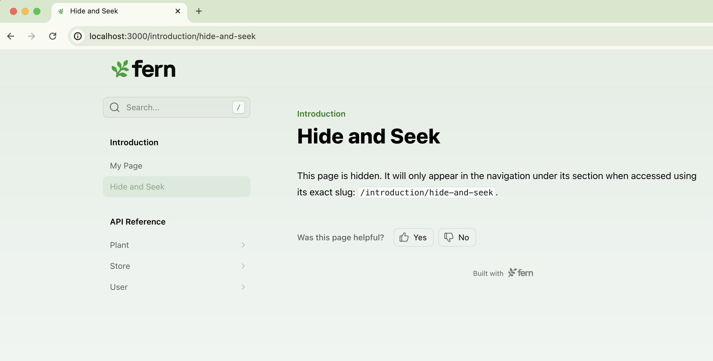

--- 
title: Hiding content in your site
---

<Markdown src="/snippets/agent-directive.mdx"/>


To hide a section, page, or version, you can add `hidden: true` to its configuration. Hidden content is accessible by URL only. 

<Tabs>
<Tab title="Hidden page">
```yaml title="docs.yml"
navigation: 
  - section: Introduction
    contents: 
      - page: My Page
        path: ./pages/my-page.mdx
      - page: Hide and Seek
        hidden: true
        path: ./pages/hide-and-seek.mdx
  - api: API Reference
```

<Frame>

</Frame>
</Tab>
<Tab title="Hidden section">
```yaml title="docs.yml"
navigation: 
  - section: Introduction
    contents: 
      - page: My Page
        path: ./pages/my-page.mdx
  - api: API Reference
  - section: Hidden Section
    hidden: true
    contents: 
      - page: Hide and Seek
        path: ./pages/hide-and-seek.mdx
```

<Frame>

</Frame>
</Tab>
<Tab title="Hidden version">
```yaml title="docs.yml"
versions:
  - display-name: v3
    path: ./versions/v3.yml
  - display-name: v2
    path: ./versions/v2.yml
  - display-name: v1 (Legacy)
    path: ./versions/v1.yml
    hidden: true
```

<Info>The default version (the first version in your `versions` list) can't be hidden.</Info>
</Tab>
</Tabs>
