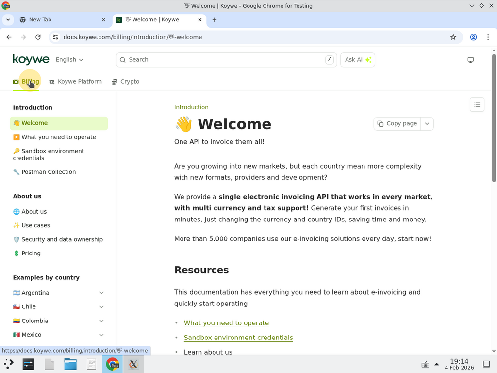
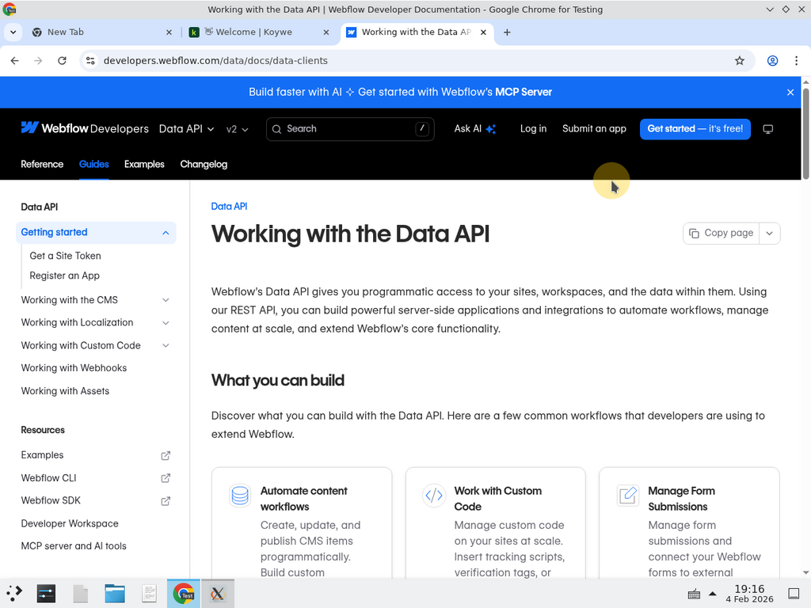
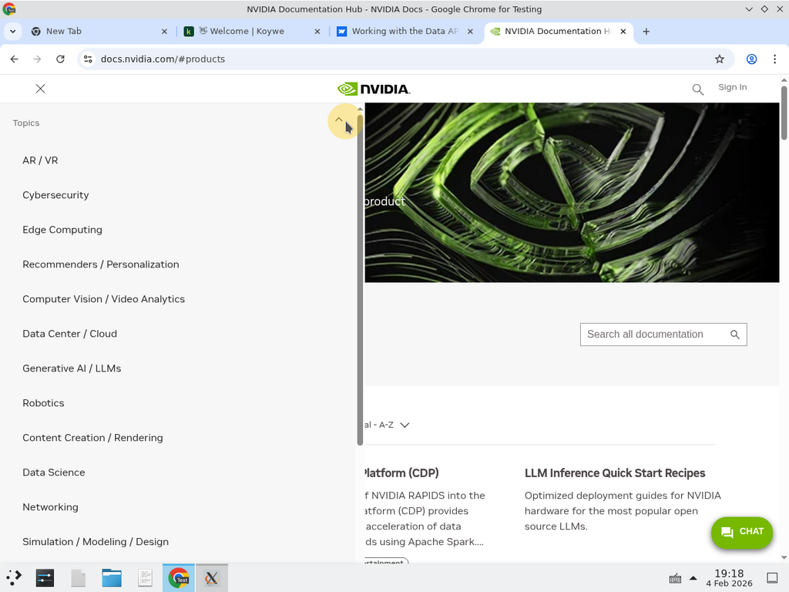

Your documentation's information architecture (IA) determines how users navigate and find content. Fern provides several navigation features that you can combine based on your site's size and complexity.

## Choosing the right structure

The best navigation structure depends on how much content you have and how it's organized. Here's a guide to help you choose:

| Site size | Characteristics | Recommended structure |
|-----------|-----------------|----------------------|
| Small | Single product, few pages, minimal API surface | [Version selector](#small-sites) |
| Medium | Multiple related products or significant content areas | [Product switcher](#medium-sites) with version selector |
| Large | Multiple distinct products with separate documentation needs | [Nested products](#large-sites) with independent versioning |

## Small sites

For documentation sites with a single product and a straightforward content structure, use a **version selector** to let users switch between API or product versions.

<Card title="Example: Koywe" href="https://docs.koywe.com/home">
  A focused documentation site with version-based navigation.
</Card>

<Frame>
  
</Frame>

A small site typically has:

- A single product or API
- Fewer than 50 pages
- One or two major content areas (such as guides and API Reference)
- Linear versioning (v1, v2, v3)

### Recommended configuration

Use [versions](/learn/docs/configuration/versions) to create a dropdown selector for different releases:

```yaml docs.yml
versions:
  - display-name: v3 (Latest)
    path: ./versions/v3.yml
  - display-name: v2
    path: ./versions/v2.yml
    availability: deprecated
```

You can optionally add [tabs](/learn/docs/configuration/tabs) to separate major content areas like guides and API Reference:

```yaml docs.yml
tabs:
  guides:
    display-name: Guides
    icon: fa-regular fa-book
  api:
    display-name: API Reference
    icon: fa-regular fa-code

navigation:
  - tab: guides
    layout:
      - section: Getting started
        contents:
          - page: Introduction
            path: ./pages/intro.mdx
  - tab: api
    layout:
      - api: API Reference
```

### Recommended settings for small sites

For small sites, keep the configuration simple and focus on readability:

```yaml docs.yml
layout:
  tabs-placement: header        # Keep tabs visible at all times
  searchbar-placement: header   # Easy access to search
  content-alignment: center     # Center content for focused reading
```

Consider these page-level settings in your frontmatter for key pages:

```mdx getting-started.mdx
---
title: Getting started
subtitle: Learn how to integrate our API in minutes
layout: guide                   # Standard layout with table of contents
---
```

## Medium sites

For documentation sites with multiple related products or significant content areas, use a **product switcher** combined with version selectors.

<Card title="Example: Webflow" href="https://developers.webflow.com/">
  A multi-product documentation site with product switching and versioning.
</Card>

<Frame>
  
</Frame>

A medium site typically has:

- Two to five related products or APIs
- 50 to 200 pages
- Shared concepts across products
- Independent versioning per product

### Recommended configuration

Use [products](/learn/docs/configuration/products) to create a switcher, with optional versioning per product:

```yaml docs.yml
products:
  - display-name: Apps
    path: ./products/apps.yml
    icon: fa-regular fa-grid-2
    subtitle: Build and publish Webflow Apps
    versions:
      - display-name: v2
        path: ./products/apps/versions/v2.yml
      - display-name: v1
        path: ./products/apps/versions/v1.yml

  - display-name: Data API
    path: ./products/data-api.yml
    icon: fa-regular fa-database
    subtitle: Access and manage site data

  - display-name: Designer API
    path: ./products/designer-api.yml
    icon: fa-regular fa-paintbrush
    subtitle: Extend the Webflow Designer
```

Products can share content through relative paths, so common pages like authentication guides don't need to be duplicated:

```yaml products/apps.yml
navigation:
  - section: Getting started
    contents:
      - page: Authentication
        path: ../shared/authentication.mdx
```

### Recommended settings for medium sites

Medium sites benefit from clear product separation and scoped search:

```yaml docs.yml
layout:
  switcher-placement: header    # Product/version switchers in header for visibility
  tabs-placement: sidebar       # Tabs in sidebar to save header space
  searchbar-placement: header   # Global search access

settings:
  default-search-filters: true  # Scope search to current product by default
```

Use landing pages to help users discover products:

```yaml docs.yml
landing-page:
  page: Welcome
  path: ./pages/welcome.mdx
```

For product overview pages, use the `overview` layout for more horizontal space:

```mdx products/apps/overview.mdx
---
title: Apps overview
subtitle: Build and publish Webflow Apps
layout: overview               # Wider layout for landing-style pages
hide-toc: true                 # Hide table of contents for cleaner look
---
```

## Large sites

For enterprise documentation with multiple distinct products that each have their own documentation needs, use **nested products** with independent navigation structures.

<Card title="Example: NVIDIA" href="https://docs.nvidia.com/">
  An enterprise documentation portal with multiple product families.
</Card>

<Frame>
  
</Frame>

A large site typically has:

- More than five distinct products
- 200+ pages
- Products with different audiences or use cases
- Complex versioning requirements
- Multiple teams contributing to documentation

### Recommended configuration

Structure your products hierarchically, with each product maintaining its own navigation, versioning, and content:

```yaml docs.yml
products:
  - display-name: Platform
    path: ./products/platform/platform.yml
    icon: fa-regular fa-server
    subtitle: Core platform services
    versions:
      - display-name: 2024.1
        path: ./products/platform/versions/2024-1.yml
      - display-name: 2023.2
        path: ./products/platform/versions/2023-2.yml

  - display-name: SDKs
    path: ./products/sdks/sdks.yml
    icon: fa-regular fa-code
    subtitle: Client libraries and tools

  - display-name: AI Services
    path: ./products/ai/ai.yml
    icon: fa-regular fa-brain
    subtitle: Machine learning and AI APIs

  - display-name: Developer Tools
    path: ./products/tools/tools.yml
    icon: fa-regular fa-wrench
    subtitle: CLI and development utilities
```

For large sites, consider these additional features:

- **[Tabs](/learn/docs/configuration/tabs)** within products to separate guides, tutorials, and API Reference
- **[Tab variants](/learn/docs/configuration/tabs#tab-variants)** to show different content for different user roles
- **[Audiences](/learn/docs/configuration/products#add-instance-audiences)** to control which products appear on internal vs. public documentation instances
- **[Landing pages](/learn/docs/configuration/products#add-a-site-level-landing-page)** to help users find the right product

### Recommended settings for large sites

Large sites need careful organization and navigation to help users find content across many products:

```yaml docs.yml
layout:
  page-width: full              # Use full width for complex navigation
  switcher-placement: sidebar   # Keep switchers in sidebar to avoid header clutter
  tabs-placement: sidebar       # Consistent sidebar-based navigation
  searchbar-placement: header   # Global search always accessible

settings:
  default-search-filters: true  # Scope search to current product

theme:
  sidebar: minimal              # Clean sidebar for many navigation items
```

Use audiences to manage internal and external documentation from the same source:

```yaml docs.yml
instances:
  - url: docs.example.com
    audiences:
      - external
  - url: internal-docs.example.com
    audiences:
      - internal
      - external

products:
  - display-name: Internal Tools
    path: ./products/internal-tools.yml
    audiences:
      - internal              # Only visible on internal instance
```

For product landing pages, use the `custom` layout for full control:

```mdx products/platform/landing.mdx
---
title: Platform documentation
layout: custom                 # Full control over page layout
hide-toc: true
hide-nav-links: true
---
```

### File structure for large sites

Organize your repository to match your product hierarchy:

<Files>
  <Folder name="fern" defaultOpen>
    <File name="docs.yml" comment="Site-level configuration" />
    <Folder name="products" defaultOpen>
      <Folder name="platform" defaultOpen>
        <File name="platform.yml" />
        <Folder name="versions">
          <File name="2024-1.yml" />
          <File name="2023-2.yml" />
        </Folder>
        <Folder name="pages" />
      </Folder>
      <Folder name="sdks">
        <File name="sdks.yml" />
        <Folder name="pages" />
      </Folder>
      <Folder name="ai">
        <File name="ai.yml" />
        <Folder name="pages" />
      </Folder>
    </Folder>
    <Folder name="shared" comment="Content shared across products">
      <File name="authentication.mdx" />
      <File name="rate-limits.mdx" />
    </Folder>
  </Folder>
</Files>

## Scaling your documentation

As your documentation grows, you can incrementally adopt more complex navigation structures:

1. **Start simple**: Begin with a version selector and basic sections
2. **Add tabs**: When you have distinct content areas (guides vs. API Reference), introduce tabs
3. **Introduce products**: When you have multiple APIs or product lines, add a product switcher
4. **Scale with audiences**: Use audiences to manage internal and external documentation from the same source

Each navigation feature builds on the previous ones, so you can evolve your information architecture as your documentation needs change.
