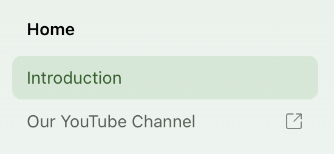

A `page` points at a single Markdown file, a `section` groups entries and can nest more sections, and a `folder` pulls in every file in a directory.

## Add a section

Sections organize your documentation in the left-side nav bar. Each section has a name and a list of `contents`, which can include pages, folders, or nested sections.

```yaml docs.yml
navigation:
  - section: Introduction
    contents:
      - page: My page
        path: ./pages/my-page.mdx
      - page: Another page
        path: ./pages/another-page.mdx
```

Sections can be nested to create multi-level navigation hierarchies.

```yaml docs.yml
navigation:
  - section: Learn
    contents:
      - section: Key concepts
        contents:
          - page: Embeddings
            path: ./docs/pages/embeddings.mdx
          - page: Prompt engineering
            path: ./docs/pages/prompts.mdx
      - section: Generation
        contents:
          - page: Command nightly
            path: ./docs/pages/command.mdx
          - page: Likelihood
            path: ./docs/pages/likelihood.mdx
```

<Frame>

</Frame>

To add an overview page to a section, add a `path` property pointing to an `.mdx` file.

{/* <!-- vale off --> */}
```yaml Section with an overview page {3}
navigation:
  - section: Guides
    path: ./pages/guide-overview.mdx
    contents:
      - page: Simple guide
        path: ./pages/guides/simple.mdx
      - page: Complex guide
        path: ./pages/guides/complex.mdx
```
{/* <!-- vale on --> */}

Sections also support [`slug` and `skip-slug`](/learn/docs/seo/configuring-slugs) to customize URL paths.

<Info title="API Reference section">
Use the special `api` key to create a [generated API Reference section](/learn/docs/api-references/overview).

```yaml docs.yml
navigation:
  - section: Introduction
    contents:
      - page: My page
        path: ./pages/my-page.mdx
  - api: API Reference
```
</Info>

## Add a page

Create an `.md` or `.mdx` file, then add a `page` entry to a section's `contents` with the file path.

```yaml docs.yml
navigation:
  - section: Introduction
    contents:
      - page: My page
        path: ./pages/my-page.mdx
      - page: Another page
        path: ./pages/another-page.mdx
```

## Add a folder

Add a `folder` entry pointing to a directory. Fern auto-discovers all `.md` and `.mdx` files and adds them to the navigation.

<Files>
  <Folder name="pages" defaultOpen>
    <Folder name="guides" defaultOpen>
      <File name="index.mdx" comment="Becomes the section overview page" />
      <File name="quickstart.mdx" />
      <Folder name="advanced" defaultOpen>
        <File name="index.mdx" comment="Becomes the nested section overview" />
        <File name="auth.mdx" />
      </Folder>
    </Folder>
  </Folder>
</Files>

```yaml docs.yml
navigation:
  - section: Introduction
    contents:
      - folder: ./pages/guides
        title: Guides # Optional, defaults to folder name
```

For the pages in a folder, Fern automatically:
- Derives titles and [URL slugs](#slugs-and-url-paths) from filenames
- Creates nested sections from subdirectories
- Sorts pages alphabetically
- Uses `index.mdx` or `index.md` files as section overview pages (case-insensitive)

<Accordion title="Folder configuration options">

Customize folder behavior with these options:

```yaml docs.yml
navigation:
  - folder: ./pages/guides
    title: Guides                  # Display name in sidebar
    slug: user-guides              # Custom URL path
    title-source: frontmatter      # Use frontmatter titles
```

<ParamField path="title" type="string" required={false} toc={true}>
  The title to display for this folder section. If not provided, the folder name is used.
</ParamField>

<ParamField path="title-source" type="'filename' | 'frontmatter'" required={false} default="filename" toc={true}>
  Determines how page and section titles within the folder are derived. By default (`filename`), titles are derived from file names. Set to `frontmatter` to use the `title` field from each file's frontmatter instead (falls back to filename if not set). This per-folder setting overrides the global [`settings.folder-title-source`](/learn/docs/configuration/site-level-settings#settingsfolder-title-source) value.
</ParamField>

<ParamField path="slug" type="string" required={false} toc={true}>
  Overrides the auto-generated URL slug for the folder.
</ParamField>

<ParamField path="skip-slug" type="boolean" required={false} default="false" toc={true}>
  Omits the folder from the URL path, so pages appear at the parent level.
</ParamField>

<ParamField path="position" type="number" required={false} toc={true}>
  Set in page frontmatter to control ordering within the folder. Pages with `position` appear first (sorted numerically), followed by the rest alphabetically.
  ```yaml page frontmatter
  ---
  title: Quickstart
  position: 1
  ---
  ```
</ParamField>
</Accordion>

## Slugs and URL paths

Fern builds each page's URL by combining slugs from every level of its navigation hierarchy — section, folder, tab, version, and product. Each level gets an auto-generated slug from its display name, or from the filename for [folder-based navigation](#add-a-folder). You can [rename a slug, skip a level, or override the path in a page's frontmatter](/learn/docs/seo/configuring-slugs).

```yaml docs.yml
navigation:
  - section: Get Started        # slug renamed to "start"
    slug: start
    contents:
      - section: Guides         # skipped — omitted from the URL
        skip-slug: true
        contents:
          - page: Quickstart    # slug renamed to "quick"
            slug: quick
            path: ./pages/quickstart.mdx
```

The **Quickstart** page is hosted at `/start/quick`. The renamed section and page slugs apply, and the skipped **Guides** slug drops out of the path.

## Hiding content

To hide a page, folder, or section, add `hidden: true`. Hidden content (including all pages within a folder) is still accessible via direct URL but is excluded from search and won't be indexed.

{/* <!-- vale off --> */}
```yaml docs.yml {7, 10, 12}
navigation:
  - section: Introduction
    contents:
      - page: My page
        path: ./pages/my-page.mdx
      - page: Hidden page
        hidden: true
        path: ./pages/my-hidden-page.mdx
      - folder: .pages/features
        title: Hidden folder
        hidden: true
  - section: Hidden sections
    hidden: true
    contents:
      - page: Another hidden page
        path: ./pages/also-hidden.mdx
```
{/* <!-- vale on --> */}

## Availability

Set availability badges on pages, sections, or folders to indicate their lifecycle status. The badge is shown in the page header; the value controls the badge label and style:

| Value | Badge |
|-------|-------|
| `beta` | Yes |
| `pre-release` | Yes |
| `in-development` | Yes |
| `deprecated` | Yes, and the title is struck through in the sidebar |
| `stable` | No (default available state) |
| `generally-available` | No (default available state) |

To render availability badges in the sidebar navigation in addition to the page header, [set `layout.show-nav-availability-badges: true` in `docs.yml`](/learn/docs/configuration/site-level-settings#layoutshow-nav-availability-badges).

Pages inherit availability from their parent section or folder unless overridden by:
- A per-page `availability` setting in `docs.yml` (shown below)
- [Page frontmatter availability](/learn/docs/configuration/page-level-settings#availability), which takes precedence over all `docs.yml` availability


```yaml docs.yml {3, 11, 14}
navigation:
  - section: Developer resources
    availability: generally-available
    contents:
      - page: Code examples # Inherits generally-available
        path: ./pages/code-examples.mdx
      - folder: ./pages/cli-tools # Inherits generally-available
        title: CLI tools
      - page: Testing framework
        path: ./pages/testing-framework.mdx
        availability: beta # Overrides section-level availability
      - folder: ./pages/performance-monitoring
        title: Performance monitoring
        availability: in-development # Overrides section-level availability
```
<Note>
  If you have different versions of your docs, section, folder, and page availability should be set in [the `.yml` files that define the navigational structure for each version](/learn/docs/configuration/versions#define-your-versions).
</Note>

[API Reference sections and endpoints](/learn/docs/api-references/customize-api-reference-layout#adding-availability) render the same sidebar badges based on their availability.

## Collapsed sections or folders

By default, sections and folders are expanded and not collapsible. Use the `collapsed` property to control how they appear in the sidebar when the page loads.

| Value | Behavior |
|---|---|
| `true` | Collapsed on load. The user can expand it. |
| `open-by-default` | Expanded on load, but collapsible. The section displays a toggle so the user can collapse it. |

{/* <!-- vale off --> */}
```yaml {8, 10, 17} Example config with collapsed sections
navigation:
  - section: Getting started # expanded, not collapsible (default)
    contents:
      - page: Introduction
        path: ./pages/intro.mdx
      - folder: ./pages/features
        title: Features
        collapsed: true # Folder starts collapsed
  - section: Advanced topics
    collapsed: true # Section starts collapsed
    contents:
      - page: Custom CSS
        path: ./pages/advanced/css.mdx
      - page: Analytics
        path: ./pages/advanced/analytics.mdx
  - section: API guides
    collapsed: open-by-default # Section starts expanded, but can be collapsed by the user
    contents:
      - page: Authentication
        path: ./pages/api/auth.mdx
      - page: Pagination
        path: ./pages/api/pagination.mdx
```
{/* <!-- vale on --> */}

## Sidebar icons

Add icons next to sections, pages, and folders using the `icon` key.

<Markdown src="/products/docs/snippets/icons.mdx" />

{/* <!-- vale off --> */}
```yaml Example config with different icon files {3, 6, 10-11, 14}
navigation:
  - section: Home
    icon: fa-regular fa-home  # Font Awesome icon
    contents:
      - page: Introduction
        icon: ./assets/icons/intro-icon.svg  # Custom image file
        path: ./pages/intro.mdx
      - folder: .pages/features
        title: Custom features
        icon: "<svg xmlns='http://www.w3.org/2000/svg' viewBox='0 0 24 24' fill='currentColor'><path d='M12 2L2 7v10c0 5.55 3.84 10.74 9 12 5.16-1.26 9-6.45 9-12V7l-10-5z'/></svg>"  # Inline SVG
        path: ./pages/custom.mdx
  - api: API Reference
    icon: fa-regular fa-puzzle
```
{/* <!-- vale on --> */}

## Links

You can add a link to an external page within your sidebar navigation with the following configuration:

{/* <!-- vale off --> */}
```yaml title="docs.yml"
navigation:
  - section: Home
    contents:
      - page: Introduction
        path: ./intro.mdx
      - link: Our YouTube channel
        href: https://www.youtube.com/
```
{/* <!-- vale on --> */}

<Frame>
  
</Frame>

### Link target

<Markdown src="/products/docs/snippets/link-target.mdx" />
