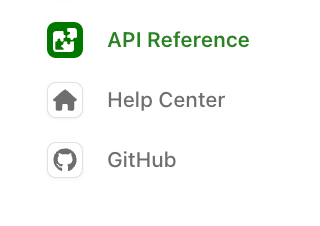

Tabs let you group sections of your documentation together, while tab variants allow you to display different content perspectives within a single tab.

## Tabs

Add `tabs` to group sections together. The example below shows tabs for `Help Center`, `API Reference`, and an external link to `Github`. Each tab has a `display-name` and `icon`.

In the `navigation` section, each tab reference must include either a `layout` (for content) or `variants` (for [tab variants](#tab-variants)). Tabs with an `href` property are external links and must not include `layout` or `variants`.

<CodeBlock>
{/* <!-- vale off --> */}

```yaml title="docs.yml"
tabs: 
  api: 
    display-name: API Reference
    icon: puzzle # Font Awesome icon
  help:
    display-name: Help center
    icon: ./assets/icons/help-icon.svg  # Custom image file
  github:
    display-name: GitHub
    icon: brands github # Font Awesome icon
    href: https://github.com/fern-api/fern
    target: _blank # Link opens in a new tab
    
navigation: 
  - tab: api
    layout: 
      - section: Introduction
        contents: 
          - page: My page
            path: my-page.mdx
      - api: API Reference   
  - tab: help
    layout: 
      - section: Help center
        contents: 
          - page: Contact us
            path: contact-us.mdx
  - tab: github
```
{/* <!-- vale on --> */}
</CodeBlock>

<Note title="Tab icons">
<Markdown src="/products/docs/snippets/icons.mdx" />
</Note>

Here's an example of how a tabs implementation renders:

<Frame>
  
</Frame>

### Tabs placement and styling

Tabs display in the left sidebar by default. Use [`theme.tabs`](/learn/docs/configuration/site-level-settings#theme-configuration) to control placement, style, and alignment.

<CodeBlock title="docs.yml">
```yaml
theme:
  tabs:
    style: bubble        # "default" (underline) or "bubble" (pill-shaped)
    alignment: center    # "left" or "center" (center only applies to header tabs)
    placement: header    # "header" or "sidebar"
```
</CodeBlock>

### Tab properties

<ParamField path="display-name" type="string" required={true} toc={true}>
  The name shown in the tab header
</ParamField>

<ParamField path="icon" type="string" toc={true}>
  <Markdown src="/products/docs/snippets/icons.mdx" />
</ParamField>

<ParamField path="slug" type="string" toc={true}>
  Custom URL slug for the tab
</ParamField>

<ParamField path="skip-slug" type="boolean" toc={true}>
  Exclude the tab slug from URLs
</ParamField>

<ParamField path="hidden" type="boolean" toc={true}>
  Hide the tab from navigation. See [Hiding content](/learn/docs/navigation/hiding-content#hiding-a-section-tab-tab-variant-or-version) for details.
</ParamField>

<ParamField path="layout" type="list" toc={true}>
  Navigation structure for the tab's content. Required unless the tab uses `variants` or `href`.
</ParamField>

<ParamField path="variants" type="list" toc={true}>
  List of [tab variants](#tab-variants) for displaying different content perspectives. Use instead of `layout`.
</ParamField>

<ParamField path="href" type="string" toc={true}>
  External URL. When set, clicking the tab redirects to this URL. Tabs with `href` must not include `layout` or `variants`.
</ParamField>

<ParamField path="target" type="string" toc={true}>
  Where the link opens. One of `_blank`, `_self`, `_parent`, or `_top`.
</ParamField>

<ParamField path="changelog" type="string" toc={true}>
  Path to a [changelog](/learn/docs/configuration/changelogs) folder, relative to the YAML file where it is set (e.g., `docs.yml`)
</ParamField>

<ParamField path="viewers" type="string | list" toc={true}>
  Role-based access control for the tab
</ParamField>

<ParamField path="orphaned" type="boolean" toc={true}>
  When true, roles don't inherit from parent elements
</ParamField>

<ParamField path="feature-flag" type="string | object" toc={true}>
  Conditional display configuration
</ParamField>

<llms-only>
### Common errors

#### Tab "X" is missing from the tabs configuration.

The [`navigation`](/learn/docs/configuration/navigation) list references a tab key that isn't declared under the top-level `tabs` object. Add the tab to `tabs:` in `docs.yml` (with at least a [`display-name`](#display-name)), or update the `- tab:` reference in `navigation` to match an existing key.

```yaml title="docs.yml"
tabs: # every tab referenced in `navigation` must be declared here
  api:
    display-name: API Reference
  help:
    display-name: Help center  

navigation:
  - tab: api
    layout: [...]
  - tab: help
    layout: [...]
```

#### Tab "X" has both a href and layout. Only one should be used.

A tab entry combines [`href`](#href) with [`layout`](#layout) or [`variants`](#variants). Use `href` for external links, or `layout`/`variants` for internal content — not both.

```yaml title="docs.yml"
tabs:
  github:
    display-name: GitHub
    href: https://github.com/fern-api/fern  # external link — no `layout` or `variants`

navigation:
  - tab: github
```

#### Tab "X" is missing a href, layout, or variants.

Every tab in [`navigation`](/learn/docs/configuration/navigation) must point somewhere. Add a [`layout`](#layout), [`variants`](#variants), or [`href`](#href) to the tab entry.

```yaml title="docs.yml"
navigation:
  - tab: api
    layout:  # points the tab at internal content
      - section: Introduction
        contents:
          - page: My page
            path: my-page.mdx
```
</llms-only>

## Tab variants

Tab variants let you display different content variations within a single tab, and [support RBAC](/learn/docs/authentication/features/rbac). This is useful for showing different user types, implementation approaches, or experience levels without creating separate tabs.

<Frame>
  <video
    autoPlay
    muted
    loop
  >
    <source src="assets/merge-tab-variants.mp4" type="video/mp4" />
  </video>
</Frame>

<Tip title="When to use variants vs. tabs">
  Use **variants** for different perspectives on the same content area (REST vs. GraphQL, beginner vs. advanced). Use **tabs** for completely different documentation sections (guides vs. API Reference).
</Tip>

### Basic usage

Define a tab with a `variants` property instead of a `layout` property. Each variant has its own title and layout. The example below shows two variants for the `Help Center` tab.

```yaml title="docs.yml" startLine=20 {22-34}
tabs: 
  api: 
    display-name: API Reference
    icon: puzzle
  help:
    display-name: Help center
    icon: home
  github:
    display-name: GitHub
    icon: brands github
    href: https://github.com/fern-api/fern
    
navigation: 
  - tab: api
    layout: 
      - section: Introduction
        contents: 
          - page: My page
            path: my-page.mdx
      - api: API Reference   
  - tab: help
    variants:
      - title: For developers
        layout:
          - section: Getting started
            contents:
              - page: Quick start
                path: ./pages/dev-quickstart.mdx
      - title: For product managers
        layout:
          - section: Getting started
            contents:
              - page: Overview
                path: ./pages/pm-overview.mdx
  - tab: github
```

### Variant properties

<ParamField path="title" type="string" required={true} toc={true}>
  Display name for the variant
</ParamField>

<ParamField path="layout" type="list" required={true} toc={true}>
  Navigation structure using the same format as regular tab layouts
</ParamField>

<ParamField path="subtitle" type="string" toc={true}>
  Text displayed below the variant title
</ParamField>

<ParamField path="icon" type="string" toc={true}>
  <Markdown src="/products/docs/snippets/icons.mdx" />
</ParamField>

<ParamField path="slug" type="string" toc={true}>
  Custom URL slug for the variant
</ParamField>

<ParamField path="skip-slug" type="boolean" toc={true}>
  Exclude the variant slug from URLs
</ParamField>

<ParamField path="hidden" type="boolean" toc={true}>
  Hide the variant from navigation. See [Hiding content](/learn/docs/navigation/hiding-content#hiding-a-section-tab-tab-variant-or-version) for details.
</ParamField>

<ParamField path="default" type="boolean" toc={true}>
  When true, this variant displays by default. If not specified, the first variant in the list is used.
</ParamField>

<ParamField path="viewers" type="string | list" toc={true}>
  Role-based access control for the variant
</ParamField>

<ParamField path="orphaned" type="boolean" toc={true}>
  When true, roles don't inherit from parent elements
</ParamField>

<ParamField path="feature-flag" type="string | object" toc={true}>
  Conditional display configuration
</ParamField>
