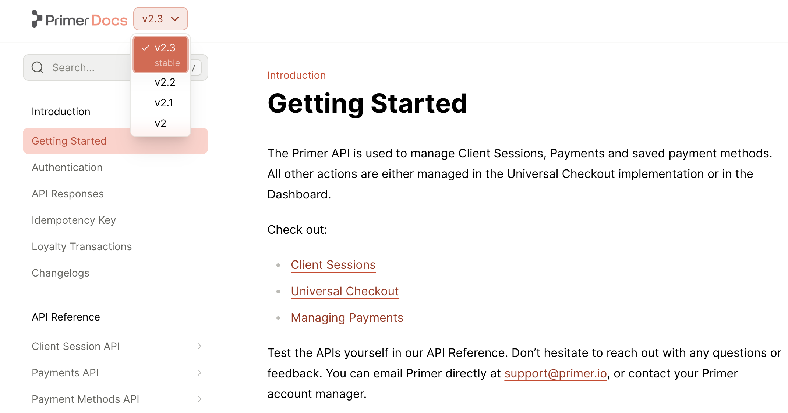

<Markdown src="/snippets/team-plan.mdx"/>

Each version of your docs can contain its own distinct tabs, sections, pages, and API references. Versions can also share content.

<Frame>

</Frame>

<Note>
  For displaying version-specific content within a single page, use the [`<Versions>` component](/learn/docs/writing-content/components/versions). You can use site-wide versioning and the `<Versions>` component independently or together.
</Note>


## Add versions to your docs

<Steps toc={true}>
<Step title="Define your versions">

Create a `versions` folder inside of your `fern` folder. To specify the contents of each version, add a `.yml` file to the `versions` folder to define the navigational structure of that version. Make sure to include the `navigation` and `tabs` properties, if applicable. 

<CodeBlock>
```bash {7-11}
fern/
  ├─ fern.config.json
  ├─ generators.yml
  ├─ docs.yml
  ├─ pages/
    ├─ ...
  └─ versions/
    ├─ latest/pages/...
    ├─ latest.yml
    ├─ v2/pages/...
    └─ v2.yml
```
</CodeBlock>

Version-specific `yml` files:

<Markdown src="/products/docs/snippets/version-specific-yml-files.mdx" />

<Note>You can also have [multiple products, some versioned and some unversioned](/docs/configuration/products).</Note>
</Step>
<Step title="Add your version configuration">

Define a version in the top-level `docs.yml` by adding an item to the `versions` list and specifying the `display-name` and `path`.

<CodeBlock title="docs.yml">
```yaml
versions: 
  - display-name: Latest          # shown in the dropdown
    path: ./versions/latest.yml   # relative path to the version file
  - display-name: V2
    path: ./versions/v2.yml
```
</CodeBlock>

<Markdown src="/products/docs/snippets/default-version.mdx" />

</Step>
<Step title="Indicate availability">

<Markdown src="/products/docs/snippets/version-availability.mdx" />

<CodeBlock title="docs.yml">
```yaml {4}
versions: 
  - display-name: Latest          
    path: ./versions/latest.yml   
    availability: beta
  - display-name: v2
    path: ./versions/v2.yml
    availability: stable
```
</CodeBlock>

</Step>
<Step title="Remove extra navigation from docs.yml">

If your `docs.yml` file includes a `navigation` field or a `tabs` field, be sure to remove. Those fields should now belong in the version-specific `.yml` files.
</Step>
</Steps>

## Customize version behavior

These optional settings let you control how versions appear in URLs and who can access them.

<AccordionGroup>
<Accordion title="Change version slugs" toc={true}>

By default, Fern generates URL slugs from the `display-name` by converting it to lowercase and replacing spaces with hyphens. For example, a version with `display-name: v3 (Deprecated)` would get the slug `v-3-deprecated` in the URL path.

To customize the URL slug for a version, use the `slug` property:

<CodeBlock title="docs.yml">
```yaml {7,11}
versions:
  - display-name: v4 (Latest)
    path: ./versions/latest.yml
    availability: stable
  - display-name: v3 (Deprecated)
    path: ./versions/v3.yml
    slug: v3
    availability: deprecated
  - display-name: v2
    path: ./versions/v2.yml
    slug: v2
    availability: deprecated
```
</CodeBlock>

In this example, setting `slug: v3` produces URLs like `/docs/v3/getting-started`.

</Accordion>
<Accordion title="Add instance audiences" toc={true}>

Control which versions appear in each [documentation instance](/docs/configuration/site-level-settings#instances-configuration) by tagging them with audiences. This enables separate sites for different user groups (e.g., internal developers, beta testers, public customers).

Content is filtered based on audience tags:

- **Match**: Content with an audience matching the instance audience is included
- **No match**: Content with a non-matching audience is excluded
- **No audience**: Content without an audience tag is included by default

Define audiences for instances and versions in `docs.yml`:

<CodeBlock title="docs.yml">

```yaml maxLines=10
instances:
  - url: internal.docs.buildwithfern.com
    audiences:
      - internal # Only shows content tagged with 'internal'
  - url: public.docs.buildwithfern.com
    audiences:
      - public # Only shows content tagged with 'public'
versions:
  - display-name: v3
    path: ./versions/v3.yml
    audiences:
      - public # This version only appears on the public instance
  - display-name: v2 (Internal)
    path: ./versions/v2.yml
    audiences:
      - internal # This version only appears on the internal instance
```
</CodeBlock>

</Accordion>
<Accordion title="Hide versions from navigation" toc={true}>

You can hide specific versions from navigation, search, and indexing while keeping them accessible via direct URL by setting `hidden: true`. This is useful for deprecating previous versions or maintaining internal-only versions without removing them entirely.

<CodeBlock title="docs.yml">
```yaml {8}
versions:
  - display-name: v3
    path: ./versions/v3.yml
  - display-name: v2
    path: ./versions/v2.yml
  - display-name: v1 (Legacy)
    path: ./versions/v1.yml
    hidden: true
```
</CodeBlock>

<Info>The default version (the first version in your `versions` list) can't be hidden.</Info>

</Accordion>
<Accordion title="Conditionally render content">
To conditionally render content within a page based on the current version, use the [`<If>` component](/learn/docs/writing-content/components/if#by-version).

```jsx Markdown
<If versions={["v2"]}>
  This content only appears in version v2.
</If>
```
</Accordion>
<Accordion title="Scope search by version" toc={true}>
Search results can be [scoped to the reader's current version](/learn/docs/customization/search#scope-search-by-product-or-version) — either boosted in ranking or filtered by default — through the `settings.search` object in `docs.yml`.
</Accordion>
</AccordionGroup>

## Customize version styling

Use custom CSS to style the version selector to match your brand.

<AccordionGroup>
<Accordion title="Selector styling" toc={true}>

You can directly customize the appearance of the version selector by targeting the `fern-version-selector` CSS class.

<Markdown src="/products/docs/snippets/common-selector-styling.mdx" />

```css
.fern-version-selector {
  transform: translateY(1px);
  border-radius: 1000px;
  border: 1px solid var(--border);
}
```
</Accordion>
<Accordion title="Dropdown styling" toc={true}>

The dropdown menu for the version selector can be customized using the `fern-version-selector-radio-group` CSS class.

  <Frame>
    
  </Frame>
</Accordion>
</AccordionGroup>
