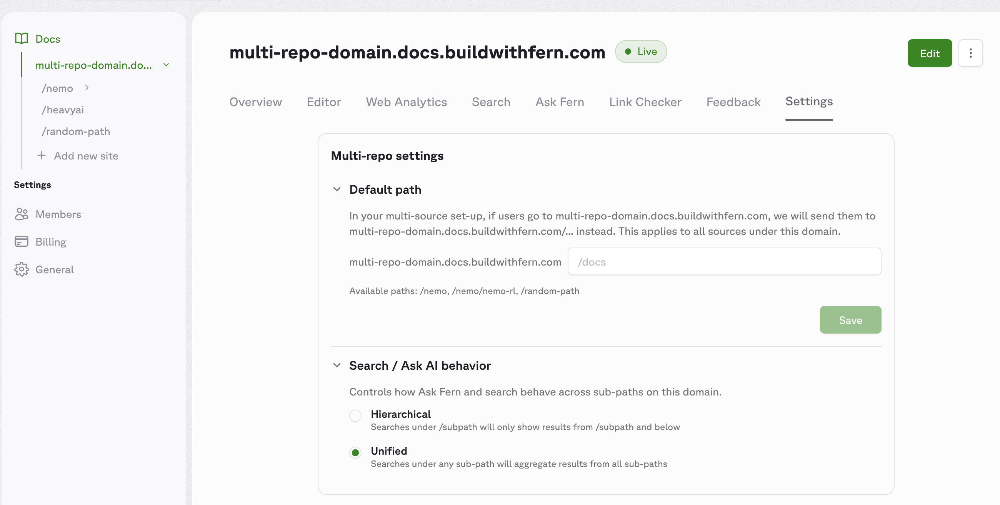

<Markdown src="/snippets/enterprise-plan.mdx" />

Multi-source documentation publishes a single docs site to a custom domain, split into multiple sub-paths. Each sub-path is sourced from its own repository, so teams ship updates independently while a shared [global theme](/learn/docs/customization/global-themes) keeps branding consistent across the site.

## How it works

Each repository declares a unique basepath under the shared domain in its `docs.yml`. Running `fern generate --docs` from that repository updates only its sub-path — every other sub-path stays untouched.

Three pieces of configuration make this work:

1. **`multi-source: true`** set on the instance in each repository's `docs.yml`, with `url` and `custom-domain` ending in the same basepath.
2. **[Global themes](/learn/docs/customization/global-themes)** live in a dedicated control repository and are referenced by name from each source repository's `docs.yml`.
3. **Multi-repo settings** in the [Fern Dashboard](https://dashboard.buildwithfern.com) control the domain's default path and search/Ask AI scope.

For example, NVIDIA's docs are split across multiple independent repositories, each publishing to its own sub-path on `docs.nvidia.com`:

- [docs.nvidia.com/nvcf](https://docs.nvidia.com/nvcf)
- [docs.nvidia.com/brev](https://docs.nvidia.com/brev)
- [docs.nvidia.com/aiperf](https://docs.nvidia.com/aiperf)
- [docs.nvidia.com/nemo/curator](https://docs.nvidia.com/nemo/curator)

Each sub-path is published independently, but end users see a single unified site. 

<Tip>
  The root `docs.nvidia.com` itself is a separate site outside the Fern setup — multi-source covers only the sub-paths. A Fern-published landing page is optional ([example](#example-a-live-multi-source-site)), and any combination of sub-paths works, including just two.
</Tip>

## Set up multi-source docs

<Steps>

<Step title="Create a control repository for the global theme">

The control repository is a dedicated Fern project that holds your global theme — the shared logo, colors, fonts, layout, and site-level settings that every source repository inherits. Define those settings in its `docs.yml`, then export and upload the theme:

```bash
fern docs theme export
fern docs theme upload --name my-org-theme
```

See [Global themes](/learn/docs/customization/global-themes) for the full setup guide and the list of fields the theme controls.

</Step>

<Step title="Configure each repository">

Each sub-path has its own repository (typically owned by a different team), separate from the control repository in Step 1. In each repository's `docs.yml`:

- Reference the global theme by name: `global-theme: my-org-theme`.
- Declare an instance with `multi-source: true` and a unique basepath on the shared domain. That basepath must appear at the end of both `url` and `custom-domain`.

For example, here are two repositories on the same shared domain — one at `/product-a`, one at `/product-b`:

<Tabs>
<Tab title="Product A repo">
```yaml docs.yml
global-theme: my-org-theme

instances:
  - url: example.docs.buildwithfern.com/product-a
    custom-domain: docs.example.com/product-a
    multi-source: true
```
</Tab>
<Tab title="Product B repo">
```yaml docs.yml
global-theme: my-org-theme

instances:
  - url: example.docs.buildwithfern.com/product-b
    custom-domain: docs.example.com/product-b
    multi-source: true
```
</Tab>
</Tabs>

</Step>

<Step title="Publish from each repository">

Each repository publishes independently:

```bash
fern generate --docs
```

Only the sub-path owned by that repository is updated. Every other sub-path is unaffected.

</Step>

<Step title="Configure domain settings in the Dashboard">

Open the [Fern Dashboard](https://dashboard.buildwithfern.com) and select your top-level domain (e.g., `docs.example.com`) — these settings apply to the whole domain, not per sub-path. In the **Settings** tab, navigate to the **Multi-repo settings** card. 

Configure the following:

- **Default path** *(optional)* — sets where users land when they visit the bare root of your domain. Set this when a Fern-managed page should serve as the root. For example, if your homepage lives at the `/home` sub-path, set the default path to `/home` so `docs.example.com` redirects to `docs.example.com/home`. Skip this if the root isn't Fern-managed, like NVIDIA's `docs.nvidia.com` (a separate marketing site outside the Fern setup).
- **Search / Ask AI behavior** — controls how [Ask Fern](/learn/docs/ai-features/ask-fern/overview) and search work across sub-paths. Two modes are available:
  - **Hierarchical** — searches under `/subpath` only return results from `/subpath` and below. Use when each sub-path covers a distinct product and users expect scoped results.
  - **Unified** — searches under any sub-path return results from all sub-paths. Use when the sub-paths are parts of a single product and users benefit from cross-cutting results.

<Frame>

</Frame>

</Step>

</Steps>

## Example: A live multi-source site

<Tip>
Browse the live site at [multi-source.docs.buildwithfern.com](https://multi-source.docs.buildwithfern.com) and the source at [fern-api/docs-examples/multi-source](https://github.com/fern-api/docs-examples/tree/main/multi-source).
</Tip>

This is the alternative shape to NVIDIA's setup: a Fern-managed homepage at the bare root, plus team sub-paths underneath. The example uses six independent `fern/` projects on one shared domain — a homepage at `/`, a `/seeds` team hub with two nested sub-children, and standalone `/greenhouses` and `/nursery` teams:

<Files>
  <Folder name="multi-source.docs.buildwithfern.com" defaultOpen>
    <File name="/" comment="homepage" />
    <Folder name="/seeds" defaultOpen comment="Seeds team hub">
      <File name="/seeds/sunflower" comment="Sunflower sub-team" />
      <File name="/seeds/tomato" comment="Tomato sub-team" />
    </Folder>
    <File name="/greenhouses" comment="Greenhouses team" />
    <File name="/nursery" comment="Nursery team" />
  </Folder>
</Files>

<Note>
The unit is one `fern/` folder per sub-path, not one repository per sub-path. A repo-per-sub-path layout (often one per team) is the most common shape, but multiple `fern/` folders in a single repo work too.
</Note>

All six projects share `global-theme: plantstore-theme` and set `multi-source: true` — they differ only in their basepath. Sub-paths can themselves contain nested sub-paths: `/seeds/sunflower` and `/seeds/tomato` are independently published projects that live under `/seeds`.

The example uses Fern's preview domain (`*.docs.buildwithfern.com`), so no `custom-domain` is set. A production deployment typically adds `custom-domain: docs.example.com/...` to each instance.

<Tabs>
<Tab title="Homepage">
```yaml homepage/fern/docs.yml
global-theme: plantstore-theme

instances:
  - url: multi-source.docs.buildwithfern.com
    multi-source: true

navigation:
  - page: Home
    path: ./pages/home.mdx
```

The homepage `home.mdx` can use cards to direct users to each team's docs:

```jsx home.mdx
<CardGroup>
  <Card title="Seeds" icon="fa-regular fa-seedling" href="/seeds">
    A hub with nested sub-children at `/seeds/sunflower` and `/seeds/tomato`.
  </Card>
  <Card title="Greenhouses" icon="fa-regular fa-warehouse" href="/greenhouses">
    Climate control and monitoring.
  </Card>
  <Card title="Nursery" icon="fa-regular fa-leaf" href="/nursery">
    Plant care and propagation.
  </Card>
</CardGroup>
```
</Tab>
<Tab title="Seeds (hub)">
```yaml seeds/fern/docs.yml
global-theme: plantstore-theme

instances:
  - url: multi-source.docs.buildwithfern.com/seeds
    multi-source: true

navigation:
  - section: Getting started
    contents:
      - page: Overview
        path: ./pages/overview.mdx
```
</Tab>
<Tab title="Sunflower (nested)">
```yaml seeds-sunflower/fern/docs.yml
global-theme: plantstore-theme

instances:
  - url: multi-source.docs.buildwithfern.com/seeds/sunflower
    multi-source: true

navigation:
  - section: Getting started
    contents:
      - page: Overview
        path: ./pages/overview.mdx
```
</Tab>
<Tab title="Greenhouses">
```yaml greenhouses/fern/docs.yml
global-theme: plantstore-theme

instances:
  - url: multi-source.docs.buildwithfern.com/greenhouses
    multi-source: true

navigation:
  - section: Getting started
    contents:
      - page: Overview
        path: ./pages/overview.mdx
```
</Tab>
</Tabs>

## Properties

<ParamField path="instances.multi-source" type="boolean" required={false} default={false}>
  When `true`, the CLI uses basepath-aware publishing so multiple repositories can coexist under one custom domain. The `url` and `custom-domain` must share the same basepath when this is enabled.
</ParamField>

<ParamField path="global-theme" type="string" required={false}>
  The name of a [global theme](/learn/docs/customization/global-themes) to apply. The CLI fetches the named theme from Fern's registry at publish time and merges its branding fields into the local `docs.yml`. See [What the theme controls](/learn/docs/customization/global-themes#what-the-theme-controls) for the full list of fields.
</ParamField>
