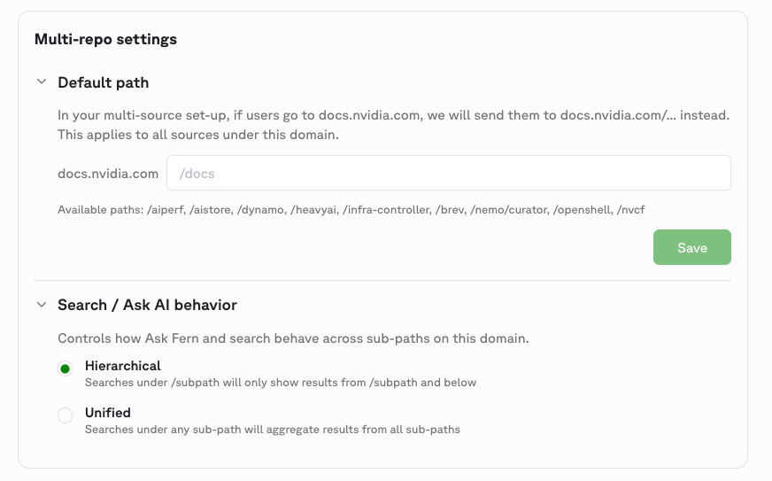

Multi-source documentation lets multiple teams publish to the same custom domain from independent repositories. Each team owns its own `docs.yml` and content, while a shared [global theme](/learn/docs/customization/global-themes) keeps branding consistent across every sub-path. Search and AI behavior can be configured per domain in the [Fern Dashboard](https://dashboard.buildwithfern.com).

This is useful when your organization has separate teams or products that each maintain their own documentation but need to present a unified site to end users, for example `docs.example.com/product-a` and `docs.example.com/product-b`.

## How it works

Each team's repository contains its own Fern project with a `docs.yml` that declares a unique basepath on the shared domain. When a team runs `fern generate --docs`, only that team's sub-path is updated — other sub-paths are unaffected.

Three features work together to make this possible:

1. **`multi-source` on instances** — tells the CLI to use basepath-aware publishing so multiple repositories can coexist under one domain.
2. **[Global themes](/learn/docs/customization/global-themes)** — a central repository defines the shared look and feel (logo, colors, fonts, layout, CSS, JS). Child repositories reference the theme by name and inherit those settings automatically.
3. **Dashboard multi-repo settings** — the [Fern Dashboard](https://dashboard.buildwithfern.com) lets you configure the default path and search behavior for the domain.

## Set up multi-source docs

<Steps>

<Step title="Create a control repository for your theme">

Pick one repository to own your organization's branding. Define your logo, colors, fonts, layout, and other site-level settings in its `docs.yml`, then export and upload the theme:

```bash
fern docs theme export
fern docs theme upload --name my-org-theme
```

See [Global themes](/learn/docs/customization/global-themes) for the full setup guide and the list of fields the theme controls.

</Step>

<Step title="Configure each team's repository">

In each team's `docs.yml`, set `multi-source: true` on the instance and reference the shared theme. Each repository should declare a unique basepath on the shared domain:

<Tabs>
<Tab title="Team A">
```yaml docs.yml
global-theme: my-org-theme

instances:
  - url: example.docs.buildwithfern.com/product-a
    custom-domain: docs.example.com/product-a
    multi-source: true
```
</Tab>
<Tab title="Team B">
```yaml docs.yml
global-theme: my-org-theme

instances:
  - url: example.docs.buildwithfern.com/product-b
    custom-domain: docs.example.com/product-b
    multi-source: true
```
</Tab>
</Tabs>

<Warning>
When `multi-source: true` is set, the `url` and `custom-domain` must share the same basepath. For example, if your `custom-domain` is `docs.example.com/product-a`, your `url` must also end in `/product-a`.
</Warning>

</Step>

<Step title="Publish from each repository">

Each team publishes independently:

```bash
fern generate --docs
```

Only the sub-path owned by that repository is updated. Other teams' content is unaffected.

</Step>

<Step title="Configure domain settings in the Dashboard">

Open the [Fern Dashboard](https://dashboard.buildwithfern.com) and navigate to the multi-repo settings for your domain. Here you can configure:

- **Default path** — where users are redirected when they visit the root of your domain (e.g., `docs.example.com` redirects to `docs.example.com/docs`).
- **Search / Ask AI behavior** — controls how [Ask Fern](/learn/docs/ai-features/ask-fern/overview) and search work across sub-paths.



Two search modes are available:

- **Hierarchical** — searches under `/subpath` only return results from `/subpath` and below. Use this when each sub-path covers a distinct product and users expect scoped results.
- **Unified** — searches under any sub-path return results from all sub-paths. Use this when the sub-paths are parts of a single product and users benefit from cross-cutting results.

</Step>

</Steps>

## Example

An organization with two product teams might structure their multi-source setup as follows:

```yaml Team A — docs.yml
global-theme: acme-theme

instances:
  - url: acme-aiperf.docs.buildwithfern.com/aiperf
    custom-domain: docs.acme.com/aiperf
    multi-source: true

navigation:
  - section: Getting started
    contents:
      - page: Overview
        path: ./pages/overview.mdx
```

```yaml Team B — docs.yml
global-theme: acme-theme

instances:
  - url: acme-aistore.docs.buildwithfern.com/aistore
    custom-domain: docs.acme.com/aistore
    multi-source: true

navigation:
  - section: Getting started
    contents:
      - page: Overview
        path: ./pages/overview.mdx
```

Both teams share `acme-theme` for consistent branding. Each publishes independently to its own basepath on `docs.acme.com`.

## Properties

<ParamField path="instances.multi-source" type="boolean" required={false} default={false}>
  When `true`, the CLI uses basepath-aware publishing so multiple repositories can coexist under one custom domain. The `url` and `custom-domain` must share the same basepath when this is enabled.
</ParamField>

<ParamField path="global-theme" type="string" required={false}>
  The name of a [global theme](/learn/docs/customization/global-themes) to apply. The CLI fetches the named theme from Fern's registry at publish time and merges its branding fields into the local `docs.yml`. See [What the theme controls](/learn/docs/customization/global-themes#what-the-theme-controls) for the full list of fields.
</ParamField>
