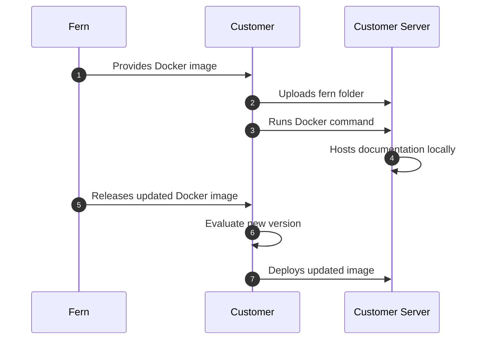

<Markdown src="/snippets/enterprise-plan.mdx" />

Fern documentation websites are hosted on Fern's infrastructure by default. Self-hosting allows you to deploy your documentation site on your own infrastructure to meet specific [security](/learn/docs/security/overview) or compliance requirements.

## When to use self-hosting

Self-hosting is typically required for organizations that operate without internet access, have strict compliance requirements, or need full control over their documentation servers.

When you self-host, you're responsible for server setup, security, maintenance, and deciding how to make the documentation accessible to your users.

<Warning>
Unless you have specific requirements that prevent using Fern's default hosting, we recommend **using our managed hosting solution** for easier setup and maintenance.
</Warning>

<Accordion title="Feature support">

Self-hosted deployments include core Fern documentation website features. However, features that require external connections to Fern's cloud services are not available in self-hosted environments.

<Info title="Extended feature support">
PDF export and **offline AI chat functionality** for self-hosted deployments are in development. [Reach out](mailto:support@buildwithfern.com) if you're interested in these features.
</Info>

| Feature | Supported |
|---------|-----------|
| [AI-generated examples](/learn/docs/ai-features/ai-examples) | No |
| [Analytics + integrations](/learn/docs/integrations/overview) | No |
| [Announcement banner](/learn/docs/customization/announcement-banner) | Yes |
| [API Explorer](/learn/docs/api-references/api-explorer) | Yes |
| [API key injection](/learn/docs/authentication/features/api-key-injection) | Yes |
| [API References](/learn/docs/api-references/overview) | Yes |
| [Ask Fern](/learn/docs/ai-features/ask-fern/overview) | No |
| [Changelog pages](/learn/docs/configuration/changelogs) | Yes |
| [Component library](/learn/docs/writing-content/components/overview) | Yes |
| [Custom branding and theming](/learn/docs/configuration/site-level-settings) | Yes |
| [Custom CSS & JS](/learn/docs/customization/custom-css-js) | Yes |
| [Custom domain](/learn/docs/preview-publish/setting-up-your-domain) | Yes |
| [Custom React components](/learn/docs/customization/custom-react-components) | Yes |
| [Dark / light mode](/learn/docs/configuration/site-level-settings) | Yes |
| [Embedded mode](/learn/docs/customization/embedded-mode) | Yes |
| [Fern Editor](/learn/docs/writing-content/fern-editor) | No |
| [Fern Writer](/learn/docs/ai-features/fern-writer) | No |
| [Header and footer customization](/learn/docs/customization/header-and-footer) | Yes |
| [Health check endpoints](/learn/docs/self-hosted/health-check-endpoints) | Yes |
| [HTTP snippets](/learn/docs/api-references/http-snippets) | Yes |
| [Intercom](/learn/docs/integrations/support/intercom) | No |
| [JWT-based authentication](/learn/docs/self-hosted/authentication) | Yes |
| [llms.txt](/learn/docs/ai-features/llms-txt) | Yes |
| [Navigation and sidebar](/learn/docs/configuration/navigation) | Yes |
| [OAuth](/learn/docs/authentication/setup/oauth) | No |
| [On-page feedback](/learn/docs/self-hosted/set-up#on-page-feedback) | Yes |
| [Page-level access control](/learn/docs/configuration/page-level-settings) | Yes |
| [Password protection](/learn/docs/self-hosted/authentication) | Yes |
| [RBAC](/learn/docs/authentication/features/rbac) | No |
| [Redirects](/learn/docs/seo/redirects) | Yes |
| [Reusable snippets](/learn/docs/writing-content/reusable-snippets) | Yes |
| [SDK code snippets](/learn/docs/api-references/sdk-snippets) | Yes |
| [Search](/learn/docs/customization/search) | Yes |
| [SEO metadata](/learn/docs/seo/setting-seo-metadata) | Yes |
| [SSO](/learn/docs/authentication/setup/sso) | No |
| [Tabs](/learn/docs/configuration/tabs) | Yes |
| [Products](/learn/docs/configuration/products) | Yes |
| [Versions](/learn/docs/configuration/versions) | Yes |

</Accordion>

## Setup process

Fern provides your documentation site as a ready-to-run Docker container that you can deploy on your own infrastructure. For detailed instructions, see [Set up self-hosted documentation](/learn/docs/self-hosted/set-up).

1. **Authenticate with Docker Hub** - Use the organization access token (OAT) provided by Fern to log in
1. **Download the Docker image** - Pull the `fernenterprise/fern-self-hosted` image
1. **Upload your fern folder** - Add your documentation source files to the container
1. **Run the container** - Start your local server using standard Docker commands
1. **Deploy** - Set up your server environment and publish the documentation
1. **Receive updated Docker images** - Fern [releases new versions of the Docker image](/learn/docs/self-hosted/release-notes) that your team can evaluate and deploy when ready. 

### Architecture diagram

## Monitoring and health checks

The self-hosted container includes [health check endpoints](./health-check-endpoints) on port 8081 for Kubernetes and Helm deployments.                                                                                                                                                                                                                                                                                                                                                                                                                                                                                                                                                                                                                                                                                                                                                                                                                                                                                                                                                                                                                                                                

