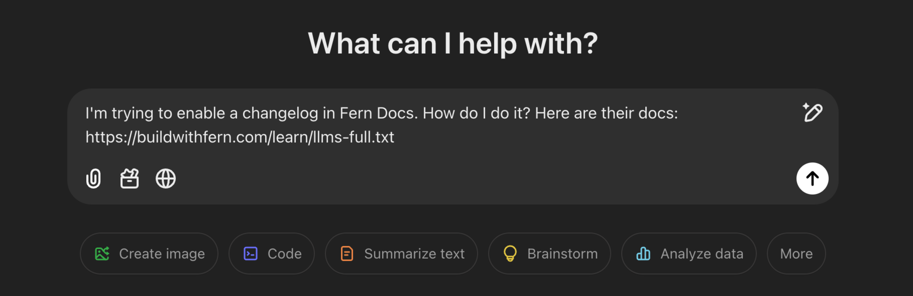

[llms.txt](https://llmstxt.org/) is a standard for exposing website content to AI developer tools. Fern automatically generates and maintains `llms.txt` and `llms-full.txt` files for your documentation site.

## `llms.txt`

Contains a lightweight summary of your documentation site with each page distilled into a one-sentence description and URL. The format is structured to help AI tools parse and understand your documentation's hierarchy and organization.

`llms.txt` is available at any level of your documentation hierarchy (e.g., `/llms.txt`, `/docs/llms.txt`, `/v1/api-reference/llms.txt`).

See an example: [docs.cohere.com/llms.txt](https://docs.cohere.com/llms.txt)

## `llms-full.txt`

Contains complete documentation content including the full text of all pages. For API documentation, this includes your complete API Reference with resolved OpenAPI specifications and SDK code examples for enabled languages. Each API endpoint page includes its full OpenAPI spec.

`llms-full.txt` is available at the root of your documentation site and summarizes all of your documentation.

When Fern detects an LLM bot accessing your documentation, it automatically serves Markdown instead of HTML, reducing token consumption by 90%+.

See an example: [docs.cohere.com/llms-full.txt](https://docs.cohere.com/llms-full.txt)

## View in Action

Check out the llms.txt files for this site:
- [https://buildwithfern.com/learn/llms.txt](https://buildwithfern.com/learn/llms.txt)
- [https://buildwithfern.com/learn/llms-full.txt](https://buildwithfern.com/learn/llms-full.txt)

<Frame>
  
</Frame>

## Analytics and monitoring

The [Fern Dashboard](https://dashboard.buildwithfern.com/) provides comprehensive analytics for llms.txt usage including:
- Traffic by LLM provider (Claude, ChatGPT, Cursor, etc.)
- Page-level breakdowns of bot vs. human visitors for `.md` and `llms.txt` files
- Performance metrics including load times, processing times, and content length
- User agent detection to identify bot traffic versus browser requests

This visibility helps you understand LLM traffic patterns and optimize your documentation for AI consumption.

## Technical Details

The llms.txt generation system handles complex schema types including self-referencing schemas, preventing infinite recursion during content generation. For large documentation sites, the system uses optimized timeouts to ensure reliable content delivery without timing out.

For REST API endpoints, the markdown generation includes OpenAPI specifications in YAML format, making it easy for LLMs to understand your API structure. The same markdown generation logic is used for both serving llms.txt files and indexing content for search, ensuring consistency across your documentation platform.
