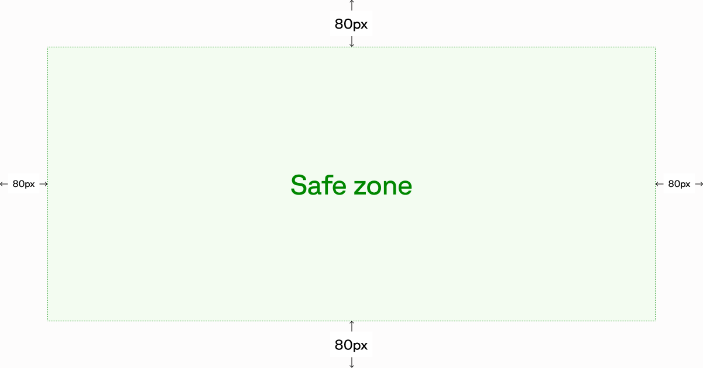

Fern automatically generates all SEO metadata for every page in your documentation site. Search engines and social media previews work out of the box with no configuration required.

When you do want to customize SEO settings, you can set defaults at the site level or override them on individual pages using frontmatter. Keep titles between 50-60 characters and descriptions between 150-160 characters for optimal display.

<Note>
    The metadata configurations on this page are for SEO and social tags that aren't visible to users. For visible footer links, see [footer links configuration](/learn/docs/configuration/site-level-settings#footer-links-configuration).
</Note>

## How it works

Fern looks for metadata values in this order:

1. **Page frontmatter** — Custom SEO values for a specific page
2. **Site-level `docs.yml`** — Default SEO values for all pages
3. **Automatic defaults** — Generated from your page's existing `title`, `description`, `subtitle`, or `excerpt` fields

<Info title="Example">
    `og:image` is the image that appears in social media previews. If you don't set `og:image` in a page's frontmatter, Fern uses the site-wide `og:image` from `docs.yml`. If neither is configured, the tag is omitted entirely.
</Info>

## Site-wide defaults

Set default SEO metadata for your entire site in `docs.yml`. These apply to all pages unless overridden by page-specific metadata.

```yaml docs.yml
metadata:
  # Core metadata
  og:site_name: "Square Developer Documentation"
  og:title: "Square Developer Platform | Payments, Commerce & Banking APIs"
  og:description: "Build with Square's suite of APIs and SDKs. Accept payments, manage inventory, create loyalty programs, and access financial services."
  og:url: "https://developer.squareup.com/docs"
  og:locale: "en_US"
  canonical-host: "developer.squareup.com"

  # Social image
  og:image: "https://developer.squareup.com/images/docs-social-card.png"
  og:image:width: 1200
  og:image:height: 630
  og:logo: "https://developer.squareup.com/images/square-logo.png"

  # Twitter / X
  twitter:title: "Square Developer Platform Documentation"
  twitter:description: "Integrate payments, point-of-sale, inventory, and financial services into your applications with Square's developer platform."
  twitter:handle: "@SquareDev"
  twitter:image: "https://developer.squareup.com/images/twitter-card.png"
  twitter:site: "@Square"
  twitter:card: "summary_large_image"
```

### Core metadata

Identity and descriptive fields used by search engines and shared across social platforms. Keep titles between 50–60 characters and descriptions between 150–160 characters for optimal display. Set `canonical-host` if your docs are accessible at multiple URLs (e.g., a custom domain and a `buildwithfern.com` subdomain) to tell search engines which URL is authoritative.

<ParamField path="metadata.og:site_name" type="string" required={false} toc={true}>
  The name of your website for Open Graph tags.
</ParamField>

<ParamField path="metadata.og:title" type="string" required={false} default="Page title" toc={true}>
  The title shown in social media previews. Falls back to the page's `title` when unset.
</ParamField>

<ParamField path="metadata.og:description" type="string" required={false} default="Page description" toc={true}>
  The description shown in social media previews. Falls back to the page's `description`, `subtitle`, or `excerpt` when unset.
</ParamField>

<ParamField path="metadata.og:url" type="string" required={false} default="Page URL" toc={true}>
  The canonical URL of your documentation. Falls back to the page's resolved URL when unset.
</ParamField>

<ParamField path="metadata.og:locale" type="string" required={false} toc={true}>
  The locale of your content (e.g., `en_US`). No default; the tag is omitted when unset.
</ParamField>

<ParamField path="metadata.canonical-host" type="string" required={false} default="Instance URL" toc={true}>
  The host of your documentation website. Used to set the canonical URL for metadata tags and documents like the sitemap. Defaults to the URL defined in `instances`.
</ParamField>

### Social image

The image displayed when your docs are shared on LinkedIn, Slack, Discord, and other platforms. You can either set a single image that applies to every page, or have Fern dynamically generate a unique image per page.

#### Manual

Set one static image with `og:image` that applies to every page. Use a 1200x630px image for the best display across platforms — this is the standard Open Graph size and will render correctly in most previews. Avoid embedding text in the image since it may be cropped on some platforms.

<ParamField path="metadata.og:image" type="string" required={false} toc={true}>
  The image shown in social media previews. Recommended size is 1200x630 pixels. No default; the tag is omitted when unset.
</ParamField>

<ParamField path="metadata.og:image:width" type="number" required={false} toc={true}>
  The width of your Open Graph image in pixels. Only applied when `og:image` is set.
</ParamField>

<ParamField path="metadata.og:image:height" type="number" required={false} toc={true}>
  The height of your Open Graph image in pixels. Only applied when `og:image` is set.
</ParamField>

<ParamField path="metadata.og:logo" type="string" required={false} toc={true}>
  URL to your company logo. No default; the tag is omitted when unset.
</ParamField>

#### Dynamic <Availability type="beta" /> [#dynamic-og-images]

Instead of using a single static image for all pages, you can enable dynamic OG image generation. When enabled, Fern automatically generates a unique `og:image` for each page that doesn't have one [set in frontmatter](#open-graph). The `og:dynamic:*` sub-settings below are only read when `og:dynamic: true` — they're ignored otherwise. `fern check` surfaces warnings for conflicting settings so you can resolve them locally.

You can optionally provide a custom background image (`og:dynamic:background-image`) for dynamically generated OG images.

```yaml docs.yml
metadata:
  og:dynamic: true
  og:dynamic:background-image: ./images/og-background.png
  og:dynamic:text-color: "#1a1a1a"
  og:dynamic:background-color: "#ffffff"
  og:dynamic:logo-color: dark
  og:dynamic:show-logo: true
  og:dynamic:show-section: true
  og:dynamic:show-description: true
  og:dynamic:show-url: true
  og:dynamic:show-gradient: true
```

<ParamField path="metadata.og:dynamic" type="boolean" required={false} default={false} toc={true}>
  When `true`, enables dynamic OG image generation for pages that don't have a custom `og:image` set. Any site-wide `og:image` and `twitter:image` still apply to the homepage; every other page uses the dynamically generated image.
</ParamField>

<ParamField path="metadata.og:dynamic:background-image" type="string" required={false} toc={true}>
  A custom background image for dynamically generated OG images. Can be a URL or a relative file path. Relative paths are resolved from the YAML file where this property is set (e.g., `docs.yml`). When set, this image is used as the background instead of a solid color. No default; the dynamic OG image renders without a background image when unset.

  Keep important visual content inside the safe zone — the central area with 80px of padding on all sides. The page title, description, logo, and URL render on top of the background, so any artwork outside the safe zone may be covered or cropped depending on the platform.

  <Frame caption="Safe zone for dynamic OG background images (80px padding on all sides)" background="subtle">
    
  </Frame>
</ParamField>

<ParamField path="metadata.og:dynamic:text-color" type="string" required={false} default="#ffffff (dark) / #1a1a1a (light)" toc={true}>
  Override the text color for dynamically generated OG images. Accepts any valid CSS color value (e.g., `"#1a1a1a"`). By default, Fern reads the text color from your theme (`grayScale[11]`). If no theme color is available, falls back to `#ffffff` for dark mode or `#1a1a1a` for light mode. Must differ from `og:dynamic:background-color` so the text remains visible.
</ParamField>

<ParamField path="metadata.og:dynamic:background-color" type="string" required={false} default="#0A0A0A (dark) / theme background (light)" toc={true}>
  Override the background color for dynamically generated OG images. Accepts any valid CSS color value (e.g., `"#ffffff"`). By default, Fern reads the background color from your theme. If no theme color is available, falls back to `#0A0A0A`.
</ParamField>

<ParamField path="metadata.og:dynamic:logo-color" type="enum" required={false} default="dark" toc={true}>
  Choose which logo variant to render in dynamically generated OG images. Accepts `dark` or `light`, matching the corresponding entry under the top-level [`logo:` setting](/learn/docs/getting-started/global-configuration#logo-configuration) in your `docs.yml`. If your `docs.yml` only defines one logo variant, that variant is used regardless of this setting. Has no effect when `og:dynamic:show-logo: false`.
</ParamField>

<ParamField path="metadata.og:dynamic:show-logo" type="boolean" required={false} default={true} toc={true}>
  Toggle visibility of the logo in dynamically generated OG images. Defaults to `true` when `og:dynamic` is enabled.
</ParamField>

<ParamField path="metadata.og:dynamic:show-section" type="boolean" required={false} default={true} toc={true}>
  Toggle visibility of the section title in dynamically generated OG images. The section title is derived from the page's navigation breadcrumb. Defaults to `true` when `og:dynamic` is enabled.
</ParamField>

<ParamField path="metadata.og:dynamic:show-description" type="boolean" required={false} default={true} toc={true}>
  Toggle visibility of the page description in dynamically generated OG images. The description is extracted from the page's frontmatter (`description`, `subtitle`, or `excerpt`). Defaults to `true` when `og:dynamic` is enabled.
</ParamField>

<ParamField path="metadata.og:dynamic:show-url" type="boolean" required={false} default={true} toc={true}>
  Toggle visibility of the page URL in dynamically generated OG images. Defaults to `true` when `og:dynamic` is enabled.
</ParamField>

<ParamField path="metadata.og:dynamic:show-gradient" type="boolean" required={false} default={true} toc={true}>
  Toggle visibility of the accent gradient overlay in dynamically generated OG images. The gradient uses your accent color. Defaults to `true` when `og:dynamic` is enabled.
</ParamField>

### Twitter / X

Controls how your docs appear in Twitter Card previews when shared on X.

<ParamField path="metadata.twitter:title" type="string" required={false} default="og:title" toc={true}>
  The title shown in Twitter Card previews. Falls back to `og:title` (and then to the page title) when unset.
</ParamField>

<ParamField path="metadata.twitter:description" type="string" required={false} default="og:description" toc={true}>
  The description shown in Twitter Card previews. Falls back to `og:description` (and then to the page description) when unset.
</ParamField>

<ParamField path="metadata.twitter:handle" type="string" required={false} toc={true}>
  Your company's Twitter handle. No default; the tag is omitted when unset.
</ParamField>

<ParamField path="metadata.twitter:image" type="string" required={false} default="og:image" toc={true}>
  The image shown in Twitter Card previews. Falls back to `og:image` when unset.
</ParamField>

<ParamField path="metadata.twitter:site" type="string" required={false} toc={true}>
  The Twitter handle for your website. No default; the tag is omitted when unset.
</ParamField>

<ParamField path="metadata.twitter:card" type="string" required={false} default="summary_large_image" toc={true}>
  The Twitter Card type. Options are `summary`, `summary_large_image`, `app`, or `player`.
</ParamField>

## Page-level overrides

Configure SEO metadata in your page's frontmatter to control how individual pages appear in search results and social shares. These settings override site-wide defaults.

<Info>
  Only the documented SEO fields are added to the HTML `<head>` as meta tags. Custom frontmatter fields won't automatically appear in your page metadata. To add custom metadata, use [custom JavaScript](/learn/docs/customization/custom-css-js#custom-javascript).
</Info>

<CodeBlock title="plantstore-quickstart.mdx">
```mdx
---
title: PlantStore API Quick Start
headline: "Get Started with PlantStore API | Developer Documentation"
keywords: plants, garden, nursery
canonical-url: https://docs.plantstore.dev/welcome
og:image: https://plantstore.dev/images/api-docs-banner.png
og:image:width: 1200
og:image:height: 630
twitter:card: summary_large_image
twitter:site: "@PlantStoreAPI"
noindex: false
nofollow: false
---
```
</CodeBlock>

### Basic metadata

Page title, URL, and keyword fields used by search engines. Use `headline` when you need a different title for search engines than what appears as the visible page heading.

<Markdown src="/products/docs/snippets/seo-fields-basic.mdx" />

### Open Graph

Controls how this page appears when shared on LinkedIn, Slack, Discord, and other platforms that support Open Graph. Keep titles between 50–60 characters and descriptions between 150–160 characters for optimal display.

<Markdown src="/products/docs/snippets/seo-fields-open-graph.mdx" />

### Twitter / X

Controls how this page appears in Twitter Card previews when shared on X.

<Markdown src="/products/docs/snippets/seo-fields-twitter.mdx" />

### Indexing

Control whether search engines index this page or follow its links. These are distinct: `noindex` removes the page from search results entirely, while `nofollow` keeps the page in results but tells search engines not to pass ranking credit through its links.

Use `noindex` for pages you want visible in the sidebar but excluded from search results — for example, early-access documentation. To hide a page from both the sidebar and search results, use `hidden: true` in `docs.yml` instead, which handles both automatically — see [Hiding content](/learn/docs/customization/hiding-content) for details. Use `nofollow` sparingly — it's rarely needed for documentation.

<Markdown src="/products/docs/snippets/seo-fields-indexing.mdx" />
