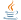
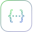
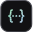
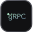

import { GridPatternRow, GridTile, QuickNav, TileDots } from "@/components/HomeGrid";

<llms-ignore>

  

  <QuickNav
    items={[
      { id: "products", label: "SDKs, Docs & Ask Fern" },
      { id: "specs", label: "Supported specs" },
      { id: "community", label: "Community" },
      { id: "help", label: "Help" },
    ]}
    links={[{ label: "Book a demo", href: "https://buildwithfern.com/book-demo?utm_source=fern-docs" }]}
  />
  {/* Main Content */}
  

    {/* Hero Section */}
    

      

        <h1 className="hero-title" data-state="closed">
          Build with Fern
        </h1>
        

          Start with SDKs, Docs, or both.
        

      

    

    {/* Feature Grid */}
    

      {/* SDKs Card */}
      

        <TileDots />
        

          <a className="card-title" href="/learn/sdks/overview/introduction">
            SDKs
          </a>
          

            Generate client libraries in multiple languages.
          

        

        
        {/* Rive Animation */}
        

          

            <canvas id="sdk-rive-canvas"></canvas>
          

        

        {/* Language Icons */}
        

          Get started with:
          {/* TypeScript */}
          
          {/* Python */}
           
          {/* Go */}
          
          {/* Java */}
          
          {/* C# */}
          
          {/* PHP */}
          
          {/* Ruby */}
          
          
          
        

        {/* Action Buttons */}
        

          <a className="fern-button filled normal primary gap-1 a-btn" href="/learn/sdks/overview/introduction">
            Introduction
            
            
          </a>
          <a className="fern-button minimal normal gap-1 a-btn" href="/learn/sdks/overview/quickstart">
            Quickstart
            
            
          </a>
          <a className="fern-button minimal normal gap-1 a-btn" href="https://buildwithfern.com/showcase">
            Customers
            
            
          </a>
        

      

      {/* Docs Card */}
      

        <TileDots />
        

          <a className="card-title" href="/learn/docs/getting-started/capabilities">
            Docs
          </a>
          

            A beautiful, interactive documentation website.
          

        

        
        {/* Rive Animation */}
        <a href="/learn/docs/getting-started/capabilities" aria-label="Docs capabilities" style="cursor: pointer; text-decoration: none;">
          

            <canvas id="docs-rive-canvas"></canvas>
          

        </a>

        

          <a className="fern-button filled normal primary gap-1 w-fit a-btn" href="/learn/docs/getting-started/capabilities">
            Introduction
            
            
          </a>
          <a className="fern-button minimal normal w-fit gap-1 a-btn" href="/learn/docs/getting-started/quickstart">
            Quickstart
            
            
          </a>
          <a className="fern-button minimal normal w-fit gap-1 a-btn" href="/learn/docs/ai-features/overview">
            AI features
            
            
          </a>
          <a className="fern-button minimal normal w-fit gap-1 a-btn" href="/learn/docs/writing-content/fern-editor">
            Fern Editor
            
            
          </a>
          <a className="fern-button minimal normal w-fit gap-1 a-btn" href="/learn/docs/api-references/generate-api-ref">
            Bring your own API spec
            
            
          </a>
          <a className="fern-button minimal normal w-fit gap-1 a-btn" href="/learn/docs/authentication/features/rbac">
            Gate docs by role
            
            
          </a>
          <a className="fern-button minimal normal w-fit gap-1 a-btn" href="/learn/docs/self-hosted/overview"> 
            Self-host your docs
            
            
          </a>
          <a className="fern-button minimal normal w-fit gap-1 a-btn" href="https://buildwithfern.com/showcase#docs-customers.alldocs-features">
            Customers
            
            
          </a>
        

      

      {/* AI Search Card */}
      

        <TileDots />
        

          <a className="card-title" href="/learn/docs/ai-features/ask-fern/overview">
            Ask Fern
          </a>
          

            AI search to find answers in your documentation instantly.
          

        

        {/* Rive Animation */}
        <a href="/learn/docs/ai-features/ask-fern/overview" aria-label="Ask Fern overview" style="cursor: pointer; text-decoration: none;">
          

            <canvas id="ai-rive-canvas"></canvas>
          

        </a>

        

          <a className="fern-button filled normal primary gap-1 a-btn" href="/learn/docs/ai-features/ask-fern/overview">
            Introduction
            
            
          </a>
          <a className="fern-button minimal normal gap-1 a-btn" href="/learn/docs/ai-features/ask-fern/overview">
            Configure
            
            
          </a>
          <a className="fern-button minimal normal gap-1 a-btn" href="https://buildwithfern.com/showcase#ask-fern-customers">
            Customers
            
            
          </a>
        

      

    

    <GridPatternRow shape="trail" bleed={false} />

    

      

        
Supported specs

        
Select one or more specs to generate SDKs and Docs.

      

      <GridTile arrow={false} href="/learn/api-definitions/openapi/overview">
        
        
        
OpenAPI

      </GridTile>
      <GridTile arrow={false} href="/learn/api-definitions/asyncapi/overview">
        
        
        
AsyncAPI

      </GridTile>
      <GridTile arrow={false} href="/learn/api-definitions/openrpc/overview">
        
        
        
OpenRPC

      </GridTile>
      <GridTile arrow={false} href="/learn/api-definitions/grpc/overview">
        
        
        
gRPC

      </GridTile>
    

    <GridPatternRow shape="trail" bleed={false} />

    

      

        
Community

      

      

        <TileDots />
        
        
        

          
Changelog

          
See our most recent product updates.

        

        

            
            
            {/* Python */}
             
            {/* Go */}
            
            {/* Java */}
            
            {/* C# */}
            
            {/* PHP */}
            
            {/* Ruby */}
            
            {/* Swift */}
            
            {/* Rust */}
            
          

      

      <GridTile arrow={false} href="https://github.com/fern-api/fern">
        
        
        

          
GitHub

          
Follow progress and contribute to the codebase.

        

      </GridTile>
      <GridTile arrow={false} href="https://x.com/buildwithfern">
        
        
        

          
X

          
Get updates on the Fern platform.

        

      </GridTile>
    

    

      

        <TileDots />
        

          
Help

          

            We're lightning-fast with support! If you're a customer, reach out via your dedicated Slack channel.
          

        

        

        <a className="fern-button outlined normal gap-2 a-btn" href="https://github.com/fern-api/fern/issues">
          
          

          File a GitHub issue
        </a>

        <a className="fern-button outlined normal gap-2 a-btn" href="mailto:support@buildwithfern.com">
          
          

          Email us
        </a>
        <a className="fern-button outlined normal gap-2 a-btn" href="https://buildwithfern.com/book-demo">
          
          

          Book a demo
        </a>
      

      

    

    <GridPatternRow shape="trail" bleed={false} />
  

  

</llms-ignore>
