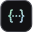

<llms-ignore>

  {/* Main Content */}
  

    {/* Dashed Pattern */}
    

    

    {/* Hero Section */}
    

      

        <h1 className="hero-title" data-state="closed">
          Build with Fern
        </h1>
        

          Start with SDKs, Docs, or both.
        

      

    

    {/* Feature Grid */}
    

      {/* SDKs Card */}
      

        

          <a className="card-title" href="/sdks/overview/introduction">
            SDKs
            
            
          </a>
          

            Generate client libraries in multiple languages.
          

        

        
        {/* SDK language tabs */}
        

          <input className="sdk-card-radio" type="radio" name="sdk-card-language" id="sdk-card-typescript" defaultChecked />
          <input className="sdk-card-radio" type="radio" name="sdk-card-language" id="sdk-card-python" />
          <input className="sdk-card-radio" type="radio" name="sdk-card-language" id="sdk-card-go" />
          <input className="sdk-card-radio" type="radio" name="sdk-card-language" id="sdk-card-java" />
          <input className="sdk-card-radio" type="radio" name="sdk-card-language" id="sdk-card-dotnet" />
          <input className="sdk-card-radio" type="radio" name="sdk-card-language" id="sdk-card-php" />
          <input className="sdk-card-radio" type="radio" name="sdk-card-language" id="sdk-card-ruby" />
          <input className="sdk-card-radio" type="radio" name="sdk-card-language" id="sdk-card-swift" />
          <input className="sdk-card-radio" type="radio" name="sdk-card-language" id="sdk-card-rust" />

          

            
          

          

            <label className="sdk-card-tab sdk-card-tab-typescript" htmlFor="sdk-card-typescript">
              
              Typescript
            </label>
            <label className="sdk-card-tab sdk-card-tab-python" htmlFor="sdk-card-python">
              
              Python
            </label>
            <label className="sdk-card-tab sdk-card-tab-go" htmlFor="sdk-card-go">
              
              GO
            </label>
            <label className="sdk-card-tab sdk-card-tab-java" htmlFor="sdk-card-java">
              
              Java
            </label>
            <label className="sdk-card-tab sdk-card-tab-dotnet" htmlFor="sdk-card-dotnet">
              
              .NET
            </label>
            <label className="sdk-card-tab sdk-card-tab-php" htmlFor="sdk-card-php">
              
              PHP
            </label>
            <label className="sdk-card-tab sdk-card-tab-ruby" htmlFor="sdk-card-ruby">
              
              Ruby
            </label>
            <label className="sdk-card-tab sdk-card-tab-swift" htmlFor="sdk-card-swift">
              
              Swift
            </label>
            <label className="sdk-card-tab sdk-card-tab-rust" htmlFor="sdk-card-rust">
              
              
              Rust
            </label>
            
          

          

            
              <code className="sdk-card-command-text sdk-card-command-typescript">npm install your-company</code>
              <code className="sdk-card-command-text sdk-card-command-python">pip install your-company</code>
              <code className="sdk-card-command-text sdk-card-command-go">go get github.com/your-company/go-sdk</code>
              <code className="sdk-card-command-text sdk-card-command-java">{'compile "com.your-company:java-sdk:1.0.0"'}</code>
              <code className="sdk-card-command-text sdk-card-command-dotnet">{'dotnet add package YourCompany.Net --version 1.0.0'}</code>
              <code className="sdk-card-command-text sdk-card-command-php">composer require your-company/your-company-php</code>
              <code className="sdk-card-command-text sdk-card-command-ruby">gem install your_company</code>
              <code className="sdk-card-command-text sdk-card-command-swift">{'.package(url: "https://github.com/your-company/swift-sdk")'}</code>
              <code className="sdk-card-command-text sdk-card-command-rust">cargo add your-company</code>
            
            <svg className="sdk-card-copy" viewBox="0 0 14 16" fill="none" aria-hidden="true">
              <rect x="0.75" y="4.25" width="8.5" height="11" rx="1.75" stroke="currentColor" strokeWidth="1.5" />
              <path d="M4.25 4V2.5C4.25 1.53 5.03 0.75 6 0.75H11.5C12.47 0.75 13.25 1.53 13.25 2.5V10C13.25 10.97 12.47 11.75 11.5 11.75H10" stroke="currentColor" strokeWidth="1.5" />
            </svg>
          

          
        

        {/* Language Icons */}
        

          Get started with:
          {/* TypeScript */}
          
          {/* Python */}
           
          {/* Go */}
          
          {/* Java */}
          
          {/* C# */}
          
          {/* PHP */}
          
          {/* Ruby */}
          
          
          
        

        {/* Action Buttons */}
        

          <a className="fern-button filled normal primary gap-1 a-btn" href="/sdks/overview/introduction">
            Introduction
            
            
          </a>
          <a className="fern-button minimal normal gap-1 a-btn" href="/sdks/overview/quickstart">
            Quickstart
            
            
          </a>
          <a className="fern-button minimal normal gap-1 a-btn" href="https://buildwithfern.com/showcase">
            Customers
            
            
          </a>
        

      

      {/* Docs Card */}
      

        

          <a className="card-title" href="/docs/getting-started/overview">
            Docs
            
            
          </a>
          

            A beautiful, interactive documentation website.
          

        

        
        {/* Rive Animation */}
        <a href="/docs/getting-started/overview" style="cursor: pointer; text-decoration: none;">
          

            <canvas id="docs-rive-canvas"></canvas>
          

        </a>

        

          <a className="fern-button filled normal primary gap-1 w-fit a-btn" href="/docs/getting-started/overview">
            Introduction
            
            
          </a>
          <a className="fern-button minimal normal w-fit gap-1 a-btn" href="/docs/getting-started/quickstart">
            Quickstart
            
            
          </a>
          <a className="fern-button minimal normal w-fit gap-1 a-btn" href="/docs/ai-features/overview">
            AI features
            
            
          </a>
          <a className="fern-button minimal normal w-fit gap-1 a-btn" href="/docs/writing-content/fern-editor">
            Fern Editor
            
            
          </a>
          <a className="fern-button minimal normal w-fit gap-1 a-btn" href="/docs/api-references/generate-api-ref">
            Bring your own API spec
            
            
          </a>
          <a className="fern-button minimal normal w-fit gap-1 a-btn" href="/docs/authentication/features/rbac">
            Gate docs by role
            
            
          </a>
          <a className="fern-button minimal normal w-fit gap-1 a-btn" href="/docs/self-hosted/overview"> 
            Self-host your docs
            
            
          </a>
          <a className="fern-button minimal normal w-fit gap-1 a-btn" href="https://buildwithfern.com/showcase#docs-customers.alldocs-features">
            Customers
            
            
          </a>
        

      

      {/* AI Search Card */}
      

        

          <a className="card-title" href="/learn/docs/ai-features/ask-fern/overview">
            Ask Fern
            
            
          </a>
          

            AI search to find answers in your documentation instantly.
          

        

        {/* Rive Animation */}
        <a href="/learn/docs/ai-features/ask-fern/overview" style="cursor: pointer; text-decoration: none;">
          

            <canvas id="ai-rive-canvas"></canvas>
          

        </a>

        

          <a className="fern-button filled normal primary gap-1 a-btn" href="/learn/docs/ai-features/ask-fern/overview">
            Introduction
            
            
          </a>
          <a className="fern-button minimal normal gap-1 a-btn" href="/learn/docs/ai-features/ask-fern/overview">
            Configure
            
            
          </a>
          <a className="fern-button minimal normal gap-1 a-btn" href="https://buildwithfern.com/showcase#ask-fern-customers">
            Customers
            
            
          </a>
        

      

    

    {/* Supported Specs Section */}
    

      

        
Supported Specs

        

          Select one or more specs to generate SDKs and Docs.
        

      

      
      

        <a className="specs-card" href="/api-definitions/openapi/overview">
          
          

          
OpenAPI

        </a>
        <a className="specs-card" href="/api-definitions/asyncapi/overview">
          
          

          <h3 className="community-card-title">AsyncAPI</h3>
        </a>
        <a className="specs-card" href="/api-definitions/openrpc/overview">
          
          

          <h3 className="community-card-title">OpenRPC</h3>
        </a>
        <a className="specs-card" href="/api-definitions/grpc/overview">
          
          

          <h3 className="community-card-title">gRPC</h3>
        </a>
      

    

    {/* Community Section */}
    

      

        
Community

      

      
      

        

          

            
            

            <h3 className="community-card-title">Changelog</h3>
          

          

            See our most recent product updates.
          

          

            
            
            {/* Python */}
             
            {/* Go */}
            
            {/* Java */}
            
            {/* C# */}
            
            {/* PHP */}
            
            {/* Ruby */}
            
            {/* Swift */}
            
            {/* Rust */}
            
          

        

        

          

            
            

            <h3 className="community-card-title">GitHub</h3>
          

          

            Follow progress and contribute to the codebase.
          

          <a className="fern-button outlined normal gap-1 a-btn" href="https://github.com/fern-api/fern">
            View
          </a>
        

        

          

            
            

            <h3 className="community-card-title">
              Twitter X
            </h3>
          

          

            Get updates on the Fern platform.
          

          <a className="fern-button outlined normal gap-1 a-btn" href="https://x.com/buildwithfern">
            View
          </a>
        

      

    

    {/* Help Section */}
    

      

        
Help

        

          We're lightning-fast with support! If you're a customer, reach out via your dedicated Slack channel.
        

      

      
      

        <a className="fern-button outlined normal gap-2 a-btn" href="https://github.com/fern-api/fern/issues">
          
          

          File a GitHub issue
        </a>

        <a className="fern-button outlined normal gap-2 a-btn" href="mailto:support@buildwithfern.com">
          
          

          Email us
        </a>
        <a className="fern-button outlined normal gap-2 a-btn" href="https://buildwithfern.com/book-demo">
          
          

          Book a demo
        </a>
      

    

  

</llms-ignore>

<llms-only>
## SDKs

Generate client libraries in multiple languages.

Get started with: [TypeScript](/sdks/generators/typescript/quickstart), [Python](/sdks/generators/python/quickstart), [Go](/sdks/generators/go/quickstart), [Java](/sdks/generators/java/quickstart), [C#](/sdks/generators/csharp/quickstart), [PHP](/sdks/generators/php/quickstart), [Ruby](/learn/sdks/generators/ruby/quickstart), [Swift](/sdks/generators/swift/quickstart), [Rust](/sdks/generators/rust/quickstart)

- [Introduction](/sdks/overview/introduction)
- [Quickstart](/sdks/overview/quickstart)
- [Customers](https://buildwithfern.com/showcase)

## Docs

A beautiful, interactive documentation website.

- [Introduction](/docs/getting-started/overview)
- [Quickstart](/docs/getting-started/quickstart)
- [AI features](/docs/ai-features/overview)
- [Fern Editor](/docs/writing-content/fern-editor)
- [Bring your own API spec](/docs/api-references/generate-api-ref)
- [Gate docs by role](/docs/authentication/features/rbac)
- [Self-host your docs](/docs/self-hosted/overview)
- [Customers](https://buildwithfern.com/showcase#docs-customers.alldocs-features)

## Ask Fern

AI search to find answers in your documentation instantly.

- [Introduction](/learn/docs/ai-features/ask-fern/overview)
- [Configure](/learn/docs/ai-features/ask-fern/overview)
- [Customers](https://buildwithfern.com/showcase#ask-fern-customers)

## Supported specs

Select one or more specs to generate SDKs and Docs.

- [OpenAPI](/api-definitions/openapi/overview)
- [AsyncAPI](/api-definitions/asyncapi/overview)
- [OpenRPC](/api-definitions/openrpc/overview)
- [gRPC](/api-definitions/grpc/overview)

## Community

- [Changelog](/docs/changelog): See the most recent product updates.
- [GitHub](https://github.com/fern-api/fern): Follow progress and contribute to the codebase.
- [X](https://x.com/buildwithfern): Get updates on the Fern platform.

## Help

Fern offers lightning-fast support. If you're a customer, reach out via your dedicated Slack channel.

- [File a GitHub issue](https://github.com/fern-api/fern/issues)
- [Email us](mailto:support@buildwithfern.com)
- [Book a demo](https://buildwithfern.com/book-demo)
</llms-only>
