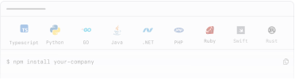
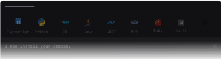
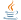
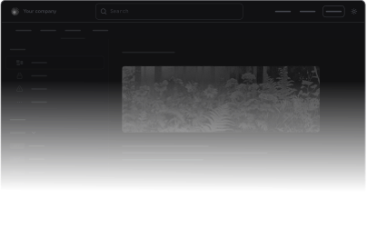
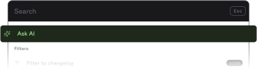
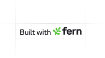
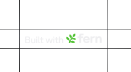

{/* 

  
 

  
 

  
 

  
 

  
 

 */}

  

  

  

  {/* Main Content */}
  

    {/* Dashed Pattern - Left Side */}
    

      

    

    {/* Dashed Pattern - Right Side */}
    

      

    

    {/* Hero Section */}
    

      

        <h1 className="hero-title">
          Build with Fern
        </h1>
        

          Start with SDKs, Docs, or both.
        

      

    

    {/* Feature Grid */}
    

      {/* SDKs Card */}
      

        

          <h2 className="card-title">SDKs</h2>
          

            Generate client libraries in multiple languages.
          

        

        
        

          
          
        

        {/* Language Icons */}
        

          Get started with:
          {/* TypeScript */}
          
          {/* Python */}
           
          {/* Go */}
          
          {/* Java */}
          
          {/* Ruby */}
          
          {/* C# */}
          
          {/* PHP */}
          
        

        {/* Action Buttons */}
        

          <a className="fern-button filled normal primary gap-1 a-btn">
            Quickstart
            
            
          </a>
          <a className="fern-button minimal normal gap-1 a-btn">
            Capabilities  
            
            
          </a>
          <a className="fern-button minimal normal gap-1 a-btn" href="https://buildwithfern.com/showcase">
            Customers
            
            
          </a>
        

      

      {/* Docs Card */}
      

        

          <h2 className="card-title">Docs</h2>
          

            A beautiful, interactive documentation website.
          

        

        
        
        

        

          <a className="fern-button filled normal primary gap-1 w-fit a-btn" href="/docs/guides/getting-started/quickstart">
            Quickstart
            
            
          </a>
          <a className="fern-button minimal normal w-fit gap-1 a-btn" href="/docs/guides/getting-started/migrate-from-an-existing-site">
            Import your brand language
            
            
          </a>
          <a className="fern-button minimal normal w-fit gap-1 a-btn" href="/docs/guides/getting-started/add-multiple-specs">
            Add multiple specs to your docs site
            
            
          </a>
          <a className="fern-button minimal normal w-fit gap-1 a-btn" href="/docs/navigation/tabs">
            Set up tabs
            
            
          </a>
          <a className="fern-button minimal normal w-fit gap-1 a-btn" href="/docs/navigation/products"> 
            Configure multiple products
            
            
          </a>
          <a className="fern-button minimal normal w-fit gap-1 a-btn" href="/docs/navigation/versions">
            Create versions
            
            
          </a>
          <a className="fern-button minimal normal w-fit gap-1 a-btn" href="/docs/reference/frontmatter">
            Customize slug from MDX
            
            
          </a>
          <a className="fern-button minimal normal w-fit gap-1 a-btn" href="/docs/component-library/overview">
            See all available components
            
            
          </a>
        

      

      {/* AI Search Card */}
      

        

          <h2 className="card-title">AI Search</h2>
          

            Let users find answers in your documentation instantly
          

        

        
        

        

          <a className="fern-button filled normal primary gap-1 a-btn" href="/ask-fern/configuration/custom-prompting">
            Configure
            
            
          </a>
          <a className="fern-button minimal normal gap-1 a-btn" href="https://buildwithfern.com/showcase">
            Customers
            
            
          </a>
        

      

    

    {/* Community Section */}
    

      

        <h2 className="card-title">Community</h2>
      

      
      

        

          
          

          <h3 className="community-card-title">Changelog</h3>
          

            See our most recent product updates.
          

          <a className="fern-button outlined normal gap-1 a-btn" href="/docs/changelog">
            Docs
            
            
          </a>
        

        
 
          
          

          <h3 className="community-card-title">Github</h3>
          

            Follow progress and contribute to the codebase.
          

          <a className="fern-button outlined normal gap-1 a-btn" href="https://github.com/fern-api/fern">
            View
            
            
          </a>
        

        

          
          

          <h3 className="community-card-title">Slack</h3>
          

            Connect with the Fern community.
          

          <a className="fern-button outlined normal gap-1 a-btn" href="https://buildwithfern.com/slack">
            View
            
            
          </a>
        

        

          
          

          <h3 className="community-card-title">
            Twitter X
          </h3>
          

            Get updates on the Fern platform.
          

          <a className="fern-button outlined normal gap-1 a-btn" href="https://x.com/buildwithfern">
            View
            
            
          </a>
        

      

    

    {/* Help Section */}
    

      

        <h2 className="card-title">Help</h2>
        

          We're lightning-fast with support - you'll typically hear back from us in hours, not days!
        

      

      
      

        <a className="fern-button outlined normal gap-2 a-btn" href="https://github.com/fern-api/fern/issues">
          
          

          File a Github issue
        </a>

        <a className="fern-button outlined normal gap-2 a-btn" href="mailto:support@buildwithfern.com">
          
          

          Email us
        </a>

        

          
          
          Fern Slack (for customers only)
        

      

    

    {/* Footer */}
    <footer className="footer">
      

        {/* Left Column - Logo and Status */}
        
        
        

          <a className="status-badge" href="https://status.buildwithfern.com">
            

            All systems operational
          </a>
          
          

            
            Soc 2 Type II
          

        

      

      {/* Footer Links */}
      

        
 © 2025 Fern • Located in Brooklyn, NY 

        {/* Newsletter Signup */}
        {/* 

          
Subscribe to our updates

          

            

              marty.mcfly@hillvalley.edu
            

            <button className="newsletter-button">
            </button>
          

        
 */}
        

          

            <h4 className="footer-column-title">Documentation</h4>
            

              <a href="#" className="footer-link">OpenAPI Compatibility</a>
              <a href="#" className="footer-link">SDKs</a>
              <a href="#" className="footer-link">Docs</a>
            

          

          

            <h4 className="footer-column-title">Resources</h4>
            

              <a href="https://buildwithfern.com/blog" className="footer-link">Blog</a>
              <a href="#support" className="footer-link">Support</a>
              <a href="https://buildwithfern.com/pricing" className="footer-link">Pricing</a>
              <a href="https://buildwithfern.com/slack" className="footer-link">Slack</a>
            

          

          

            <h4 className="footer-column-title">Company</h4>
            

              <a href="https://brandfetch.com/buildwithfern.com" className="footer-link">Brand Kit</a>
              <a href="https://github.com/fern-api/fern" className="footer-link">Github</a>
              <a href="https://buildwithfern.com/privacy-policy" className="footer-link">Privacy Policy</a>
              <a href="https://buildwithfern.com/terms-of-service" className="footer-link">Terms of Service</a>
            

          

        

      

    </footer>
  

