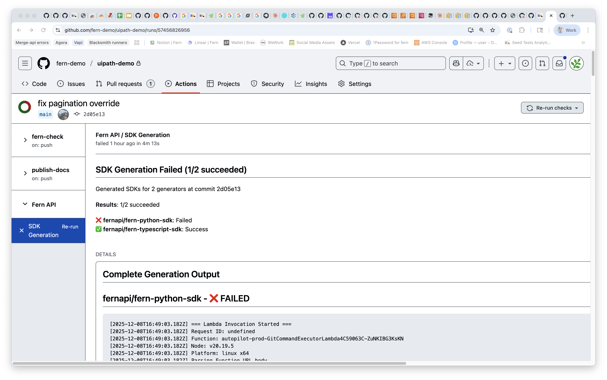

Fern Autopilot automates SDK releases end-to-end. When your API specification changes, Autopilot regenerates SDKs, determines the version bump, and publishes to package registries.

## How it works

Autopilot detects changes to your spec using either **git-based detection** (monitors your spec repository for commits) or **pull-based detection** (periodically fetches your hosted spec from a URL). Once changes are detected, Autopilot:

1. Regenerates SDKs for all configured languages
2. Analyzes the API diff and determines the next version (semantic, calendar-based, integer, or custom)
3. Commits to repositories, tags releases, and publishes packages
4. Updates changelogs automatically

Autopilot pauses and requests confirmation if it's uncertain about the version bump. Publishing uses tokens stored in your GitHub Actions secrets—Fern never has access to these credentials.

If a release fails, Autopilot pauses and sends alerts via Slack (if configured) or the Fern Dashboard where you can review and retry.

## Setup

Autopilot is enabled with git-based detection on all repositories with the [Fern GitHub App](https://github.com/apps/fern-api) installed. Releases trigger automatically on commits to your spec repository and appear as commit status checks. No changes to your CI/CD setup are required.

<Frame>
  
</Frame>

Customize Autopilot if you need to fetch from a hosted spec URL, review releases before publishing, or disable automatic releases entirely:

<AccordionGroup>
<Accordion title="Enable pull-based detection">

Add a cron schedule to your `generators.yml`:

```yaml
autopilot:
  cron:
    schedule: "0 0 * * 0"  # Weekly on Sunday at midnight
```

Or configure per-generator:

```yaml
groups:
  python-sdk:
    generators:
      - name: fernapi/fern-python-sdk
        version: 4.38.2
        autopilot:
          cron:
            schedule: "0 */6 * * *"  # Every 6 hours
```
</Accordion>

<Accordion title="Review releases before publishing">

[Set `mode: pull-request`](/learn/sdks/reference/generators-yml#pull-request) to review releases before publishing.  Autopilot will open a pull request for you to review instead of publishing directly.

```yaml generators.yml {8}
groups: 
  ts-sdk:
    generators:
      - name: fernapi/fern-typescript-sdk
      ...
        github: 
          repository: your-org/your-repo-name
          mode: pull-request
```
</Accordion>

<Accordion title="Disable Autopilot">

Disable globally:

```yaml
autopilot:
  git_based_autogeneration: false
```

Or per-generator:

```yaml
groups:
  ts-sdk:
    generators:
      - name: fernapi/fern-typescript-node-sdk
        version: 0.40.0
        autopilot:
          git_based_autogeneration: false
```

To disable Autopilot entirely for your organization, reach out via Slack.
</Accordion>
</AccordionGroup>