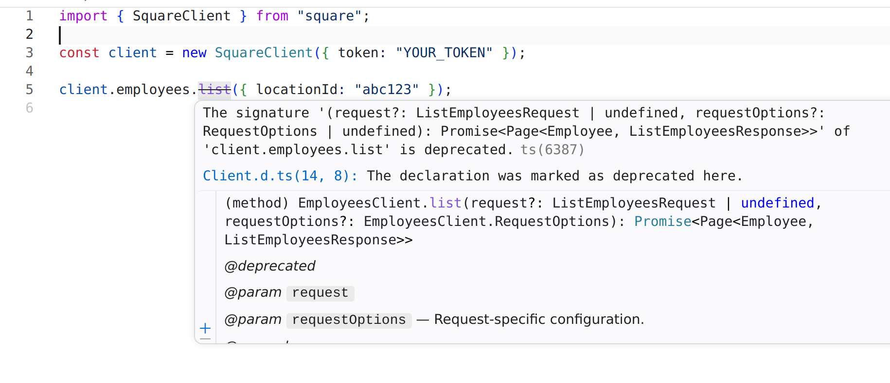

Fern-generated SDKs provide a consistent set of features across all languages to help developers interact with your API. Usage information is auto-generated in your SDK's `README.md`, [which you can customize](./readme).

For a complete example of a generated SDK README, see [Intercom's Python SDK](https://github.com/intercom/python-intercom/blob/3aac991a92cefe34cf437f8f5ca46c97c04c1a6c/README.md).

## Installation and basic usage

Users install SDKs using standard package managers (npm for TypeScript, pip for Python, Maven/Gradle for Java, etc.) from language-specific registries.

Users initialize the client with your API's base URL and any required authentication, then call methods on the client to interact with your API. Generated SDKs support modern runtimes across languages.

## Reference

The `README.md` file links to an auto-generated `reference.md` file
([example](https://github.com/intercom/python-intercom/blob/HEAD/reference.md))
that lists all available API methods organized by resource, including method
signatures with parameter types, usage examples, and request/response structures
for each endpoint.

## IDE support and IntelliSense

Fern-generated SDKs include full type definitions that enable rich IDE support. When developers use your SDK in editors like VS Code, they get autocomplete, inline documentation, and type information.

The inline documentation comes from your API definition. During the SDK generation process, Fern embeds your parameter descriptions, return types, and code examples directly in the code as docstrings (Python), JSDoc (TypeScript), Javadoc (Java), etc.

<Frame caption="From Vapi Server SDK (TypeScript)" background="subtle">
  <video
    src="../images/intellisense.mp4"
    autoPlay
    loop
    playsInline
    muted
>
</video>
</Frame>

## Availability

When you mark an endpoint with an [availability](/learn/api-definitions/openapi/extensions/availability) status like `deprecated` or `beta`, the generated SDK includes the corresponding doc comment tag on the client method. IDEs display these as warnings and strikethrough styling so your users know which endpoints are stable and which to avoid.

<Frame caption="Deprecated method with strikethrough in the [Square TypeScript SDK](https://github.com/square/square-nodejs-sdk/blob/master/src/api/resources/employees/client/Client.ts)">
  
</Frame>

## Error handling

When the API returns a 4xx or 5xx status code, the SDK throws an error that includes the status code, error message, response body, and raw response object.

## Webhook signature verification

When you define webhooks in your API spec, Fern automatically [generates utilities that allow your users to verify webhook signatures](./webhook-signature-verification) and ensure events originate from your API.

## WebSockets

When you define [WebSocket channels](/learn/api-definitions/asyncapi/channels/pubsub) in your API spec, Fern can [generate typed WebSocket clients](./websocket-clients) with connection management, typed messages, and automatic reconnection.

## Default parameter values

You can configure [default values](/learn/api-definitions/openapi/extensions/default-values) for path, header, and query parameters, including headers defined under [`x-fern-global-headers`](/learn/api-definitions/openapi/extensions/global-headers). The SDK makes those parameters optional and sends the default when the caller doesn't provide one — useful for things like pinning an API version header or default region.

## Customization options

Your SDK users can configure individual requests using language-specific options:

| Option | Description | Availability |
|--------|-------------|--------------|
| Timeouts | Configure request timeouts (default: 30 seconds for [C#](/learn/sdks/generators/csharp/configuration#default-timeout-in-seconds) and PHP, 60 seconds for all other languages) | All languages |
| [Retries](/sdks/deep-dives/retries-with-backoff) | Configure maximum retries (default: 2 with exponential backoff for 408, 429, and 5xx responses) | All languages except Ruby and Swift |
| Custom HTTP client | Override the default HTTP client for unsupported environments or custom requirements | TypeScript, Python, Java, PHP, and Swift |
| [aiohttp transport](/learn/sdks/generators/python/aiohttp-support) | Opt into `aiohttp` as the async HTTP transport to resolve DNS concurrency bottlenecks | Python only |
| Custom headers | Send additional headers with any request | TypeScript, Java, and Swift |
| Raw response data | Access response headers alongside parsed data | TypeScript, Python, and Go |
| Query parameters | Add extra query string parameters | TypeScript and Swift |
| Abort signals | Cancel in-flight requests | TypeScript only |
