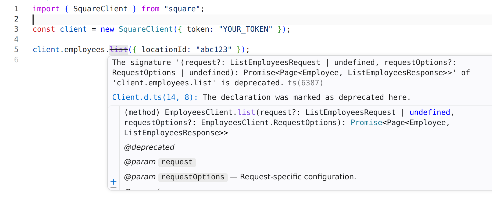

Fern-generated SDKs provide a consistent set of features across all languages to help developers interact with your API. Usage information is auto-generated in your SDK's `README.md`, [which you can customize](./readme).

For a complete example of a generated SDK README, see [Intercom's Python SDK](https://github.com/intercom/python-intercom/blob/3aac991a92cefe34cf437f8f5ca46c97c04c1a6c/README.md).

## Installation and basic usage

Users install SDKs using standard package managers (npm for TypeScript, pip for Python, Maven/Gradle for Java, etc.) from language-specific registries.

Users initialize the client with your API's base URL and any required authentication, then call methods on the client to interact with your API. Generated SDKs support modern runtimes across languages.

## Reference

The `README.md` file links to an auto-generated `reference.md` file
([example](https://github.com/intercom/python-intercom/blob/HEAD/reference.md))
that lists all available API methods organized by resource, including method
signatures with parameter types, usage examples, and request/response structures
for each endpoint.

## IDE support and IntelliSense

Fern-generated SDKs include full type definitions that enable rich IDE support. When developers use your SDK in editors like VS Code, they get autocomplete, inline documentation, and type information.

The inline documentation comes from your API definition. During the SDK generation process, Fern embeds your parameter descriptions, return types, and code examples directly in the code as docstrings (Python), JSDoc (TypeScript), Javadoc (Java), etc.

<Frame caption="From Vapi Server SDK (TypeScript)" background="subtle">
  <video
    src="../images/intellisense.mp4"
    autoPlay
    loop
    playsInline
    muted
>
</video>
</Frame>

## Availability

The TypeScript SDK generator adds JSDoc tags for endpoint [availability](/learn/api-definitions/openapi/extensions/availability). Deprecated endpoints receive `@deprecated`; `alpha`, `beta`, and `preview` endpoints receive `@beta`. IDEs can display deprecated methods with warnings and strikethrough styling.

Other SDK generators don't emit availability annotations. Availability on types, properties, and enum values also doesn't add annotations to generated code.

<Frame caption="Deprecated method with strikethrough in the [Square TypeScript SDK](https://github.com/square/square-nodejs-sdk/blob/master/src/api/resources/employees/client/Client.ts)">
  
</Frame>

## Error handling

When the API returns a 4xx or 5xx status code, the SDK throws an error that includes the status code, error message, response body, and raw response object.

## Server-sent events

When your API uses [server-sent events](/learn/api-definitions/openapi/endpoints/sse#server-sent-events), the generated SDK returns a streaming response that yields parsed data objects. SDK users can opt into [metadata-aware iteration](/learn/sdks/deep-dives/sse-metadata) to read SSE protocol fields (event ID, event type, retry interval) alongside the parsed data, which is useful for stream resumption via the `Last-Event-ID` header. [Newline-delimited JSON streams](/learn/api-definitions/openapi/endpoints/sse#json-streaming) yield the same async-iterable response, one parsed object per line.

## Webhook signature verification

When you define webhooks in your API spec, Fern automatically [generates utilities that allow your users to verify webhook signatures](./webhook-signature-verification) and ensure events originate from your API.

## WebSockets

When you define [WebSocket channels](/learn/api-definitions/asyncapi/channels/pubsub) in your API spec, Fern can [generate typed WebSocket clients](./websocket-clients) with connection management, typed messages, and automatic reconnection.

## Default parameter values

You can configure [default values](/learn/api-definitions/openapi/extensions/default-values) for path, header, and query parameters, including headers defined under [`x-fern-global-headers`](/learn/api-definitions/openapi/extensions/global-headers). The SDK makes those parameters optional and sends the default when the caller doesn't provide one — useful for things like pinning an API version header or default region.

## Customization options

Your SDK users can configure individual requests using language-specific options:

| Option | Description | Availability |
|--------|-------------|--------------|
| Timeouts | Configure request timeouts (default: 30 seconds for [C#](/learn/sdks/generators/csharp/configuration#default-timeout-in-milliseconds) and PHP, 60 seconds for all other languages) | All languages |
| [Retries](/learn/sdks/deep-dives/retries-with-backoff) | Configure maximum retries (default: 2 with exponential backoff for 408, 429, and 5xx responses) | All languages except Ruby and Swift |
| Custom HTTP client | Override the default HTTP client for unsupported environments or custom requirements | TypeScript, Python, Java, PHP, and Swift |
| [aiohttp transport](/learn/sdks/generators/python/aiohttp-support) | Opt into `aiohttp` as the async HTTP transport to resolve DNS concurrency bottlenecks | Python only |
| Custom headers | Send additional headers with any request | TypeScript, Java, and Swift |
| Raw response data | Access response headers alongside parsed data | TypeScript, Python, and Go |
| Query parameters | Add extra query string parameters | TypeScript and Swift |
| [Additional body parameters](#additional-body-parameters) | Send extra properties in the request body, such as beta fields that aren't in your API definition | All languages |
| Abort signals | Cancel in-flight requests | TypeScript only |

### Additional body parameters

SDK users can send request body properties that aren't part of the generated request types, such as beta or undocumented fields, without waiting for a new SDK release. The SDK merges these properties into the serialized request body. Keys use the API's wire format (for example, `snake_case`), and they override generated properties with the same name.

<CodeBlocks>
  <CodeBlock title="TypeScript">
    ```ts {3}
    await client.plants.create(
      { name: "Monstera" },
      { additionalBodyParameters: { watering_schedule: "weekly" } }
    );
    ```
  </CodeBlock>
  <CodeBlock title="Python">
    ```python {3}
    client.plants.create(
        name="Monstera",
        request_options={"additional_body_parameters": {"watering_schedule": "weekly"}},
    )
    ```
  </CodeBlock>
  <CodeBlock title="Go">
    ```go {4-6}
    response, err := client.Plants.Create(
      ctx,
      &acme.CreatePlantRequest{Name: "Monstera"},
      option.WithBodyProperties(map[string]interface{}{
        "watering_schedule": "weekly",
      }),
    )
    ```
  </CodeBlock>
  <CodeBlock title="Java">
    ```java {3-5}
    client.plants().create(
        CreatePlantRequest.builder().name("Monstera").build(),
        RequestOptions.builder()
            .addBodyProperty("watering_schedule", "weekly")
            .build()
    );
    ```
  </CodeBlock>
  <CodeBlock title="C#">
    ```csharp {3-9}
    await client.Plants.CreateAsync(
        new CreatePlantRequest { Name = "Monstera" },
        new RequestOptions
        {
            AdditionalBodyProperties = new Dictionary<string, object?>
            {
                ["watering_schedule"] = "weekly",
            },
        }
    );
    ```
  </CodeBlock>
  <CodeBlock title="PHP">
    ```php {3}
    $client->plants->create(
        new CreatePlantRequest(['name' => 'Monstera']),
        ['bodyProperties' => ['watering_schedule' => 'weekly']],
    );
    ```
  </CodeBlock>
  <CodeBlock title="Ruby">
    ```ruby {3-5}
    client.plants.create(
      name: "Monstera",
      request_options: {
        additional_body_parameters: { "watering_schedule" => "weekly" }
      }
    )
    ```
  </CodeBlock>
  <CodeBlock title="Rust">
    ```rust {3}
    let response = client.plants.create(
        &request,
        Some(RequestOptions::new().additional_body_param("watering_schedule", "weekly")),
    ).await?;
    ```
  </CodeBlock>
  <CodeBlock title="Swift">
    ```swift {3-5}
    let plant = try await client.plants.create(
        request: .init(name: "Monstera"),
        requestOptions: .init(
            additionalBodyProperties: ["watering_schedule": "weekly"]
        )
    )
    ```
  </CodeBlock>
</CodeBlocks>

Behavior varies slightly by language:

| Language | Minimum generator version | Supported request bodies | Notes |
|----------|---------------------------|--------------------------|-------|
| TypeScript | [3.78.0](/learn/sdks/generators/typescript/changelog) | JSON | |
| Python | Any | JSON | |
| Go | [1.65.3](/learn/sdks/generators/go/changelog) | JSON and form-encoded | Earlier versions return an error when a key matches a generated property instead of overriding it. |
| Java | [4.24.0](/learn/sdks/generators/java/changelog) | JSON and form-encoded | |
| C# | [2.86.2](/learn/sdks/generators/csharp/changelog) | JSON and form-encoded | Nested objects are merged recursively rather than replaced. Earlier versions support JSON bodies only and throw an error on endpoints without a request body. |
| PHP | [0.11.0](/learn/sdks/generators/php/changelog) | JSON | Ignored on endpoints without a JSON request body. |
| Ruby | [1.30.1](/learn/sdks/generators/ruby/changelog) | JSON and form-encoded | Ignored on `GET` and `HEAD` requests. |
| Rust | [0.53.0](/learn/sdks/generators/rust/changelog) | JSON and form-encoded | |
| Swift | [0.37.0](/learn/sdks/generators/swift/changelog) | JSON | Ignored on `GET` and `HEAD` requests. `additionalBodyParameters` is also available but accepts only string values. |

In every language, file upload (multipart) endpoints ignore additional body parameters. When an endpoint has no request body, most SDKs send the additional properties as a JSON body.
