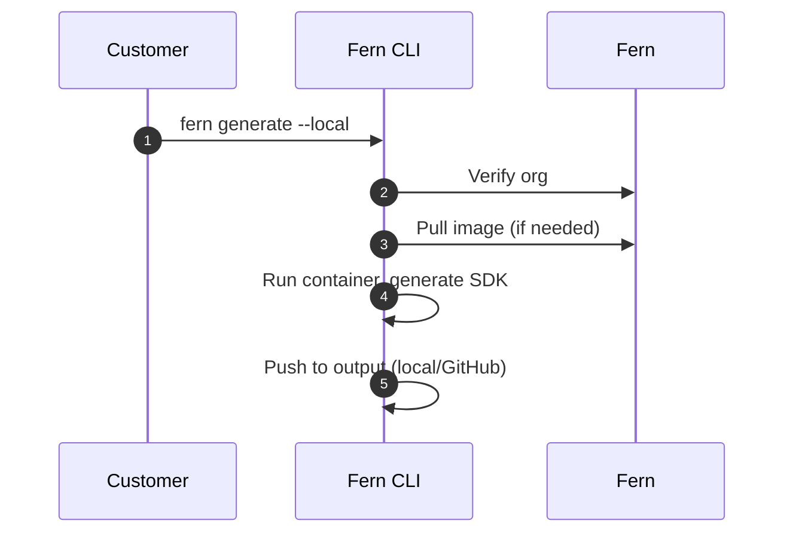

<Markdown src="/snippets/enterprise-plan.mdx" />

Fern SDK generation [runs on Fern's infrastructure by default](/sdks/overview/how-it-works). Self-hosting allows you to run SDK generation on your own infrastructure. Use self-hosting if your organization:

- Operates without internet access
- Has strict compliance or security requirements
- Needs full control over your SDK generation process

When you self-host, you're responsible for infrastructure management and SDK distribution. Self-hosted SDK generation includes [all Fern SDK features](/learn/sdks/overview/capabilities).

<Info>
Unless you have specific requirements that prevent using Fern's default hosting, we recommend **using our managed cloud generation solution** for easier setup and maintenance.
</Info>

## Setup

<Info>
This page assumes that you have:

* An initialized `fern` folder. See [Set up the `fern` folder](/sdks/overview/quickstart).
* SDK generators configured in `generators.yml`. See language-specific quickstarts: [TypeScript](/sdks/generators/typescript/quickstart), [Python](/sdks/generators/python/quickstart), [Go](/sdks/generators/go/quickstart), [Java](/sdks/generators/java/quickstart), etc.
</Info>

Self-hosted SDK generation allows you to output to your local file system or push directly to a GitHub repository you control. Follow these steps to set up and run local generation:

<Steps>
<Step title="Ensure Docker is running">

Verify that a Docker daemon is running on your machine, as SDK generation runs inside a Docker container:

```bash
docker ps
```

</Step>

<Step title="Generate a Fern token">

Generate a Fern token, which is required for local generation to verify your organization.

```bash
fern token
```

The token is specific to your organization defined in `fern.config.json` and doesn't expire.

</Step>

<Step title="Configure output location">

Configure your `generators.yml` to output SDKs to your local file system or a GitHub repository you control.

<Tabs>
<Tab title="Local file system" language="local">

Output generated SDKs directly to a local directory:

```yaml title="generators.yml" {7-8}
groups:
  python-sdk:
    generators:
      - name: fernapi/fern-python-sdk
        version: 4.0.0
        output:
          location: local-file-system
          path: ../sdks/python
```

</Tab>
<Tab title="GitHub repository" language="github">

To push generated SDKs to your GitHub repository, configure the `github` property with `uri` and `token`. Set the [publishing `mode`](/learn/sdks/reference/generators-yml#github) to `push` for direct commits or `pull-request` to create PRs.

```yaml title="generators.yml" {4-8}
groups:
  python-sdk:
    generators:
      - name: fernapi/fern-python-sdk
        version: 4.0.0
        github:
          uri: https://github.com/your-org/python-sdk
          token: ${GITHUB_TOKEN}
          mode: push
          branch: main
```

</Tab>
</Tabs>
</Step>

<Step title="Set up authentication">

Configure authentication based on your chosen output location.

<Tabs>
<Tab title="Local file system" language="local">

Set your Fern token as an environment variable:

```bash
export FERN_TOKEN=your-generated-token
```

</Tab>
<Tab title="GitHub repository" language="github">

Set up GitHub secrets for authentication. In your repository's **Settings** > **Secrets and variables** > **Actions**, add:

- `FERN_TOKEN`: The token you generated above
- `GITHUB_TOKEN`: A [GitHub personal access token](https://docs.github.com/en/authentication/keeping-your-account-and-data-secure/managing-your-personal-access-tokens) with repository write access

</Tab>
</Tabs>
</Step>

<Step title="Run generation locally">

Use the `--local` flag to generate SDKs locally instead of using Fern's cloud infrastructure. You can combine `--local` with `--group` to generate specific SDKs locally.

```bash
fern generate --local
fern generate --group python-sdk --local
```

<Accordion title="Optional: Configure a custom container registry">

By default, `fern generate --local` pulls generator Docker images from Docker Hub. If your organization mirrors Fern's images into a private registry, you can configure the CLI to pull from that registry instead.
To use a custom registry, replace the `name` field in your generator configuration with an [`image`](http://localhost:3000/learn/sdks/reference/generators-yml#image) object containing `name` and `registry`:

```yaml title="generators.yml" {4-6}
groups:
  python-sdk:
    generators:
      - image:
          name: fern-python-sdk
          registry: ghcr.io/your-org
        version: <Markdown src="/snippets/version-number-python.mdx"/>
        output:
          location: local-file-system
          path: ../sdks/python
```

<Info>
  The `image.name` must be a recognized Fern generator name (for example, `fern-python-sdk` or `fern-typescript-sdk`). This ensures the CLI can resolve the correct IR version for your generator. The `version` must also match a published Fern generator version.
</Info>

Generators configured with a custom `image` are skipped during `fern generator upgrade`. You must manually update the version for these generators.

If your registry requires authentication, log in before running `fern generate --local`. The CLI uses the credentials stored by Docker.

```bash
# Example: authenticate with GitHub Container Registry
echo $CR_PAT | docker login ghcr.io -u USERNAME --password-stdin

# Then run local generation as usual
fern generate --local
```

</Accordion>

</Step>
</Steps>

## How it works

When you run `fern generate --local`, the Fern CLI executes SDK generation on your local machine instead of using [Fern's cloud infrastructure](/learn/sdks/overview/how-it-works).

<Tip>
The underlying SDK generation architecture is the same whether you use cloud or self-hosted generation. See the [expanded architecture diagram](/learn/sdks/overview/how-it-works#expanded-architecture) for details.
</Tip>

The self-hosted process works as follows:

1. **Organization verification** (network call) - The CLI verifies your organization registration with Fern
1. **Download generator image** (network call if not cached) - The CLI downloads the generator's Docker image if not already available locally
1. **Generate SDK** (local) - The CLI runs the generator container locally to produce SDK files based on your API definition and `generators.yml` configuration
1. **Output SDK** (local) - Generated SDK files are saved to your configured output location (local file system or GitHub repository)

Steps 1 and 2 are the only network calls made when using the `--local` flag. No API definition or specification data is sent over the network: all SDK generation happens locally on your machine.



## Determining SDK versions

When self-hosting, your pipeline picks the version number for each SDK release. Cloud generation handles this automatically via [Fern Autorelease](/learn/sdks/overview/autorelease), but self-hosted setups need to compute the next version themselves.

The CLI exposes two workflows for this. Both can be wired into the same generation pipeline:

- **`--version AUTO`** is the recommended approach. Fern classifies the change and picks the next version for you. This is the path that continues to receive improvements.
- **`fern ir` + `fern diff`** is the deterministic alternative. Use it when you need explicit control over how the version number is derived, or when you can't depend on an external LLM provider.

### `--version AUTO` (recommended)

Pass `--version AUTO` to `fern generate` and Fern analyzes the diff between the previous and current SDK output, classifies the change as `MAJOR`, `MINOR`, or `PATCH`, and applies the next [semantic version](https://semver.org/) to the generated package. The same analysis also produces:

- A changelog entry describing what changed
- A PR description summarizing the release
- A [conventional commit](https://www.conventionalcommits.org/) message

```bash
FERN_TOKEN=<token> fern generate --version AUTO
```

<Info>
`--version AUTO` requires:
- A `FERN_TOKEN` for organization verification (same as all local generation).
- An `ai:` block in `generators.yml` selecting the LLM provider and model (see below).
- The corresponding provider credentials in your environment (see below).
- A self-hosted GitHub output configured in `generators.yml` (with `github.uri` and `github.token`, [as shown above](#setup)), because the auto-versioning pipeline pushes the version bump and changelog back to the SDK repo.
</Info>

Configure the provider and model in `generators.yml`:

```yaml title="generators.yml"
ai:
  provider: openai   # openai | anthropic | bedrock
  model: gpt-4o      # any model name the provider accepts
```

Set the matching API key in your environment so the Fern CLI can call the provider:

- `OPENAI_API_KEY` for OpenAI
- `ANTHROPIC_API_KEY` for Anthropic
- Standard AWS credentials (`AWS_ACCESS_KEY_ID`, `AWS_SECRET_ACCESS_KEY`, `AWS_REGION`) for AWS Bedrock

The diff is sent to the provider's API using your credentials — Fern's infrastructure is not involved in the analysis.

This approach is designed for use with `fern automations generate`, which powers Fern's automated release pipeline, but it works standalone anywhere that meets the requirements above.

### Deterministic versioning with `fern ir` + `fern diff`

If you'd rather derive the version number yourself, use the `fern ir` and `fern diff` commands to compute the bump from your API definition. This flow has no LLM dependency: `fern diff` walks the intermediate representation (IR) of both specs and returns a deterministic result.

The workflow has three steps:

<Steps>
<Step title="Generate the previous IR">

Check out the spec as it was at the last SDK generation and write its IR to disk:

```bash
fern ir old-ir.json
```

Pass `--api <name>` if your [project defines multiple APIs](/learn/sdks/overview/project-structure).

</Step>
<Step title="Generate the current IR">

Check out the spec at `HEAD` and write its IR to disk:

```bash
fern ir new-ir.json
```

</Step>
<Step title="Diff the two IRs">

Run `fern diff` with `--from-version` set to the SDK's current version. When `--from-version` is provided, the command prints a JSON object containing the computed bump and the next version:

```bash
fern diff \
  --from old-ir.json \
  --to new-ir.json \
  --from-version 1.4.2
```

```json
{
  "bump": "minor",
  "nextVersion": "1.5.0",
  "errors": []
}
```

`bump` is one of `major`, `minor`, `patch`, or `no_change`. Pass `nextVersion` to `fern generate` to release that exact version:

<Tabs>
<Tab title="CLI v1" language="cli-v1">
```bash
fern generate --version 1.5.0
```
</Tab>
<Tab title="CLI v2" language="cli-v2">
```bash
fern generate --output-version 1.5.0
```
</Tab>
</Tabs>

</Step>
</Steps>

<Info>
`fern diff` exits with a non-zero status when the computed bump is `major`. This makes it easy to gate breaking changes on a manual review step in CI.
</Info>

#### Wiring `fern ir` + `fern diff` into CI

The non-obvious part is reproducing the IR for the *previous* spec. Each generated SDK records the config repo commit it was generated from in `.fern/metadata.json`:

```json title=".fern/metadata.json"
{
  "cliVersion": "0.74.0",
  "generatorName": "fernapi/fern-python-sdk",
  "generatorVersion": "4.0.0",
  "originGitCommit": "a1b2c3d4e5f6...",
  "requestedVersion": "1.4.2",
  "sdkVersion": "1.4.2"
}
```

`originGitCommit` is the SHA in the **config repo** that produced the SDK at its current version. Check that commit out, run `fern ir`, then switch back to `HEAD` and run `fern ir` again to produce both inputs to `fern diff`.

The following GitHub Actions snippet runs in the config repo on every push to `main` and computes the next version for a Python SDK whose `originGitCommit` and `sdkVersion` are read from the SDK repo:

```yaml title=".github/workflows/release-sdk.yml"
name: Release SDK

on:
  push:
    branches: [main]

jobs:
  release:
    runs-on: ubuntu-latest
    env:
      FERN_TOKEN: ${{ secrets.FERN_TOKEN }}
      SDK_REPO: your-org/python-sdk
    steps:
      - name: Check out config repo
        uses: actions/checkout@v4
        with:
          fetch-depth: 0

      - name: Set up Fern CLI
        uses: fern-api/setup-fern-cli@v1

      - name: Read previous SDK metadata
        id: meta
        run: |
          curl -fsSL \
            -H "Authorization: token ${{ secrets.GITHUB_TOKEN }}" \
            -H "Accept: application/vnd.github.raw" \
            "https://api.github.com/repos/${SDK_REPO}/contents/.fern/metadata.json" \
            > metadata.json
          echo "old_sha=$(jq -r .originGitCommit metadata.json)" >> "$GITHUB_OUTPUT"
          echo "from_version=$(jq -r .sdkVersion metadata.json)" >> "$GITHUB_OUTPUT"

      - name: Generate previous IR
        run: |
          git checkout ${{ steps.meta.outputs.old_sha }}
          fern ir old-ir.json --api <your-api-name>

      - name: Generate current IR
        run: |
          git checkout ${{ github.sha }}
          fern ir new-ir.json --api <your-api-name>

      - name: Compute next version
        id: diff
        run: |
          result=$(fern diff \
            --from old-ir.json \
            --to new-ir.json \
            --from-version ${{ steps.meta.outputs.from_version }}) || true
          bump=$(echo "$result" | jq -r .bump)
          if [ "$bump" = "major" ]; then
            echo "Computed a major version bump — manual review required before releasing."
            exit 1
          fi
          echo "next_version=$(echo "$result" | jq -r .nextVersion)" >> "$GITHUB_OUTPUT"

      - name: Generate SDK
        run: fern generate --group python-sdk --version ${{ steps.diff.outputs.next_version }}
```

`fetch-depth: 0` on the checkout step is required so the runner has the history needed to check out `originGitCommit`. Replace the metadata-fetch step with whatever mechanism gives your pipeline access to the SDK repo's `.fern/metadata.json` (a checkout of the SDK repo, a release artifact, an internal API, and so on).
