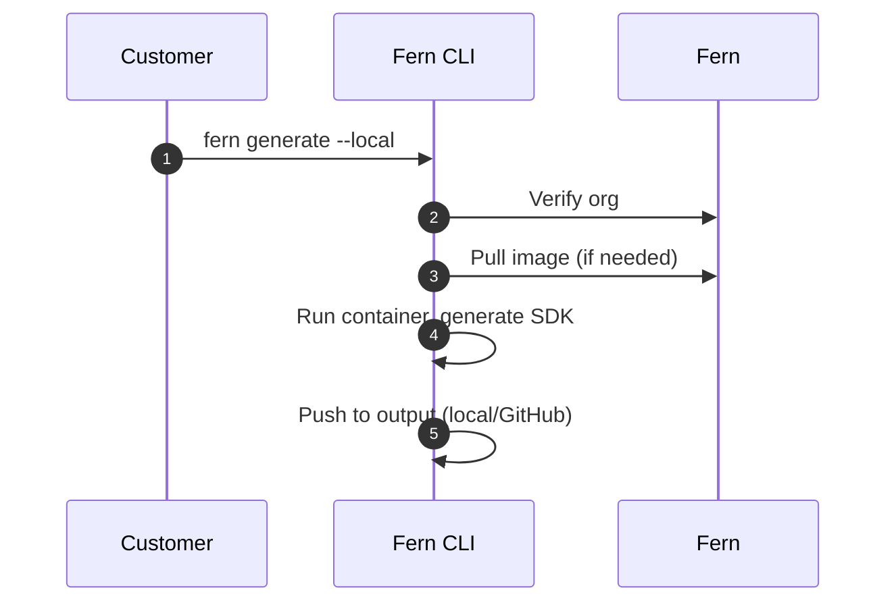

<Markdown src="/snippets/enterprise-plan.mdx" />

Fern SDK generation [runs on Fern's infrastructure by default](/learn/sdks/overview/how-it-works). Self-hosting allows you to run SDK generation on your own infrastructure. Use self-hosting if your organization:

- Operates without internet access
- Has strict compliance or security requirements
- Needs full control over your SDK generation process

When you self-host, you're responsible for [infrastructure management, SDK distribution](/learn/sdks/deep-dives/self-hosted-operations), and [computing SDK version numbers](/learn/sdks/deep-dives/self-hosted-versioning). Self-hosted SDK generation includes [all Fern SDK features](/learn/sdks/overview/capabilities).

<Info>
Unless you have specific requirements that prevent using Fern's default hosting, we recommend **using our managed cloud generation solution** for easier setup and maintenance.
</Info>

## Infrastructure requirements

Each machine that runs `fern generate --local` needs:

- **A Docker runtime.** Generation runs inside a generator container, so a Docker daemon must be available (`docker ps` succeeds). In CI, use a runner with Docker preinstalled or a Docker-in-Docker service.
- **A `FERN_TOKEN`.** Organization verification requires a Fern API key, injected as the `FERN_TOKEN` environment variable. Store it as a CI secret rather than in the repo.
- **Outbound network access to two endpoints.** The CLI verifies your organization with Fern and pulls the generator image. No API definition leaves your infrastructure. Air-gapped environments must [mirror generator images into a private registry](#private-registry-setup) reachable from the runner.
- **Write access to the output location.** Local-file-system output writes to disk; GitHub output needs a `GITHUB_TOKEN` with write access to the SDK repository.

## Setup

<Info>
This page assumes that you have:

* An initialized `fern` folder. See [Set up the `fern` folder](/learn/sdks/overview/quickstart).
* SDK generators configured in `generators.yml`. See language-specific quickstarts: [TypeScript](/learn/sdks/generators/typescript/quickstart), [Python](/learn/sdks/generators/python/quickstart), [Go](/learn/sdks/generators/go/quickstart), [Java](/learn/sdks/generators/java/quickstart), etc.
</Info>

Self-hosted SDK generation allows you to output to your local file system or push directly to a GitHub repository you control. Follow these steps to set up and run local generation:

<Steps>
<Step title="Ensure Docker is running">

Verify that a Docker daemon is running on your machine, as SDK generation runs inside a Docker container:

```bash
docker ps
```

</Step>

<Step title="Generate a Fern API key">

Generate a Fern API key, which is required for local generation to verify your organization. Create one from the [API keys](/learn/dashboard/configuration/api-keys) page in the Dashboard, or run `fern token` in your terminal:

```bash
fern token
```

The API key is specific to your organization defined in `fern.config.json` and doesn't expire.

</Step>

<Step title="Configure output location">

Configure your `generators.yml` to output SDKs to your local file system or a GitHub repository you control.

<Tabs>
<Tab title="Local file system" language="local">

Output generated SDKs directly to a local directory:

```yaml title="generators.yml" {7-8}
groups:
  python-sdk:
    generators:
      - name: fern-python-sdk
        version: 4.0.0
        output:
          location: local-file-system
          path: ../sdks/python
```

</Tab>
<Tab title="GitHub repository" language="github">

To push generated SDKs to your GitHub repository, configure the `github` property with `uri` and `token`. Set the [publishing `mode`](/learn/sdks/reference/generators-yml#github) to `push` for direct commits or `pull-request` to create PRs.

```yaml title="generators.yml" {4-8}
groups:
  python-sdk:
    generators:
      - name: fern-python-sdk
        version: 4.0.0
        github:
          uri: https://github.com/your-org/python-sdk
          token: ${GITHUB_TOKEN}
          mode: push
          branch: main
```

</Tab>
</Tabs>
</Step>

<Step title="Set up authentication">

Configure authentication based on your chosen output location.

<Tabs>
<Tab title="Local file system" language="local">

Set your Fern API key as an environment variable:

```bash
export FERN_TOKEN=your-generated-token
```

</Tab>
<Tab title="GitHub repository" language="github">

Set up GitHub secrets for authentication. In your repository's **Settings** > **Secrets and variables** > **Actions**, add:

- `FERN_TOKEN`: The API key you generated above
- `GITHUB_TOKEN`: A [GitHub personal access token](https://docs.github.com/en/authentication/keeping-your-account-and-data-secure/managing-your-personal-access-tokens) with repository write access

</Tab>
</Tabs>
</Step>

<Step title="Configure version computation">

Cloud generation picks SDK version numbers automatically. With self-hosting, your pipeline computes the next version itself — see [Self-hosted SDK versioning](/learn/sdks/deep-dives/self-hosted-versioning) for the two supported workflows.

</Step>

<Step title="Run generation locally">

Use the `--local` flag to generate SDKs locally instead of using Fern's cloud infrastructure. You can combine `--local` with `--group` to generate specific SDKs locally.

```bash
fern generate --local
fern generate --group python-sdk --local
```

To pull generator images from a private registry your organization controls instead of Docker Hub, see [Private registry setup](#private-registry-setup).

<Note>
To share a locally generated SDK internally without publishing it to a registry, add [`--package`](/learn/cli-api-reference/cli-reference/sdk-commands#package), which builds a distributable artifact into a `fern-dist/` folder inside the output directory.
</Note>

</Step>
</Steps>

## Private registry setup

By default, `fern generate --local` pulls generator Docker images from Docker Hub. Organizations that restrict outbound traffic or require vetted images can mirror Fern's generator images into a private registry and point the CLI at it. Remote (cloud) generation doesn't support custom registries.

<Steps>
<Step title="Mirror the generator image">

Pull each generator image at the version you intend to use, retag it for your registry, and push. The CLI resolves the full reference as `{registry}/{name}:{version}`.

```bash
docker pull fernapi/fern-python-sdk:4.0.0
docker tag fernapi/fern-python-sdk:4.0.0 ghcr.io/your-org/fern-python-sdk:4.0.0
docker push ghcr.io/your-org/fern-python-sdk:4.0.0
```

</Step>
<Step title="Reference the registry in generators.yml">

Replace the generator's `name` field with an [`image`](/learn/sdks/reference/generators-yml#image) object containing `name` and `registry`:

```yaml title="generators.yml" {4-6}
groups:
  python-sdk:
    generators:
      - image:
          name: fern-python-sdk
          registry: ghcr.io/your-org
        version: <Markdown src="/snippets/version-number-python.mdx"/>
        output:
          location: local-file-system
          path: ../sdks/python
```

The `image.name` must be a recognized Fern generator name (for example, `fern-python-sdk` or `fern-typescript-sdk`) so the CLI can resolve the correct IR version, and `version` must match a published Fern generator version. Generators configured with an `image` are skipped during `fern generator upgrade`, so bump their versions manually and re-mirror the matching image when you upgrade.

</Step>
<Step title="Authenticate to the registry">

If the registry requires authentication, log in before running `fern generate --local`. The CLI uses the credentials stored by Docker.

```bash
# Example: authenticate with GitHub Container Registry
echo $CR_PAT | docker login ghcr.io -u USERNAME --password-stdin

# Then run local generation as usual
fern generate --local
```

</Step>
</Steps>

## Trust a corporate CA bundle

Some generators make network calls from inside the container (`pnpm install` for TypeScript, `go mod tidy` for Go, NuGet restore during `dotnet format` for C#, and the `git clone` of an existing SDK repository when merging its README). On networks with TLS interception, these calls fail because the container doesn't trust the corporate CA. Set `FERN_CA_BUNDLE` (Fern CLI 5.116.0 or later) to a PEM CA bundle on the host that runs the CLI:

```bash
export FERN_CA_BUNDLE=/etc/ssl/certs/corporate-bundle.pem
fern generate --local
```

The CLI mounts the file read-only at `/fern/ca-bundle.crt` in the generator container and points `NODE_EXTRA_CA_CERTS`, `SSL_CERT_FILE`, and `GIT_SSL_CAINFO` at it. TLS verification stays on. The CLI exits with an error if the path is unreadable or contains no PEM certificates.

- `SSL_CERT_FILE` and `GIT_SSL_CAINFO` replace the container's trust store, so the file must be a full bundle (the public roots plus your corporate CA), not only the corporate root or intermediate. The CLI warns when the file holds fewer than 50 certificates.
- Java ignores these variables, so Gradle and Spotless downloads in `fern-java-*` generators still fail behind interception. Set [`FERN_JAVA_SKIP_FORMATTING=true`](#skip-java-code-formatting) for those generators.
- The bind mount must be visible to the Docker daemon, so `FERN_CA_BUNDLE` requires a local daemon. Remote `DOCKER_HOST` and Docker-in-Docker sidecars aren't supported.
- `FERN_CA_BUNDLE` only affects `fern generate --local`.

## How it works

When you run `fern generate --local`, the Fern CLI executes SDK generation on your local machine instead of using [Fern's cloud infrastructure](/learn/sdks/overview/how-it-works).

<Tip>
The underlying SDK generation architecture is the same whether you use cloud or self-hosted generation. See the [expanded architecture diagram](/learn/sdks/overview/how-it-works#expanded-architecture) for details.
</Tip>

The self-hosted process works as follows:

1. **Organization verification** (network call) - The CLI verifies your organization registration with Fern
1. **Download generator image** (network call if not cached) - The CLI downloads the generator's Docker image if not already available locally
1. **Generate SDK** (local) - The CLI runs the generator container locally to produce SDK files based on your API definition and `generators.yml` configuration
1. **Output SDK** (local) - Generated SDK files are saved to your configured output location (local file system or GitHub repository)

Steps 1 and 2 are the only network calls the CLI makes when using the `--local` flag. No API definition or specification data is sent over the network: all SDK generation happens locally on your machine. The Java generator additionally reaches Gradle's distribution and plugin hosts to format its output, which [`FERN_JAVA_SKIP_FORMATTING`](#skip-java-code-formatting) turns off.



## Skip Java code formatting

The Java generator formats its output with `./gradlew :spotlessApply`, which downloads Gradle and the Spotless plugin from `services.gradle.org` and `plugins.gradle.org`. On networks that block those hosts or intercept TLS (Java ignores [`FERN_CA_BUNDLE`](#trust-a-corporate-ca-bundle)), set `FERN_JAVA_SKIP_FORMATTING=true` (Java generator 4.18.0 or later) to skip the formatting pass. The CLI forwards the variable into the generator container:

```bash
FERN_JAVA_SKIP_FORMATTING=true fern generate --local --group java-sdk
```

Generated code is left unformatted; run `./gradlew spotlessApply` in the SDK repository to format it.
