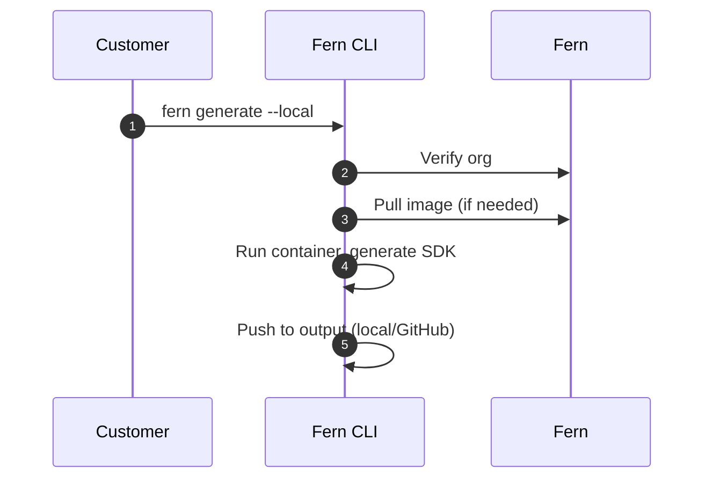

<Markdown src="/snippets/enterprise-plan.mdx" />

Fern SDK generation [runs on Fern's infrastructure by default](/sdks/overview/how-it-works). Self-hosting allows you to run SDK generation on your own infrastructure. Use self-hosting if your organization:

- Operates without internet access
- Has strict compliance or security requirements
- Needs full control over your SDK generation process

When you self-host, you're responsible for infrastructure management, SDK distribution, and [computing SDK version numbers](/learn/sdks/deep-dives/self-hosted-versioning). Self-hosted SDK generation includes [all Fern SDK features](/learn/sdks/overview/capabilities).

<Info>
Unless you have specific requirements that prevent using Fern's default hosting, we recommend **using our managed cloud generation solution** for easier setup and maintenance.
</Info>

## Setup

<Info>
This page assumes that you have:

* An initialized `fern` folder. See [Set up the `fern` folder](/sdks/overview/quickstart).
* SDK generators configured in `generators.yml`. See language-specific quickstarts: [TypeScript](/sdks/generators/typescript/quickstart), [Python](/sdks/generators/python/quickstart), [Go](/sdks/generators/go/quickstart), [Java](/sdks/generators/java/quickstart), etc.
</Info>

Self-hosted SDK generation allows you to output to your local file system or push directly to a GitHub repository you control. Follow these steps to set up and run local generation:

<Steps>
<Step title="Ensure Docker is running">

Verify that a Docker daemon is running on your machine, as SDK generation runs inside a Docker container:

```bash
docker ps
```

</Step>

<Step title="Generate a Fern API key">

Generate a Fern API key, which is required for local generation to verify your organization. Create one from the [API keys](/learn/dashboard/configuration/api-keys) page in the Dashboard, or run `fern token` in your terminal:

```bash
fern token
```

The API key is specific to your organization defined in `fern.config.json` and doesn't expire.

</Step>

<Step title="Configure output location">

Configure your `generators.yml` to output SDKs to your local file system or a GitHub repository you control.

<Tabs>
<Tab title="Local file system" language="local">

Output generated SDKs directly to a local directory:

```yaml title="generators.yml" {7-8}
groups:
  python-sdk:
    generators:
      - name: fern-python-sdk
        version: 4.0.0
        output:
          location: local-file-system
          path: ../sdks/python
```

</Tab>
<Tab title="GitHub repository" language="github">

To push generated SDKs to your GitHub repository, configure the `github` property with `uri` and `token`. Set the [publishing `mode`](/learn/sdks/reference/generators-yml#github) to `push` for direct commits or `pull-request` to create PRs.

```yaml title="generators.yml" {4-8}
groups:
  python-sdk:
    generators:
      - name: fern-python-sdk
        version: 4.0.0
        github:
          uri: https://github.com/your-org/python-sdk
          token: ${GITHUB_TOKEN}
          mode: push
          branch: main
```

</Tab>
</Tabs>
</Step>

<Step title="Set up authentication">

Configure authentication based on your chosen output location.

<Tabs>
<Tab title="Local file system" language="local">

Set your Fern API key as an environment variable:

```bash
export FERN_TOKEN=your-generated-token
```

</Tab>
<Tab title="GitHub repository" language="github">

Set up GitHub secrets for authentication. In your repository's **Settings** > **Secrets and variables** > **Actions**, add:

- `FERN_TOKEN`: The API key you generated above
- `GITHUB_TOKEN`: A [GitHub personal access token](https://docs.github.com/en/authentication/keeping-your-account-and-data-secure/managing-your-personal-access-tokens) with repository write access

</Tab>
</Tabs>
</Step>

<Step title="Configure version computation">

Cloud generation picks SDK version numbers automatically. With self-hosting, your pipeline computes the next version itself — see [Self-hosted SDK versioning](/learn/sdks/deep-dives/self-hosted-versioning) for the two supported workflows.

</Step>

<Step title="Run generation locally">

Use the `--local` flag to generate SDKs locally instead of using Fern's cloud infrastructure. You can combine `--local` with `--group` to generate specific SDKs locally.

```bash
fern generate --local
fern generate --group python-sdk --local
```

<Accordion title="Optional: Configure a custom container registry">

By default, `fern generate --local` pulls generator Docker images from Docker Hub. If your organization mirrors Fern's images into a private registry, you can configure the CLI to pull from that registry instead.
To use a custom registry, replace the `name` field in your generator configuration with an [`image`](http://localhost:3000/learn/sdks/reference/generators-yml#image) object containing `name` and `registry`:

```yaml title="generators.yml" {4-6}
groups:
  python-sdk:
    generators:
      - image:
          name: fern-python-sdk
          registry: ghcr.io/your-org
        version: <Markdown src="/snippets/version-number-python.mdx"/>
        output:
          location: local-file-system
          path: ../sdks/python
```

<Info>
  The `image.name` must be a recognized Fern generator name (for example, `fern-python-sdk` or `fern-typescript-sdk`). This ensures the CLI can resolve the correct IR version for your generator. The `version` must also match a published Fern generator version.
</Info>

Generators configured with a custom `image` are skipped during `fern generator upgrade`. You must manually update the version for these generators.

If your registry requires authentication, log in before running `fern generate --local`. The CLI uses the credentials stored by Docker.

```bash
# Example: authenticate with GitHub Container Registry
echo $CR_PAT | docker login ghcr.io -u USERNAME --password-stdin

# Then run local generation as usual
fern generate --local
```

</Accordion>

</Step>
</Steps>

## How it works

When you run `fern generate --local`, the Fern CLI executes SDK generation on your local machine instead of using [Fern's cloud infrastructure](/learn/sdks/overview/how-it-works).

<Tip>
The underlying SDK generation architecture is the same whether you use cloud or self-hosted generation. See the [expanded architecture diagram](/learn/sdks/overview/how-it-works#expanded-architecture) for details.
</Tip>

The self-hosted process works as follows:

1. **Organization verification** (network call) - The CLI verifies your organization registration with Fern
1. **Download generator image** (network call if not cached) - The CLI downloads the generator's Docker image if not already available locally
1. **Generate SDK** (local) - The CLI runs the generator container locally to produce SDK files based on your API definition and `generators.yml` configuration
1. **Output SDK** (local) - Generated SDK files are saved to your configured output location (local file system or GitHub repository)

Steps 1 and 2 are the only network calls made when using the `--local` flag. No API definition or specification data is sent over the network: all SDK generation happens locally on your machine.


