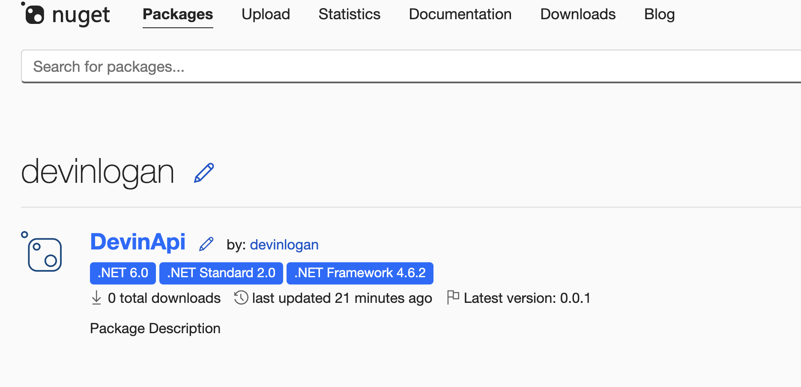
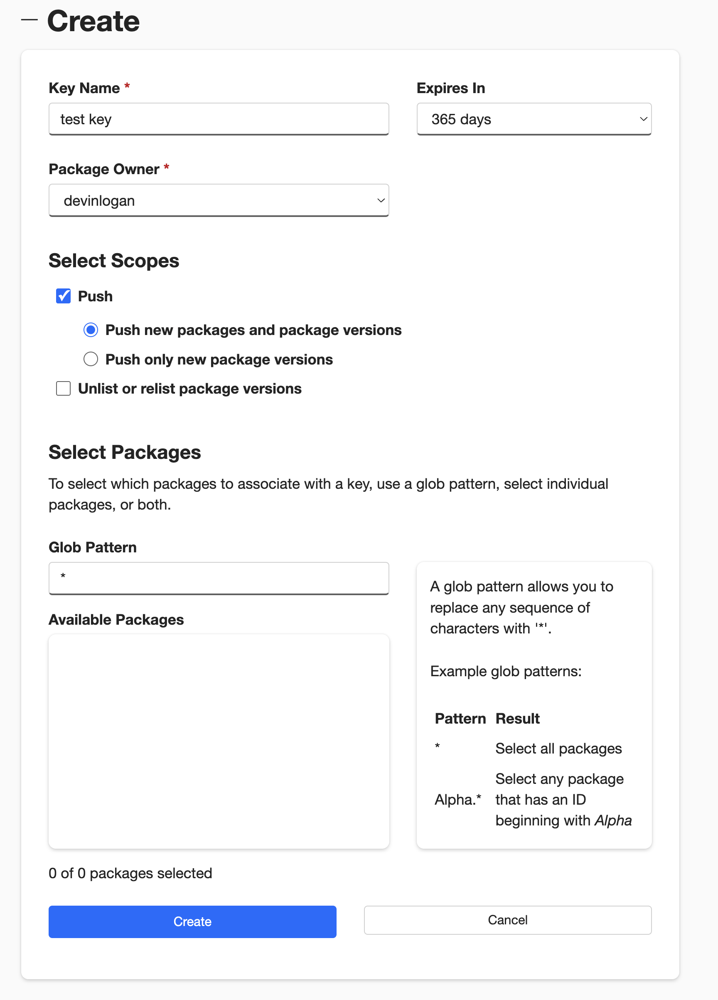
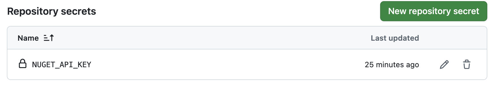
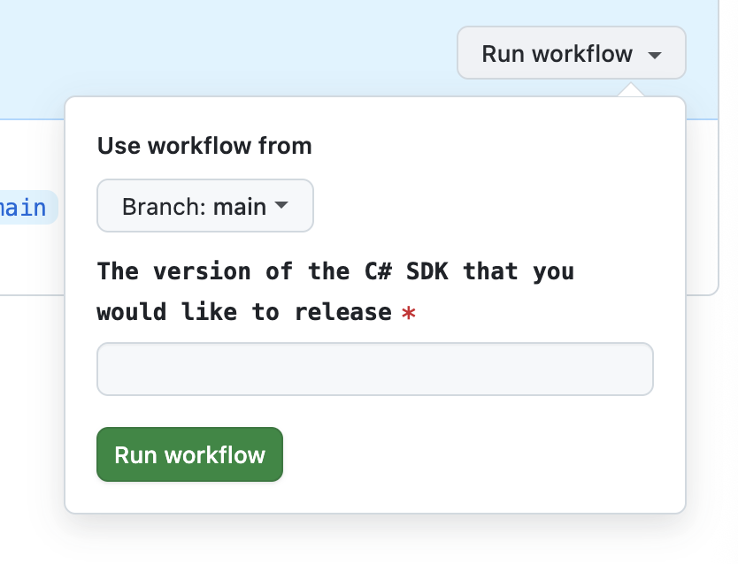

Publish your public-facing Fern C#/.NET SDK to the [NuGet
registry](https://www.nuget.org/). After following the steps on this page,
you'll have a versioned package published on NuGet.


<Frame>
	
</Frame>

<Info>
	This page assumes that you have:

	* An initialized `fern` folder, a GitHub repository for your C#/.NET SDK, and a C#/.NET generator group in `generators.yml`. See [Generating an SDK (C#/.NET)](/learn/sdks/generators/csharp/quickstart).
</Info>

## Configure SDK package settings

You'll need to update your `generators.yml` file to configure the package name, output location, and client name for NuGet publishing. Your `generators.yml` [should live in your source repository](/sdks/overview/project-structure) (or on your local machine), not the repository that contains your C#/.NET SDK code.

<Steps>
<Step title="Configure `output` location">

In the `group` for your C#/.NET SDK, change the output location from `local-file-system` (the default) to `nuget` to indicate that Fern should publish your package directly to the npm registry:

```yaml {6-7} title="generators.yml"
groups: 
  csharp-sdk:
	generators:
	  - name: fernapi/fern-csharp-sdk
	    version: <Markdown src="/snippets/version-number-csharp.mdx"/>
		output:
		  location: nuget
```
</Step>
<Step title="Add a unique package name">

Your package name must be unique in the NuGet repository, otherwise publishing your SDK to NuGet will fail. 

```yaml {8} title="generators.yml"
groups: 
  csharp-sdk:
	generators:
	  - name: fernapi/fern-csharp-sdk
		version: <Markdown src="/snippets/version-number-csharp.mdx"/>
		output:
		  location: nuget
		  package-name: your-package-name
```

</Step>
<Step title="Configure `client-class-name`">

The `client-class-name` option controls the name of the generated client. This is the name customers use to import your SDK (`import { your-client-name } from 'your-package-name';`). 

```yaml {9-10} title="generators.yml"
groups: 
  csharp-sdk:
    generators:
      - name: fernapi/fern-csharp-sdk
        version: <Markdown src="/snippets/version-number-csharp.mdx"/>
        output:
          location: nuget
          package-name: your-package-name
        config:
          client_class_name: YourClientName # must be PascalCase
```
</Step>
</Steps>

## Generate a NuGet API key

<Steps>

<Step title="Log into NuGet">

Log into [NuGet](https://nuget.org/) or create a new account. 

</Step>

<Step title="Add New Key">

1. Click on your profile picture. 
1. Select **API Keys**, then **Create**.
1. Name your key.
1. Select **Push > Push new packages and package versions** as the **Select Scopes** type.
1. Enter `*` under **Select Packages > Glob Patten**. 
		
	<Tip title="Replacing an existing NuGet package">
		If you are overriding an existing package, you can select the relevant
		package instead of entering `*`. 
	</Tip>
1. Click **Create**.

<Frame>

</Frame>

<Warning>Save your new key –  it won’t be displayed after you leave the page.</Warning>

</Step>

</Steps>

## Configure NuGet publication

<Steps>
<Step title="Add repository location">

Add the path to the GitHub repository containing your C#/.NET SDK:

```yaml title="generators.yml" {11-12}
groups: 
  csharp-sdk:
    generators:
      - name: fernapi/fern-csharp-sdk
        version: <Markdown src="/snippets/version-number-csharp.mdx"/>
        output:
          location: nuget
          package-name: your-package-name
        config:
          client_class_name: YourClientName
        github: 
          repository: your-org/company-csharp
```	  
</Step>
<Step title="Configure NuGet authentication key">

Add `api-key: ${NUGET_API_KEY}` to `generators.yml` to tell Fern to use the `NUGET_API_KEY` environment variable for authentication when publishing to the NuGet registry.

```yaml title="generators.yml" {9}
groups: 
  csharp-sdk:
    generators:
      - name: fernapi/fern-csharp-sdk
        version: <Markdown src="/snippets/version-number-csharp.mdx"/>
        output:
          location: nuget
          package-name: your-package-name
          api-key: ${NUGET_API_KEY}
        config:
          client_class_name: YourClientName
        github: 
          repository: your-org/company-csharp
```
</Step>
<Step title="Choose your publishing mode">

<Markdown src="/products/sdks/snippets/github-publishing-mode.mdx"/>

```yaml title="generators.yml" {14}
groups: 
  csharp-sdk:
    generators:
      - name: fernapi/fern-csharp-sdk
        version: <Markdown src="/snippets/version-number-csharp.mdx"/>
        output:
          location: nuget
          package-name: your-package-name
          api-key: ${NUGET_API_KEY}
        config:
          client_class_name: YourClientName
        github: 
          repository: your-org/company-csharp
		  mode: push
		  branch: your-branch-name # Required for mode: push
```

</Step>
</Steps>

## Publish your SDK

Decide how you want to publish your SDK to NuGet. You can use GitHub workflows for automated releases or publish directly via the CLI. 

<AccordionGroup>

<Accordion title="Release via a GitHub workflow">

Set up a release workflow via [GitHub Actions](https://docs.github.com/en/actions/get-started/quickstart) so you can trigger new SDK releases directly from your source repository. 

<Steps>
<Step title="Set up authentication">

Open your source repository in GitHub. Click on the **Settings** tab. Then, under the **Security** section, open **Secrets and variables** > **Actions**. 

You can also use the url `https://github.com/<your-repo>/settings/secrets/actions`.

</Step>
<Step title="Add secret for your NuGet API key">

1. Select **New repository secret**. 
1. Name your secret `NUGET_API_KEY`.
1. Add the corresponding API key you generated above.
1. Click **Add secret**. 

<Frame>

</Frame>

</Step>
<Step title="Add secret for your Fern API key">

1. Select **New repository secret**. 
1. Name your secret `FERN_TOKEN`.
1. Add your Fern API key. If you don't already have one, generate one by
	running `fern token`. By default, the API key is generated for the
	organization listed in `fern.config.json`.
1. Click **Add secret**. 

</Step>
<Step title="Set up a new workflow">

Set up a CI workflow that you can manually trigger from the GitHub UI. In your repository, navigate to **Actions**. Select **New workflow**, then **Set up workflow yourself**. Add a workflow that's similar to this: 

	```yaml title=".github/workflows/publish.yml" maxLines=0
	name: Publish C#/.NET SDK

	on:
	  workflow_dispatch:
	    inputs:
	      version:
	        description: "The version of the C#/.NET SDK that you would like to release"
	        required: true
	        type: string

	jobs:
	  release:
	    runs-on: ubuntu-latest
	    steps:
	      - name: Checkout repo
	        uses: actions/checkout@v4

	      - name: Install Fern CLI
	        run: npm install -g fern-api

	      - name: Release C#/.NET SDK
	        env:
	          FERN_TOKEN: ${{ secrets.FERN_TOKEN }}
	          NUGET_API_KEY: ${{ secrets.NUGET_API_KEY }}
	        run: |
	          fern generate --group csharp-sdk --version ${{ inputs.version }} --log-level debug
	```
	<Note>
		You can alternatively configure your workflow to execute `on: [push]`. See Vapi's [npm publishing GitHub Action](https://github.com/VapiAI/server-sdk-typescript/blob/main/.github/workflows/ci.yml) for an example. 
	</Note>
</Step>

<Step title="Regenerate and release your SDK"> 

Navigate to the **Actions** tab, select the workflow you just created, specify a version number, and click **Run workflow**. This regenerates your SDK. 

<Frame>
	
</Frame>

<Markdown src="/products/sdks/snippets/release-sdk.mdx"/>

Once the workflow completes, you can view your new release by logging into NuGet and navigating to **Manage Packages**.

</Step>
</Steps>
</Accordion>

<Accordion title="Release via CLI and environment variables">
<Steps>

<Step title="Set npm environment variable">

Set the `NUGET_API_KEY` environment variable on your local machine:

```bash
export NUGET_API_KEY=your-actual-nuget-api-key
```

</Step>
<Step title="Regenerate and release your SDK">

Regenerate your SDK, specifying the version:

```bash
fern generate --group csharp-sdk --version <version>
```

<Markdown src="/products/sdks/snippets/release-sdk.mdx"/>

Once the workflow completes, you can view your new release by logging into NuGet and navigating to **Manage Packages**.

</Step>

</Steps>
</Accordion>
</AccordionGroup>