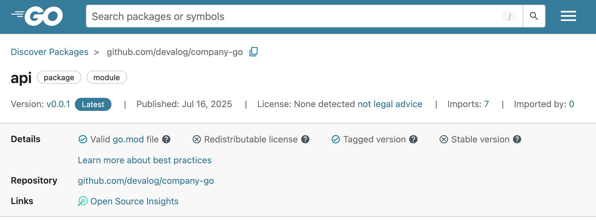

Publish your public-facing Fern Go SDK to
[pkg.go.dev](https://pkg.go.dev/).

<Info>
	This page assumes that you have:

	* An initialized `fern` folder, a GitHub repository for your Go SDK, and a Go generator group in `generators.yml`. See [Generating an SDK (Go)](/learn/sdks/generators/go/quickstart).
</Info>

<Frame>
	
</Frame>

## Requirements

Go SDKs are automatically published to [pkg.go.dev](https://pkg.go.dev/) when you push a semantic version tag to your repository and the repository meets the below requirements. No dedicated CI is needed.

Your repository must have:

- Public visibility
- An [approved license](https://pkg.go.dev/license-policy) such as [MIT](https://opensource.org/license/mit) or [Apache 2.0](https://www.apache.org/licenses/LICENSE-2.0)
- A valid module path in `go.mod`, which determines your publish URL. For example, `github.com/your-org/your-sdk` publishes to `https://pkg.go.dev/github.com/your-org/your-sdk`. If your module path includes a major version suffix like `/v2`, your SDK publishes to that versioned URL instead (`https://pkg.go.dev/github.com/your-org/your-sdk/v2`).

## Configure `generators.yml`

<Steps>

	  <Step title="Configure `output` location">

        Go publishes via Git repositories, so remove the auto-generated
        `output` and `config` properties. Instead, add the path to your
        GitHub repository: 

	    ```yaml {6-7}
	    groups: 
	      go-sdk:
	        generators:
	          - name: fern-go-sdk
	            version: <Markdown src="/snippets/version-number-go.mdx"/>
	            github:
                  repository: devalog/company-go

	    ```
	  </Step>
	    
  </Steps>


## Publish to pkg.go.dev

  At this point, you're ready to generate a release for your SDK.

<Steps>
 
	<Step title="Generate your release">

	Regenerate your SDK and publish it on pkg.go.dev:

	```bash
	fern generate --group go-sdk --version <version>
	```
    Local machine output will verify that the release is pushed to your
    repository and tagged with the version you specified. 

    </Step>

    <Step title="Verify on pkg.go.dev">
    
    Once the semantic version tag is pushed, pkg.go.dev will automatically index your package. Navigate to `https://pkg.go.dev/<go-module-path-in-go.mod>` to verify your SDK is published.

    <Tip>
      After releasing a new version, it may take a few minutes for pkg.go.dev
      to index and display the update. You can also check if the Go
      proxy has indexed your module at
      `https://proxy.golang.org/<go-module-path-in-go.mod>/@v/list`. pkg.go.dev
      indexing usually happens within 5-15 minutes of the proxy picking it up. 
      
      For more information, see Go's documentation on [Adding a
      package](https://pkg.go.dev/about#adding-a-package). 
    </Tip> 
    
    </Step>

</Steps>
