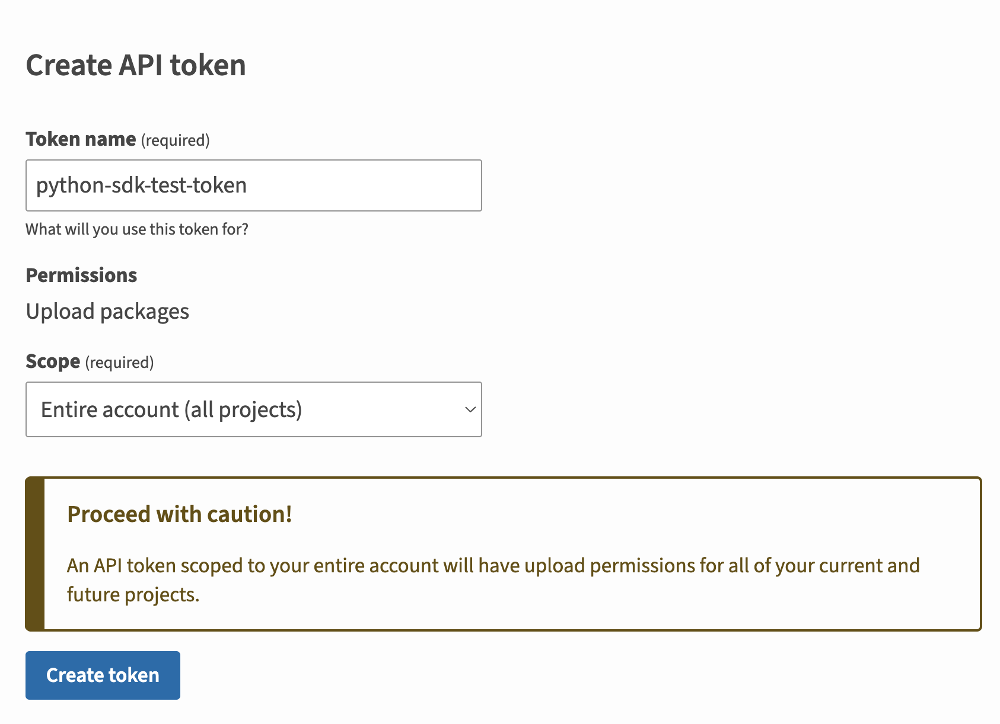
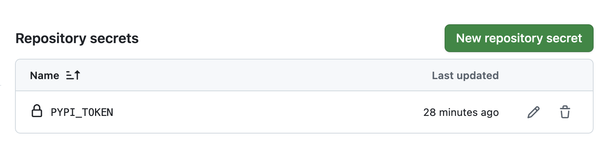
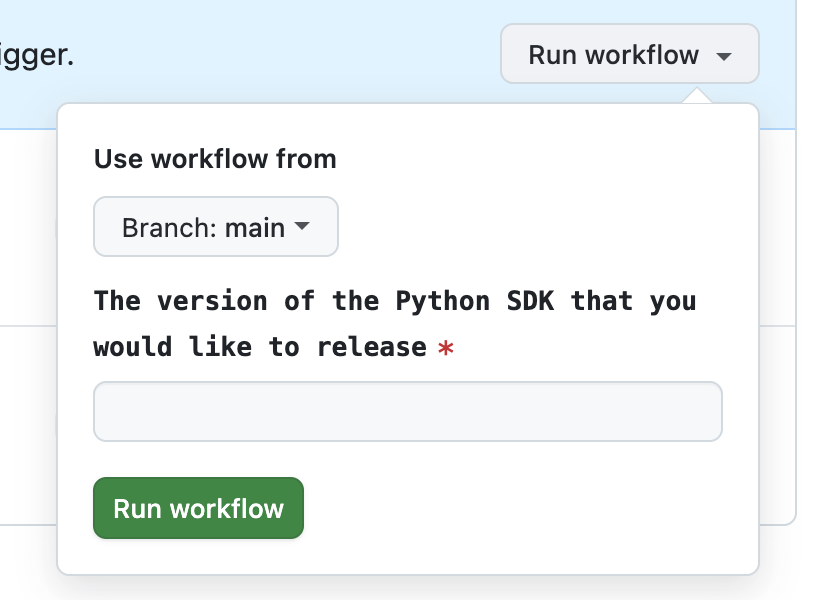

Publish your public-facing Fern Python SDK to the [PyPI
registry](https://pypi.org/). After following the steps on this page,
you'll have a versioned package published on PyPI.

<Frame>
	
</Frame>

<Info>
	This page assumes that you have:

	* An initialized `fern` folder, a GitHub repository for your Python SDK, and a Python generator group in `generators.yml`. See [Generating an SDK (Python)](/learn/sdks/generators/python/quickstart).
</Info>

## Configure SDK package settings

You'll need to update your `generators.yml` file to configure the package name, output location, and client naming for PyPi publishing. Your `generators.yml` [should live in your source repository](/sdks/overview/project-structure) (or on your local machine), not the repository that contains your Python SDK code.

<Steps>

	  <Step title="Configure `output` location">

		In the `group` for your Python SDK, change the output location in from `local-file-system` (the default) to `pypi` to indicate that Fern should publish your package directly to the PyPi registry:

	    ```yaml title="generators.yml" {6-7}
	    groups: 
	      python-sdk:
	        generators:
	          - name: fern-python-sdk
	            version: <Markdown src="/snippets/version-number-python.mdx"/>
	            output:
	              location: pypi

	    ```
	  </Step>

	  <Step title="Add a unique package name">

	     Your package name must be unique in the PyPI repository, otherwise publishing your SDK to PyPI will fail. 


```yaml title="generators.yml" {8}
groups: 
  python-sdk:
    generators:
      - name: fern-python-sdk
        version: <Markdown src="/snippets/version-number-python.mdx"/>
        output:
          location: pypi
          package-name: your-package-name
```
	    
	  </Step>

	<Step title="Configure `client-class-name`">

	     The `client-class-name` option controls the name of the generated client. This is the name customers use to import your SDK (`import { your-client-name } from 'your-package-name';`). 


```yaml title="generators.yml" {9-10}
groups: 
  python-sdk:
    generators:
      - name: fern-python-sdk
        version: <Markdown src="/snippets/version-number-python.mdx"/>
        output:
          location: pypi
          package-name: your-package-name
        config:
          client_class_name: YourClientName # must be PascalCase
```
	    
	  </Step>

	<Step title="Add PyPI metadata (optional)">

	You can add publishing metadata to your PyPI package to improve discoverability and provide additional information to users. This metadata appears on your package's PyPI page and includes `keywords` for PyPI search and discovery, `documentation-link` for your package documentation, and `homepage-link` for your project homepage. 
	
	You can additionally add general metadata for the SDK (description, contact email, author, license, etc.) at [the individual SDK level](/learn/sdks/reference/generators-yml#metadata-2) or [globally for all SDKs](/learn/sdks/reference/generators-yml#metadata). 


```yaml title="generators.yml" {9, 13}
groups: 
  python-sdk:
    generators:
      - name: fern-python-sdk
        version: <Markdown src="/snippets/version-number-python.mdx"/>
        output:
          location: pypi
          package-name: your-package-name
          metadata: # Publishing metadata
            keywords: ["api", "sdk", "client"]
            documentation-link: "https://docs.yourcompany.com"
            homepage-link: "https://yourcompany.com"
        metadata: # General SDK metadata
          license: MIT
        config:
          client_class_name: YourClientName
```
	    
	  </Step>
  </Steps>

## Generate a PyPi token

<Steps>

	<Step title="Log into PyPi">

	Log into [PyPi](https://pypi.org/) or create a new account. 

	</Step>

	<Step title="Navigate to Account settings">

	1.    Click on your profile picture. 
	1.    Select **Account settings**.
	1.    Scroll down to **API Tokens**. 

	</Step>

	<Step title="Add New Token">

	1.    Click on **Add API Token**
  	1.    Name your token and set the scope to the relevant projects.
    1.    Click **Create token**

	<Frame>
	
	</Frame>

    <Warning>Save your new token –  it won’t be displayed after you leave the page.</Warning>

	</Step>

</Steps>

## Configure PyPi publication

<Steps>
<Step title="Add repository location">

Add the path to your GitHub repository to `generators.yml`: 

```yaml title="generators.yml" {11-12}
groups: 
  python-sdk:
    generators:
      - name: fern-python-sdk
        version: <Markdown src="/snippets/version-number-python.mdx"/>
        output:
          location: pypi
          package-name: your-package-name
        config:
          client_class_name: YourClientName
        github: 
          repository: your-org/company-python
```
	  
</Step>
<Step title="Configure PyPi authentication token">

Add `token: ${PYPI_TOKEN}` to `generators.yml`.

```yaml {9} title="generators.yml"
groups: 
  python-sdk:
    generators:
      - name: fern-python-sdk
        version: <Markdown src="/snippets/version-number-python.mdx"/>
        output:
          location: pypi
          package-name: your-package-name
          token: ${PYPI_TOKEN}
        config:
          client_class_name: YourClientName
        github: 
          repository: your-org/company-python
```
</Step>
<Step title="Choose your publishing mode">

<Markdown src="/products/sdks/snippets/github-publishing-mode.mdx"/>

```yaml title="generators.yml" {14}
groups: 
  python-sdk:
	generators:
	  - name: fern-python-sdk
		version: <Markdown src="/snippets/version-number-python.mdx"/>
		output:
		  location: npm
		  package-name: name-of-your-package
		  token: ${PYPI_TOKEN}
		config:
		  namespaceExport: YourClientName
		github: 
		  repository: your-org/your-repository
		  mode: push
		  branch: your-branch-name # Required for mode: push
```

</Step>
</Steps>

## Publish your SDK

Decide how you want to publish your SDK to PyPi. You can use GitHub workflows for automated releases or publish directly via the CLI.

<AccordionGroup>
<Accordion title="Release via a GitHub workflow (recommended)">

Set up a release workflow via [GitHub Actions](https://docs.github.com/en/actions/get-started/quickstart) so you can trigger new SDK releases directly from your source repository. 

<Steps>

<Step title="Set up authentication">

Open your Fern repository in GitHub. Click on the **Settings** tab in your repository. Then, under the **Security** section, open **Secrets and variables** > **Actions**. 

<Frame>

</Frame>

You can also use the url `https://github.com/<your-repo>/settings/secrets/actions`.

</Step>
<Step title="Add secret for your PyPi Token">

1. Select **New repository secret**. 
1. Name your secret `PYPI_TOKEN`.
1. Add the corresponding token you generated above.
1. Click **Add secret**. 

<Frame>

</Frame>

</Step>
<Step title="Add secret for your Fern API key">

1. Select **New repository secret**. 
1. Name your secret `FERN_TOKEN`.
1. Add your Fern API key. If you don't already have one, generate one by
	running `fern token`. By default, the API key is generated for the
	organization listed in `fern.config.json`.
1. Click **Add secret**. 

</Step>

<Step title="Set up a new workflow">

Set up a CI workflow that you can manually trigger from the GitHub UI. In your repository, navigate to **Actions**. Select **New workflow**, then **Set up workflow yourself**. Add a workflow that's similar to this: 

	```yaml title=".github/workflows/publish.yml" maxLines=0
	name: Publish Python SDK

	on:
	  workflow_dispatch:
	    inputs:
	      version:
	        description: "The version of the Python SDK that you would like to release"
	        required: true
	        type: string

	jobs:
	  release:
	    runs-on: ubuntu-latest
	    steps:
	      - name: Checkout repo
	        uses: actions/checkout@v4

	      - name: Install Fern CLI
	        run: npm install -g fern-api

	      - name: Release Python SDK
	        env:
	          FERN_TOKEN: ${{ secrets.FERN_TOKEN }}
	          PYPI_TOKEN: ${{ secrets.PYPI_TOKEN }}
	        run: |
	          fern generate --group python-sdk --version ${{ inputs.version }} --log-level debug
	```

</Step>

	<Step title="Regenerate and release your SDK"> 

		Navigate to the **Actions** tab, select the workflow you just created, specify a version number, and click **Run workflow**. This regenerates your SDK. 

		<Frame>
			
		</Frame>
	
		<Markdown src="/products/sdks/snippets/release-sdk.mdx"/>

		Once the workflow completes, you can view your new release by logging into PyPi and navigating to **Your projects**.
	
	</Step>
</Steps>

</Accordion>
<Accordion title="Release via CLI and environment variables">
<Steps>
 
	<Step title="Set PyPI environment variable">

	Set the `PYPI_TOKEN` environment variable on your local machine:

	```bash
	export PYPI_TOKEN=your-actual-pypi-token
	```

	</Step>

	<Step title="Regenerate and release your SDK">

	Regenerate your SDK, specifying the version:

	```bash
	fern generate --group python-sdk --version <version>
	```
	<Markdown src="/products/sdks/snippets/release-sdk.mdx"/>

	Once the workflow completes, you can view your new release by logging into PyPi and navigating to **Your projects**.
    </Step>

</Steps>
</Accordion>
</AccordionGroup>
