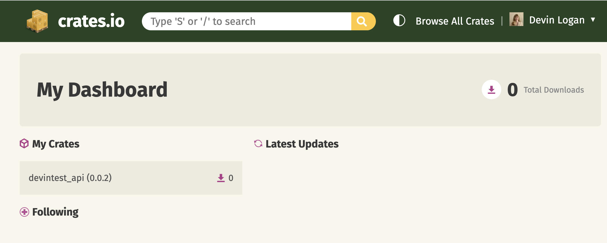
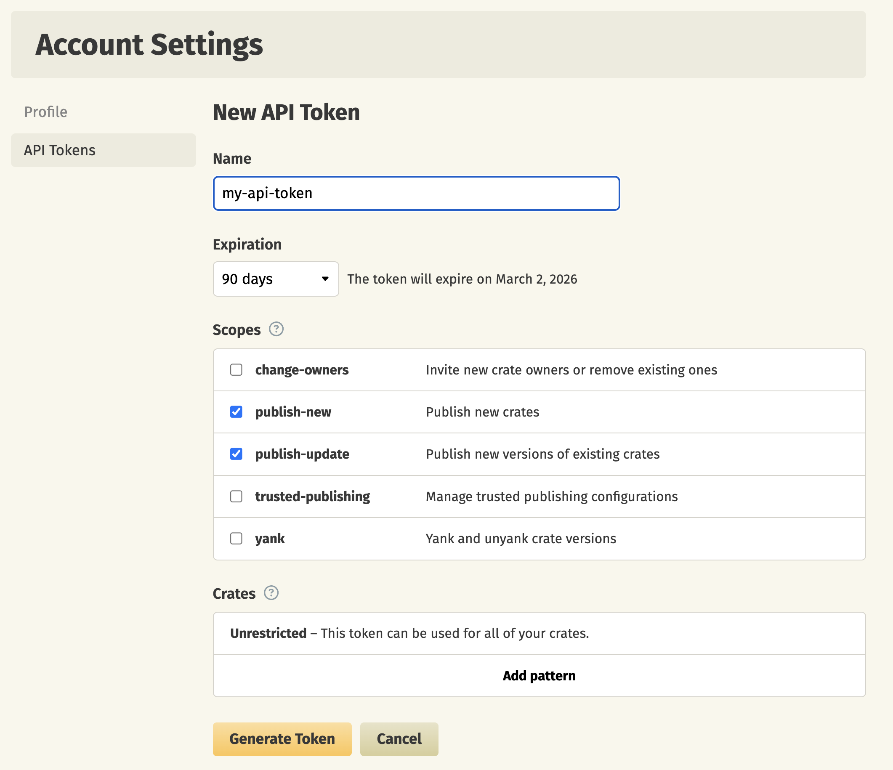

Publish your public-facing Fern Rust SDK to the [crates.io
registry](https://crates.io/). After following the steps on this page,
you'll have a versioned crate published on crates.io. To distribute the SDK
internally instead, generate to the local file system (optionally
[self-hosted](/learn/sdks/deep-dives/self-hosted)) and build a `.crate` file with
[`fern generate --package`](/learn/cli-api-reference/cli-reference/commands#package).

<Info>
	This page assumes that you have:

	* An initialized `fern` folder, a GitHub repository for your Rust SDK, and a Rust generator group in `generators.yml`. See [Generating an SDK (Rust)](/learn/sdks/generators/rust/quickstart).
</Info>

<Frame>
  
</Frame>

## Configure `generators.yml`

<Steps>

  <Step title="Configure `output` location">

  Change the output location in `generators.yml` from `local-file-system` (the default) to `crates` to indicate that Fern should publish your crate directly to the crates.io registry:

    ```yaml title="generators.yml" {6-7}
    groups: 
      rust-sdk:
        generators:
          - name: fern-rust-sdk
            version: <Markdown src="/snippets/version-number-rust.mdx"/>
            output:
              location: crates

    ```
  </Step>

  <Step title="Add a unique crate name">

     Your crate name must be unique in the crates.io registry, otherwise publishing your SDK will fail. Update your crate name if you haven't done so already:


```yaml title="generators.yml" {8}
groups: 
  rust-sdk:
    generators:
      - name: fern-rust-sdk
        version: <Markdown src="/snippets/version-number-rust.mdx"/>
        output:
          location: crates
          package-name: your-crate-name
```
    
  </Step>

  <Step title="Configure `clientClassName`">

     The `clientClassName` option controls the name of the generated client struct. This is the name users will use when instantiating your SDK client.


```yaml title="generators.yml" {9-10}
groups: 
  rust-sdk:
    generators:
      - name: fern-rust-sdk
        version: <Markdown src="/snippets/version-number-rust.mdx"/>
        output:
          location: crates
          package-name: your-crate-name
        config:
          clientClassName: YourClientName # must be PascalCase
```
    
  </Step>

  <Step title="Add repository location">

  Add the path to your GitHub repository to `generators.yml`: 

```yaml title="generators.yml" {11-12}
groups: 
  rust-sdk:
    generators:
      - name: fern-rust-sdk
        version: <Markdown src="/snippets/version-number-rust.mdx"/>
        output:
          location: crates
          package-name: your-crate-name
        config:
          clientClassName: YourClientName
        github: 
          repository: your-org/your-rust-sdk
```
  
  </Step>
</Steps>

## Set up crates.io publishing authentication

<Steps>

  <Step title="Log into crates.io">

  Log into [crates.io](https://crates.io/) using your GitHub account.

  </Step>

  <Step title="Navigate to Account settings">

  1. Click on your profile picture in the top right corner.
  1. Select **Account Settings**.
  1. Go to the **API Tokens** section.

  </Step>

  <Step title="Create a new API token">

  1. Click **New Token**.
  1. Name your token (e.g., "Fern SDK Publishing").
  1. Under **Scopes**, select **publish-new** to publish new crates and **publish-update** to update existing crates.
  1. Click **Generate Token**.

  <Frame>
  
</Frame>

  <Warning>Save your new token immediately. It won't be displayed again after you leave the page.</Warning>

  </Step>

  <Step title="Configure crates.io authentication token">

  Add `token: ${CRATES_IO_API_KEY}` to `generators.yml` to tell Fern to use the `CRATES_IO_API_KEY` environment variable for authentication when publishing to crates.io.

```yaml title="generators.yml" {9}
groups: 
  rust-sdk:
    generators:
      - name: fern-rust-sdk
        version: <Markdown src="/snippets/version-number-rust.mdx"/>
        output:
          location: crates
          package-name: your-crate-name
          token: ${CRATES_IO_API_KEY}
        config:
          clientClassName: YourClientName
        github: 
          repository: your-org/your-rust-sdk
```
  </Step>

</Steps>


## Publish your SDK

Decide how you want to publish your SDK to crates.io. You can use GitHub workflows for automated releases or publish directly via the CLI.

<AccordionGroup>
<Accordion title="Release via a GitHub workflow (recommended)">

Set up a release workflow via [GitHub Actions](https://docs.github.com/en/actions/get-started/quickstart) so you can trigger new SDK releases directly from your source repository. 

<Steps>

<Step title="Set up authentication">

Open your source repository in GitHub. Click on the **Settings** tab in your repository. Then, under the **Security** section, open **Secrets and variables** > **Actions**. 

You can also use the url `https://github.com/<your-repo>/settings/secrets/actions`.

</Step>
<Step title="Add secret for your crates.io token">

1. Select **New repository secret**. 
1. Name your secret `CRATES_IO_API_KEY`.
1. Add the corresponding token you generated above.
1. Click **Add secret**. 

</Step>
<Step title="Add secret for your Fern API key">

1. Select **New repository secret**. 
1. Name your secret `FERN_TOKEN`.
1. Add your Fern API key. If you don't already have one, generate one by
  running `fern token`. By default, the API key is generated for the
  organization listed in `fern.config.json`.
1. Click **Add secret**. 

</Step>

<Step title="Set up a new workflow">

Set up a CI workflow that you can manually trigger from the GitHub UI. In your repository, navigate to **Actions**. Select **New workflow**, then **Set up workflow yourself**. Add a workflow that's similar to this: 

  ```yaml title=".github/workflows/publish.yml" maxLines=0
name: Publish Rust SDK

on:
  workflow_dispatch:
    inputs:
      version:
        description: "The version of the Rust SDK that you would like to release"
        required: true
        type: string

jobs:
  release:
    runs-on: ubuntu-latest
    steps:
      - name: Checkout repo
        uses: actions/checkout@v4

      - name: Install Fern CLI
        run: npm install -g fern-api

      - name: Release Rust SDK
        env:
          FERN_TOKEN: ${{ secrets.FERN_TOKEN }}
          CRATES_IO_API_KEY: ${{ secrets.CRATES_IO_API_KEY }}
        run: |
          fern generate --group rust-sdk --version ${{ inputs.version }} --log-level debug
  ```

</Step>

  <Step title="Regenerate and release your SDK"> 

    Navigate to the **Actions** tab, select the workflow you just created, specify a version number, and click **Run workflow**. This regenerates your SDK. 
  
    <Markdown src="/products/sdks/snippets/release-sdk.mdx"/>

    Once the workflow completes, you can view your new release by logging into crates.io, navigating to **Dashboard**, and looking under **My Crates**.
  
  </Step>
</Steps>

</Accordion>
<Accordion title="Release via CLI and environment variables">
<Steps>
 
  <Step title="Set crates.io environment variable">

  Set the `CRATES_IO_API_KEY` environment variable on your local machine:

  ```bash
  export CRATES_IO_API_KEY=your-actual-rust-token
  ```

  </Step>

  <Step title="Regenerate and release your SDK">

  Regenerate your SDK, specifying the version:

  ```bash
  fern generate --group rust-sdk --version <version>
  ```
  <Markdown src="/products/sdks/snippets/release-sdk.mdx"/>

  Once the workflow completes, you can view your new release by logging into crates.io, navigating to **Dashboard**, and looking under **My Crates**.
    </Step>

</Steps>
</Accordion>
</AccordionGroup>
