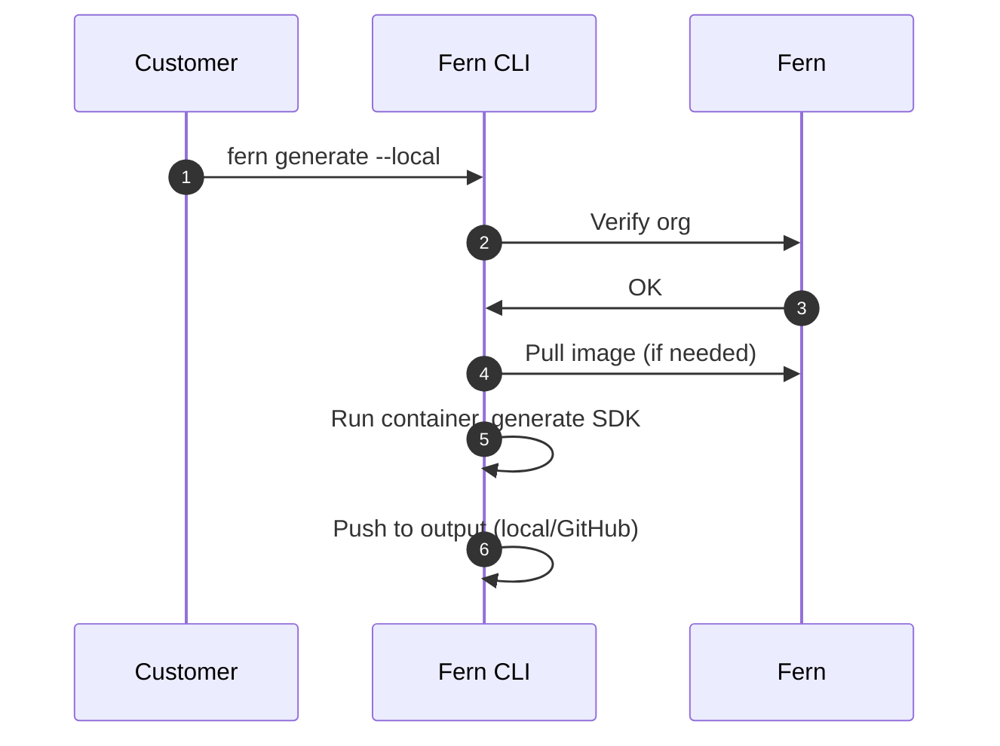

<Markdown src="/snippets/enterprise-plan.mdx" />

Fern SDK generation [runs on Fern's infrastructure by default](/sdks/overview/how-it-works). Self-hosting allows you to run SDK generation on your own infrastructure to meet specific security or compliance requirements.

## Setup

To run SDK generation locally, use the `--local` flag with the `fern generate` command. This runs SDK generation on your own machine instead of using Fern's cloud infrastructure.

```bash
fern generate --local
```

You can combine `--local` with other flags like `--group` to generate specific SDKs:

```bash
fern generate --group python-sdk --local
```

### Configure output location

For self-hosted generation, configure your `generators.yml` to output SDKs to your local file system or a GitHub repository you control.

<Tabs>
<Tab title="Local file system">

Output generated SDKs directly to a local directory:

```yaml title="generators.yml"
groups:
  python-sdk:
    generators:
      - name: fernapi/fern-python-sdk
        version: 4.0.0
        output:
          location: local-file-system
          path: ../sdks/python
```

</Tab>
<Tab title="GitHub repository">

Push generated SDKs to your own GitHub repository. When using the `--local` flag, configure the `github` property with the self-hosted schema:

```yaml title="generators.yml"
groups:
  python-sdk:
    generators:
      - name: fernapi/fern-python-sdk
        version: 4.0.0
        github:
          uri: https://github.com/your-org/python-sdk
          token: ${GITHUB_TOKEN}
          mode: push
          branch: main
```

The self-hosted GitHub configuration uses `uri` and `token` properties instead of `repository`. The `mode` can be `push` or `pull-request`.

</Tab>
</Tabs>

## When to use self-hosting

Self-hosting is typically required for organizations that operate without internet access, have strict compliance requirements, or need full control over their SDK generation process.

When you self-host, you're responsible for server setup, security, maintenance, and deciding how to distribute your generated SDKs. Self-hosted SDK generation includes [all Fern SDK features](/learn/sdks/overview/capabilities).

<Warning>
Unless you have specific requirements that prevent using Fern's default hosting, we recommend **using our managed cloud generation solution** for easier setup and maintenance.
</Warning>

## How it works

When you run `fern generate --local`, the Fern CLI executes SDK generation on your local machine instead of using Fern's cloud infrastructure.

<Note>
A Docker daemon must be running on the machine where you run the command, as SDK generation runs inside a Docker container.
</Note>

The self-hosted process works as follows:

1. **Organization verification** - The CLI verifies your organization registration with Fern
1. **Download generator image** - If not already cached, the CLI downloads the generator's Docker image
1. **Generate SDK** - The CLI runs the generator container locally to produce SDK files based on your API definition and `generators.yml` configuration
1. **Output SDK** - Generated SDK files are saved to your configured output location (local file system or GitHub repository)

### Network calls

When using the `--local` flag, the Fern CLI makes only two network calls:

1. **Organization verification** - Validates your Fern organization registration
1. **Docker image download** - Downloads the generator image if not already available locally

No API definition or specification data is sent over the network. All SDK generation happens locally on your machine.

### Architecture diagram


