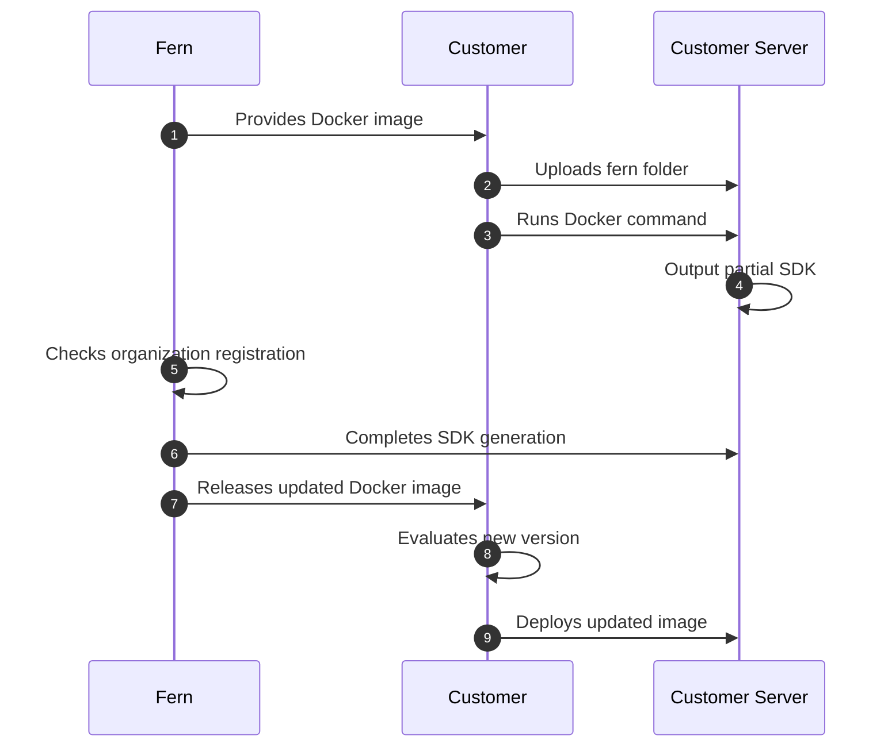

<Markdown src="/snippets/enterprise-plan.mdx" />

Fern SDK generation [runs on Fern's infrastructure by default](/sdks/overview/how-it-works). Self-hosting allows you to run SDK generation on your own infrastructure to meet specific security or compliance requirements.

## Setup

To run SDK generation locally, use the `--local` flag with the `fern generate` command. This downloads and runs the SDK generator Docker containers on your own machine instead of using Fern's cloud infrastructure.

```bash
fern generate --local
```

You can combine `--local` with other flags like `--group` to generate specific SDKs:

```bash
fern generate --group python-sdk --local
```

### Configure output location

For self-hosted generation, configure your `generators.yml` to output SDKs to your local file system or a GitHub repository you control.

<Tabs>
<Tab title="Local file system">

Output generated SDKs directly to a local directory:

```yaml title="generators.yml"
groups:
  python-sdk:
    generators:
      - name: fernapi/fern-python-sdk
        version: 4.0.0
        output:
          location: local-file-system
          path: ../sdks/python
```

</Tab>
<Tab title="GitHub repository">

Push generated SDKs to your own GitHub repository. Configure the `github` property with your repository details:

```yaml title="generators.yml"
groups:
  python-sdk:
    generators:
      - name: fernapi/fern-python-sdk
        version: 4.0.0
        github:
          repository: your-org/python-sdk
          mode: push
          branch: main
```

For more details on GitHub publishing modes (`release`, `pull-request`, `push`), see the [generators.yml reference](/learn/sdks/reference/generators-yml#github).

</Tab>
</Tabs>

<Note>
Self-hosted SDK generation uses the Fern CLI with the `--local` flag. The self-hosted Docker image referenced in [self-hosted docs setup](/learn/docs/enterprise/self-hosted) is specifically for documentation generation, not SDK generation.
</Note>

## When to use self-hosting

Self-hosting is typically required for organizations that operate without internet access, have strict compliance requirements, or need full control over their SDK generation process.

When you self-host, you're responsible for server setup, security, maintenance, and deciding how to distribute your generated SDKs. Self-hosted SDK generation includes [all Fern SDK features](/learn/sdks/overview/capabilities).

<Warning>
Unless you have specific requirements that prevent using Fern's default hosting, we recommend **using our managed cloud generation solution** for easier setup and maintenance.
</Warning>

## How it works

When you run `fern generate`, Fern uses Docker containers to execute SDK generation logic. By default, Fern runs **cloud generation** by allocating compute space and running the container remotely. With **self-hosted (local) generation**, you download and run the same Docker container on your own infrastructure.

Both approaches generate partial SDK files to your configured output location, then Fern verifies your organization registration and completes the SDK by adding package distribution files.

The self-hosted process works as follows:

1. **Download the Docker image** - Fern provides the location of the most up-to-date Docker image containing the SDK generation logic
1. **Upload your fern folder** - Add your API definition and other configuration files to the container
1. **Run the container** - Execute SDK generation using standard Docker commands
1. **Partial SDK output** - Core SDK files are generated and saved to your configured output location (local file system, GitHub repository, package registry, etc.)
1. **Organization verification** - Fern verifies your organization registration and completes SDK generation by adding package distribution files like `pyproject.toml`, READMEs, and dependency configurations
1. **Receive updated Docker images** - Fern releases new versions of the Docker image that your team can evaluate and deploy when ready

### Architecture diagram


