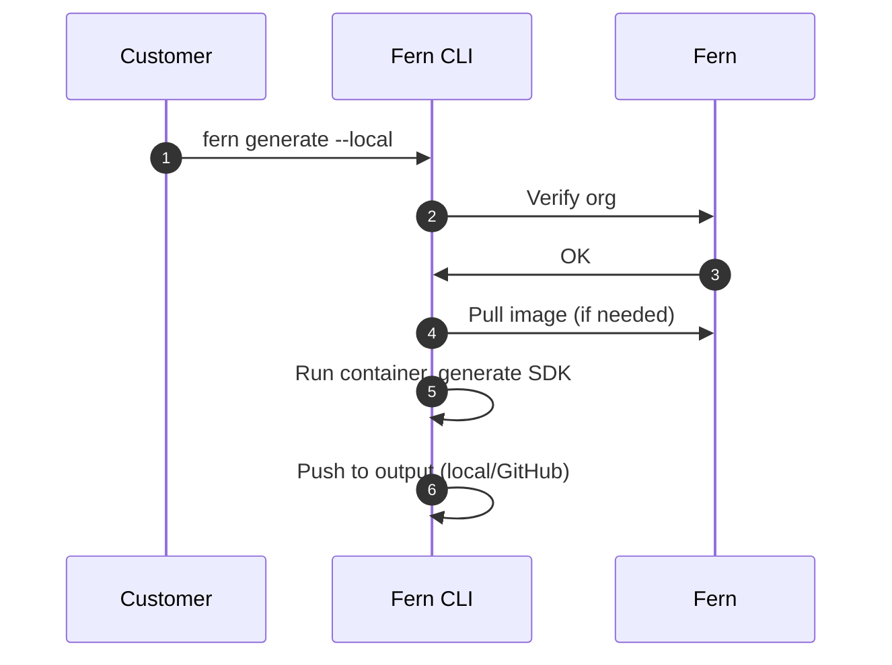

<Markdown src="/snippets/enterprise-plan.mdx" />

Fern SDK generation [runs on Fern's infrastructure by default](/sdks/overview/how-it-works). Self-hosting allows you to run SDK generation on your own infrastructure. Use self-hosting if your organization:

- Operates without internet access
- Has strict compliance or security requirements
- Needs full control over your SDK generation process

When you self-host, you're responsible for infrastructure management and SDK distribution. Self-hosted SDK generation includes [all Fern SDK features](/learn/sdks/overview/capabilities).

<Info>
Unless you have specific requirements that prevent using Fern's default hosting, we recommend **using our managed cloud generation solution** for easier setup and maintenance.
</Info>

## How it works

When you run `fern generate --local`, the Fern CLI executes SDK generation on your local machine instead of using Fern's cloud infrastructure. The self-hosted process works as follows:

1. **Organization verification** (network call) - The CLI verifies your organization registration with Fern
1. **Download generator image** (network call if not cached) - The CLI downloads the generator's Docker image if not already available locally
1. **Generate SDK** (local) - The CLI runs the generator container locally to produce SDK files based on your API definition and `generators.yml` configuration
1. **Output SDK** (local) - Generated SDK files are saved to your configured output location (local file system or GitHub repository)

These are the only network calls made when using the `--local` flag. No API definition or specification data is sent over the network: all SDK generation happens locally on your machine.

<Accordion title="Architecture diagram">



</Accordion>

## Setup

<Steps>
<Step title="Ensure Docker is running">

Verify that a Docker daemon is running on your machine, as SDK generation runs inside a Docker container:

```bash
docker ps
```

</Step>

<Step title="Generate a token">

Generate a `FERN_TOKEN` variable in your local environment (required for local generation):

```bash
fern token
```

</Step>

<Step title="Configure output location">

Configure your `generators.yml` to output SDKs to your local file system or a GitHub repository you control.

<Tabs>
<Tab title="Local file system">

Output generated SDKs directly to a local directory:

```yaml title="generators.yml" {7-8}
groups:
  python-sdk:
    generators:
      - name: fernapi/fern-python-sdk
        version: 4.0.0
        output:
          location: local-file-system
          path: ../sdks/python
```

</Tab>
<Tab title="GitHub repository">

To push generated SDKs to your GitHub repository, configure the `github` property with `uri` and `token`. Set the [publishing `mode`](/learn/sdks/reference/generators-yml#github) to `push` for direct commits or `pull-request` to create PRs.

```yaml title="generators.yml" {7-8}
groups:
  python-sdk:
    generators:
      - name: fernapi/fern-python-sdk
        version: 4.0.0
        github:
          uri: https://github.com/your-org/python-sdk
          token: ${GITHUB_TOKEN}
          mode: push
          branch: main
```

</Tab>
</Tabs>
</Step>
<Step title="Run generation locally">

Use the `--local` flag to generate SDKs locally instead of using Fern's cloud infrastructure. You can combine `--local` with other flags like `--group` to generate specific SDKs locally.

```bash
fern generate --local
fern generate --group python-sdk --local
```

</Step>
</Steps>


