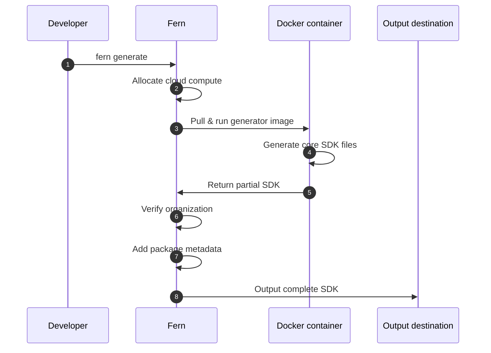

Fern combines your API specifications with generator configurations and custom code to produce SDKs in multiple languages. By default, SDK generation runs on Fern's managed cloud infrastructure.

Alternatively, [you can run SDK generation on your own infrastructure](/sdks/deep-dives/self-hosted) to meet specific security or compliance requirements.

## Cloud generation workflow

Before generating SDKs, you'll configure your `fern/` folder with SDK generators specified in `generators.yml` and connect your API specification. You can also add custom code, tests, and other configuration as needed.

Running `fern generate` kicks off the cloud generation process and involves a few key steps:

<Steps>
<Step title="Cloud execution">
Fern allocates compute resources and pulls the appropriate Docker image for your specified generator version.
</Step>
<Step title="Generate core SDK">
The Docker container executes the generation logic and produces your SDK's core files (models, client code, API methods).
</Step>
<Step title="Verify organization">
Fern verifies your organization registration to ensure the complete SDK can be generated. Without organization verification, only partial SDK files (core code without package metadata) are produced.
</Step>
<Step title="Add package metadata">
Fern completes the SDK by adding package distribution files such as `pyproject.toml`, `package.json`, README, and any dependencies. 
</Step>
<Step title="Output to destination">
Fern publishes or saves the complete SDK to your configured location (local filesystem, GitHub repository, package registry). After publication, developers can use your SDKs to integrate with your APIs.
</Step>
</Steps>

<AccordionGroup>
<Accordion title="Cloud generation sequence diagram">

</Accordion>

<Accordion title="Expanded architecture diagram" anchor="expanded-architecture">
<Frame>

</Frame>
</Accordion>
</AccordionGroup>

## Version numbers

Every generation stamps a version on the generated package. What you pass to `fern generate` determines how that version is chosen:

| Command | How the version is chosen |
| --- | --- |
| `fern generate --version 1.5.0` | Stamped as-is, with no computation. |
| `fern generate` | Fern computes the next version from the SDK's current version and applies a patch bump. |
| `fern generate --version AUTO` | Fern AI classifies the diff between the previous and new SDK output as `MAJOR`, `MINOR`, `PATCH`, or `NO_CHANGE`, applies that bump, and writes a changelog entry. |

Without `--version`, Fern reads the SDK's current version from three sources and takes the highest [semver](https://semver.org/) among them before applying the patch bump:

- The highest published version in the language's package registry: npm, PyPI, Maven Central, NuGet, RubyGems, the Go proxy, or crates.io. PHP and Swift skip this source.
- The most recent GitHub release tag in the SDK repository.
- `sdkVersion` in `.fern/metadata.json` on the SDK repository's default branch.

Taking the highest of the three keeps a stale registry from regressing the version.

None of the three sources move until a change lands, so repeated generations against an unmerged branch are idempotent: each run computes the same next version and overwrites the open pull request. The version advances once a merge brings in the updated `.fern/metadata.json`, a GitHub release is tagged, or a new version reaches the registry. Teams that want exactly one registry version per batch of merges can generate with [`mode: pull-request` or `mode: push`](/learn/sdks/reference/generators-yml#github), neither of which publishes, then do a single release run with an explicit `--version`.

### Prerelease versions

When the SDK's current version is a prerelease (`1.5.0-rc.1`, `2.0.0-beta`, `1.0.0-alpha.3`), a computed bump advances the prerelease counter and stays on that line. Promoting the SDK to a stable version requires an explicit version: `fern generate --version 2.0.0`.

### `--version AUTO`

`--version AUTO` is diff-driven rather than registry-driven: the generator stamps a placeholder, then Fern diffs the previous and new generated output, picks the bump, applies it, and commits the changelog entry. It requires an `ai` block in `generators.yml` naming a provider and model, documented alongside the CI recipes in [self-hosted SDK versioning](/learn/sdks/deep-dives/self-hosted-versioning). A `NO_CHANGE` classification, an empty output diff, or a [Replay](/learn/sdks/overview/custom-code#replay) run leaves the previous version in place.

## Quotas

Cloud (remote) generation uses a [leaky bucket](https://en.wikipedia.org/wiki/Leaky_bucket) rate-limiting algorithm with the following default limits:

| Parameter | Value |
| --- | --- |
| Burst capacity | 10 generations |
| Refill rate | 5 generations per minute |

You can run up to 10 generations in quick succession. Fern then replenishes your allowance at 5 generations per minute, so if you hit the limit, subsequent requests will be throttled until enough capacity is restored. In practice, this only affects automated workflows that trigger many generations in a tight loop — occasional manual runs won't come close to the limit.

<Note>
Rate limits apply only to cloud generation. [Local generation](/learn/sdks/deep-dives/self-hosted) using `--local` isn't subject to any quotas.
</Note>

If your team needs higher quotas, contact support@buildwithfern.com.
