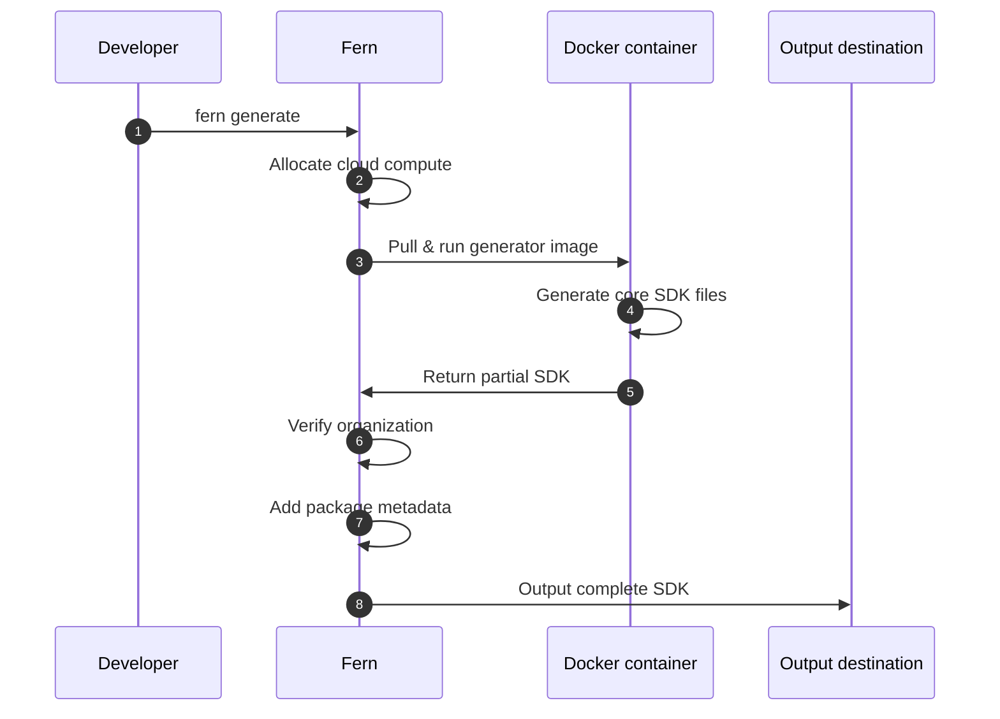
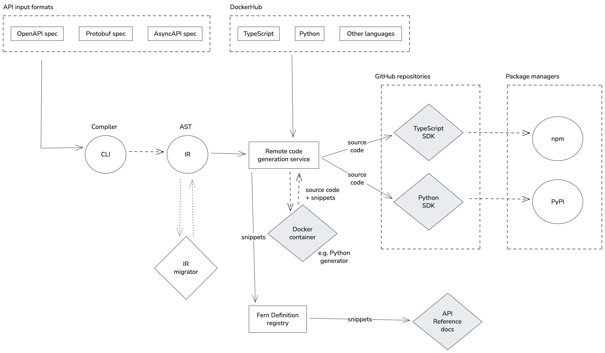

Fern combines your API specifications with generator configurations and custom code to produce SDKs in multiple languages. By default, SDK generation runs on Fern's managed cloud infrastructure.

Alternatively, [you can run SDK generation on your own infrastructure](/learn/sdks/deep-dives/self-hosted) to meet specific security or compliance requirements.

## Cloud generation workflow

Before generating SDKs, you'll configure your `fern/` folder with SDK generators specified in `generators.yml` and connect your API specification. You can also add custom code, tests, and other configuration as needed.

Running `fern generate` kicks off the cloud generation process and involves a few key steps:

<Steps>
<Step title="Cloud execution">
Fern allocates compute resources and pulls the appropriate Docker image for your specified generator version.
</Step>
<Step title="Generate core SDK">
The Docker container executes the generation logic and produces your SDK's core files (models, client code, API methods).
</Step>
<Step title="Verify organization">
Fern verifies your organization registration to ensure the complete SDK can be generated. Without organization verification, only partial SDK files (core code without package metadata) are produced.
</Step>
<Step title="Add package metadata">
Fern completes the SDK by adding package distribution files such as `pyproject.toml`, `package.json`, README, and any dependencies. 
</Step>
<Step title="Output to destination">
Fern publishes or saves the complete SDK to your configured location (local filesystem, GitHub repository, package registry). After publication, developers can use your SDKs to integrate with your APIs.
</Step>
</Steps>

<AccordionGroup>
<Accordion title="Cloud generation sequence diagram">

</Accordion>

<Accordion title="Expanded architecture diagram" anchor="expanded-architecture">
<Frame>

</Frame>
</Accordion>
</AccordionGroup>

## Quotas

Cloud (remote) generation uses a [leaky bucket](https://en.wikipedia.org/wiki/Leaky_bucket) rate-limiting algorithm with the following default limits:

| Parameter | Value |
| --- | --- |
| Burst capacity | 10 generations |
| Refill rate | 5 generations per minute |

You can run up to 10 generations in quick succession. Fern then replenishes your allowance at 5 generations per minute, so if you hit the limit, subsequent requests will be throttled until enough capacity is restored. In practice, this only affects automated workflows that trigger many generations in a tight loop — occasional manual runs won't come close to the limit.

<Note>
Rate limits apply only to cloud generation. [Local generation](/learn/sdks/deep-dives/self-hosted) using `--local` isn't subject to any quotas.
</Note>

If your team needs higher quotas, contact support@buildwithfern.com.
