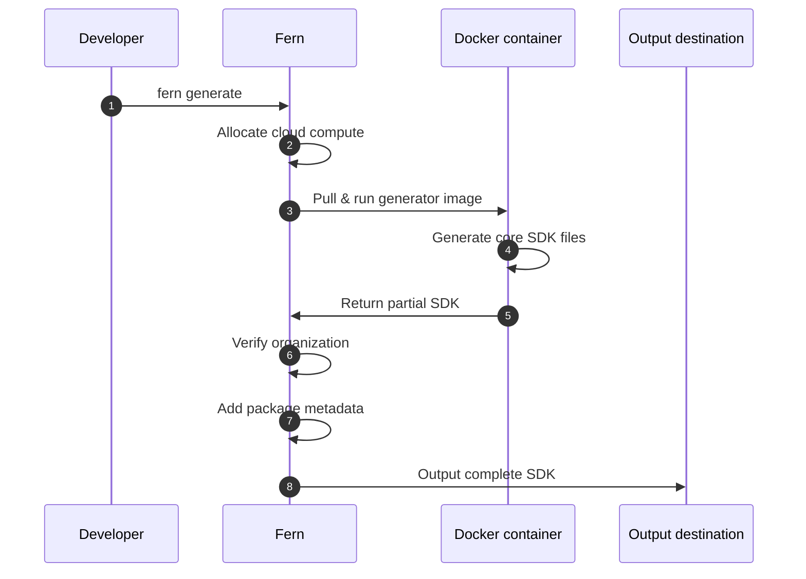
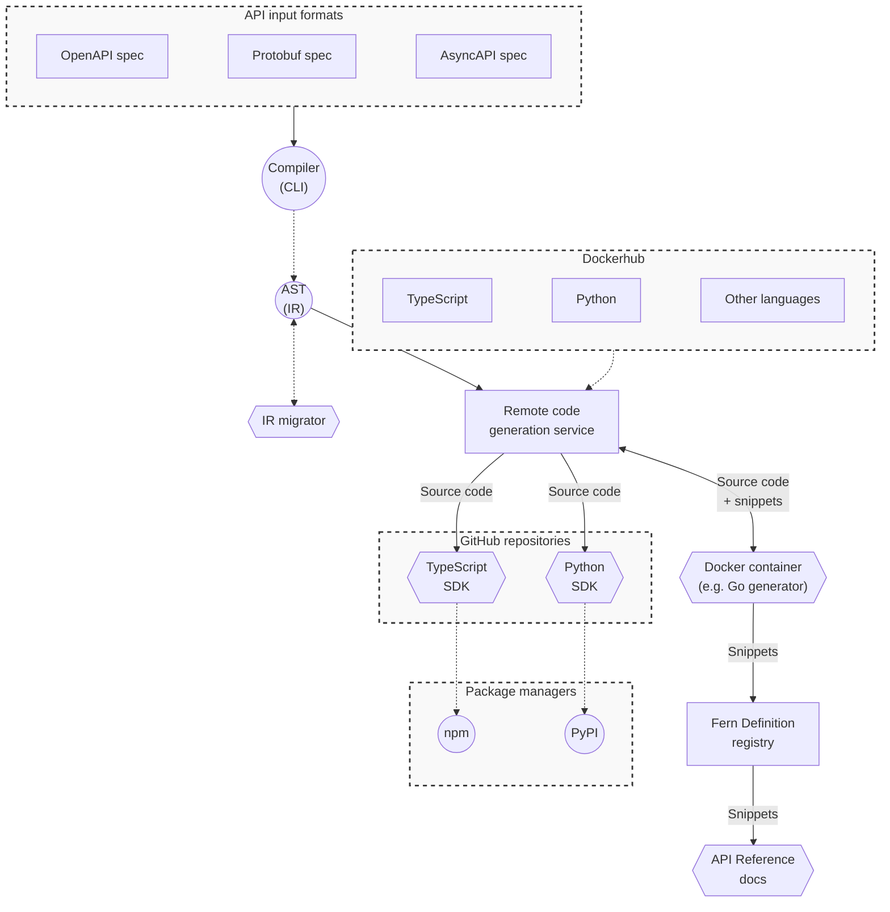
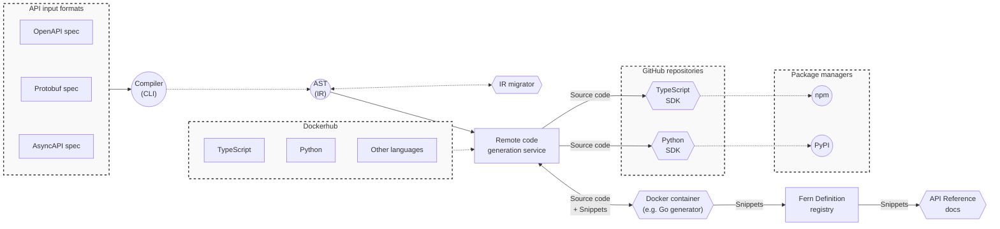

Fern combines your API specifications with generator configurations and custom code to produce SDKs in multiple languages. By default, SDK generation runs on Fern's managed cloud infrastructure.

Alternatively, [you can run SDK generation on your own infrastructure](/sdks/deep-dives/self-hosted) to meet specific security or compliance requirements.

## Cloud generation workflow

Before generating SDKs, you'll configure your `fern/` folder with SDK generators specified in `generators.yml` and connect your API specification. You can also add custom code, tests, and other configuration as needed.

Running `fern generate` kicks off the cloud generation process and involves a few key steps:

<Steps>
<Step title="Cloud execution">
Fern allocates compute resources and pulls the appropriate Docker image for your specified generator version.
</Step>
<Step title="Generate core SDK">
The Docker container executes the generation logic and produces your SDK's core files (models, client code, API methods).
</Step>
<Step title="Verify organization">
Fern verifies your organization registration to ensure the complete SDK can be generated. Without organization verification, only partial SDK files (core code without package metadata) are produced.
</Step>
<Step title="Add package metadata">
Fern completes the SDK by adding package distribution files such as `pyproject.toml`, `package.json`, README, and any dependencies. 
</Step>
<Step title="Output to destination">
Fern publishes or saves the complete SDK to your configured location (local filesystem, GitHub repository, package registry). After publication, developers can use your SDKs to integrate with your APIs.
</Step>
</Steps>

## SDK generation architecture

The below diagram shows the complete SDK generation architecture, including all components involved in transforming your API specification into production-ready SDKs.

<Tip>
This core SDK architecture applies to both cloud-based and [self-hosted](/sdks/deep-dives/self-hosted) generation. The key difference is where the generation runs (Fern's infrastructure vs. your infrastructure), not the underlying components or how they work together.
</Tip>

