## How it works

At a high level, using Fern to build your SDK involves:

1. **Inputting your API Definition**. Fern takes your API Definition and sets up
   a directory (the `fern` folder) containing YAML files that describe your API endpoints,
   request/response schemas, authentication, and error handling. 
1. **Generating an SDK** in one or multiple languages. Fern SDKs have extensive [built-in
   capabilities](/sdks/overview/capabilities) designed to meet your needs.
1. **Adding your custom code and configuration**. Once you have a basic SDK
   generated, connect to GitHub, set up publishing credentials, and and
   configure other metadata. You can also set up [audience
   filtering](/sdks/deep-dives/filter-your-endpoints-audiences), [auto
   pagination](/sdks/deep-dives/configure-auto-pagination), and other advanced
   capabilities. 
1. **Releasing your versioned SDKs** to users via package registries. 

When your API changes, simply update your definition and regenerate the SDK to release a new version. 

## Get started

First, install the Fern CLI and [set up your `fern`
folder](/sdks/overview/quickstart). Then, generate your SDK. Choose from a wide
range of programming languages, each with its own idiomatic SDK generator:

  {/* Dashed Pattern - Left Side */}
  

    {/* 

 */}
  

  {/* Dashed Pattern - Right Side */}
  

    {/* 

 */}
  

  <CardGroup cols={2}>
    <a class="fern-card interactive not-prose relative block p-6 text-base" href="/sdks/generators/typescript/quickstart">
      

        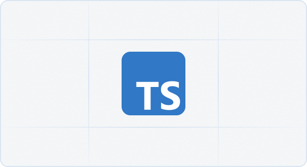
        
        

          

            TypeScript
            
            
          

        

      

    </a>
    <a class="fern-card interactive not-prose relative block p-6 text-base" href="/sdks/generators/python/quickstart">
      

        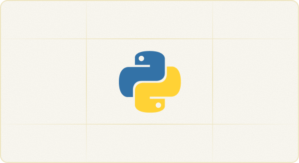
        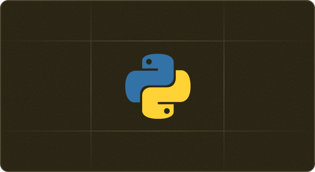
        

          

            Python
            
            
          

        

      

    </a>
    <a class="fern-card interactive not-prose relative block p-6 text-base" href="/sdks/generators/go/quickstart">
      

        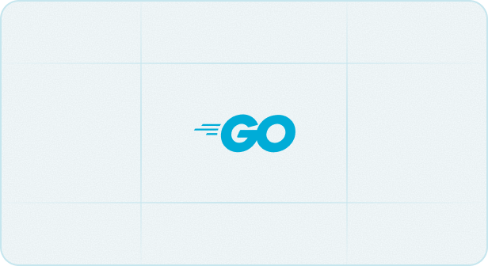
        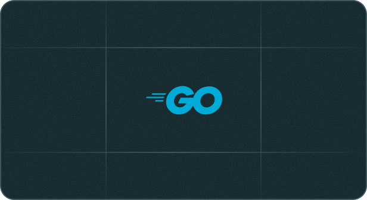
        

          

            Go
            
            
          

        

      

    </a>
    <a class="fern-card interactive not-prose relative block p-6 text-base" href="/sdks/generators/java/quickstart">
      

        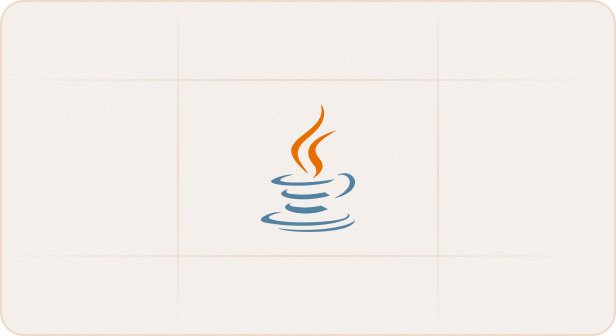
        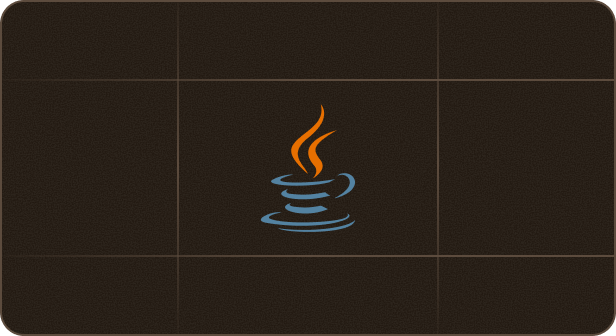
        

          

            Java
            
            
          

        

      

    </a>
    <a class="fern-card interactive not-prose relative block p-6 text-base" href="/sdks/generators/csharp/quickstart">
      

        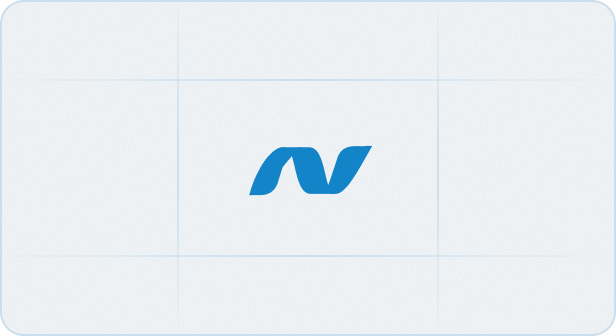
        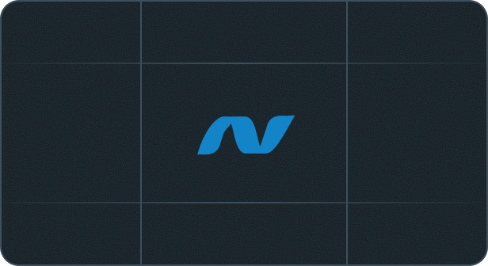
        

          

            .NET
            
            
          

        

      

    </a>
    <a class="fern-card interactive not-prose relative block p-6 text-base" href="/sdks/generators/php/quickstart">
      

        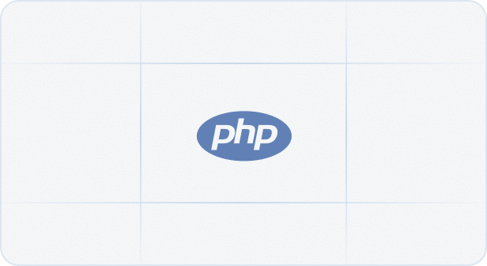
        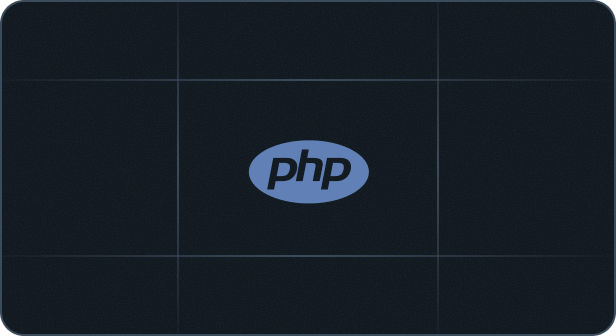
        

          

            PHP
            
            
          

        

      

    </a>
    <a class="fern-card interactive not-prose relative block p-6 text-base" href="/sdks/generators/ruby/quickstart">
      

        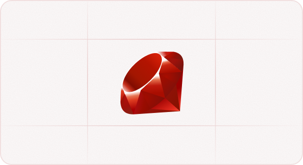
        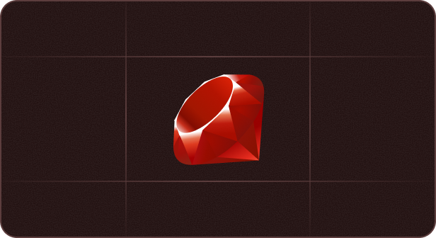
        

          

            Ruby
            
            
          

        

      

    </a>
    <a class="fern-card interactive not-prose relative block p-6 text-base" href="/sdks/generators/mcp-server">
      

        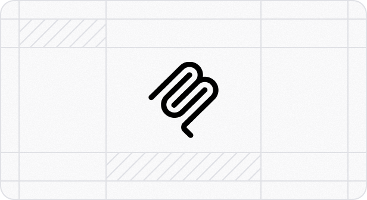
        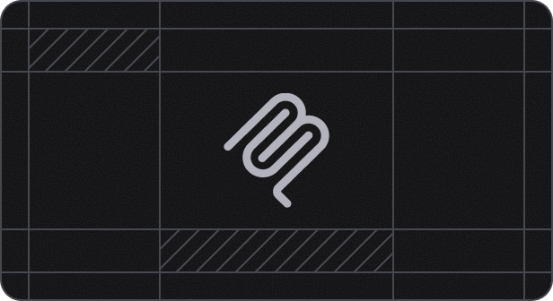
        

          

            MCP Server
            
            
          

        

      

    </a>
    <a class="fern-card interactive not-prose relative block p-6 text-base" href="https://buildwithfern.com/book-demo?type=language-request">
      

        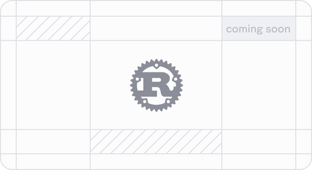
        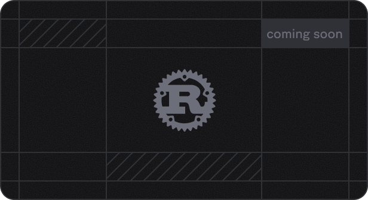
        

          

            Rust
            
            
          

        

      

    </a>
    <a class="fern-card interactive not-prose relative block p-6 text-base" href="https://buildwithfern.com/book-demo?type=language-request">
      

        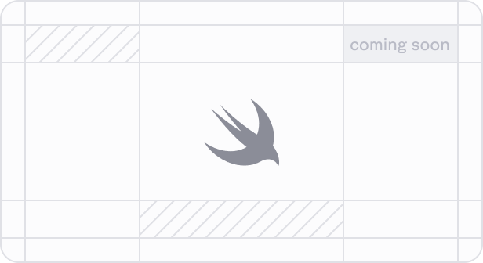
        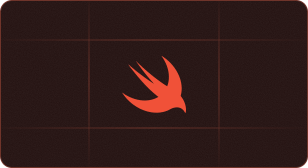
        

          

            Swift
            
            
          

        

      

    </a>
    <a class="fern-card interactive not-prose relative block p-6 text-base" href="https://buildwithfern.com/book-demo?type=language-request">
      

        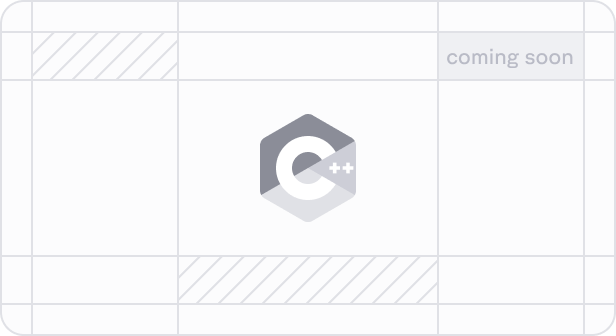
        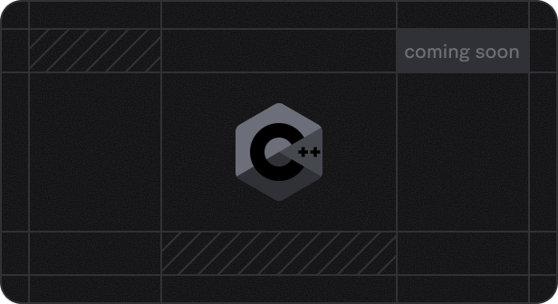
        

          

            C++
            
            
          

        

      

    </a>

    <a class="fern-card interactive not-prose relative block p-6 text-base" href="https://buildwithfern.com/book-demo?type=language-request">
      

        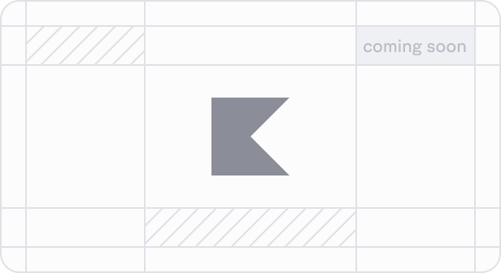
        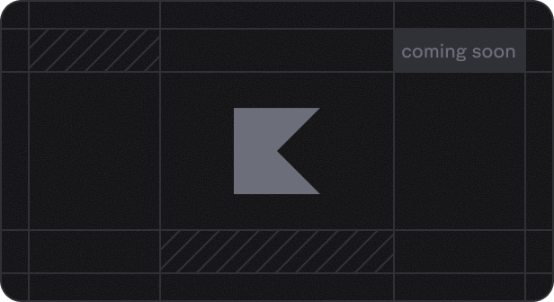
        

          

            Kotlin
            
            
          

        

      

    </a>
  </CardGroup> 
  

