import { TileDots } from "@/components/HomeGrid";

<llms-ignore>

  

    

      <TileDots />
      <a className="sdk-tile-graphic" href="/learn/sdks/generators/typescript/quickstart" aria-label="TypeScript">
        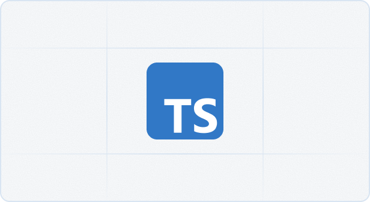
        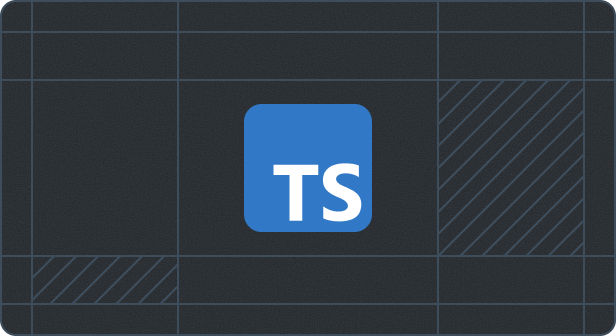
      </a>
      

        <a className="hg-tile-title hg-tile-title-sm" href="/learn/sdks/generators/typescript/quickstart">TypeScript</a>
        

          v<Markdown src="/snippets/version-number-ts.mdx"/>
          <a className="changelog-button" href="/learn/sdks/generators/typescript/changelog">
            
            
            
Changelog

          </a>
        

      

    

    

      <TileDots />
      <a className="sdk-tile-graphic" href="/learn/sdks/generators/python/quickstart" aria-label="Python">
        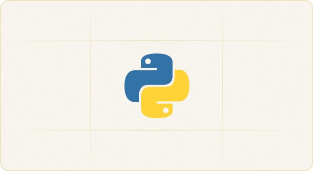
        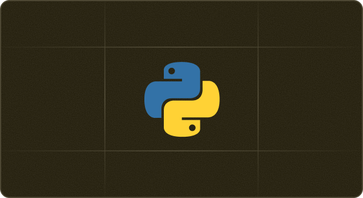
      </a>
      

        <a className="hg-tile-title hg-tile-title-sm" href="/learn/sdks/generators/python/quickstart">Python</a>
        

          v<Markdown src="/snippets/version-number-python.mdx"/>
          <a className="changelog-button" href="/learn/sdks/generators/python/changelog">
            
            
            
Changelog

          </a>
        

      

    

    

      <TileDots />
      <a className="sdk-tile-graphic" href="/learn/sdks/generators/go/quickstart" aria-label="Go">
        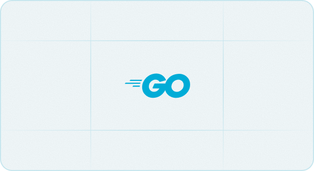
        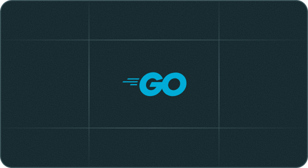
      </a>
      

        <a className="hg-tile-title hg-tile-title-sm" href="/learn/sdks/generators/go/quickstart">Go</a>
        

          v<Markdown src="/snippets/version-number-go.mdx"/>
          <a className="changelog-button" href="/learn/sdks/generators/go/changelog">
            
            
            
Changelog

          </a>
        

      

    

    

      <TileDots />
      <a className="sdk-tile-graphic" href="/learn/sdks/generators/java/quickstart" aria-label="Java">
        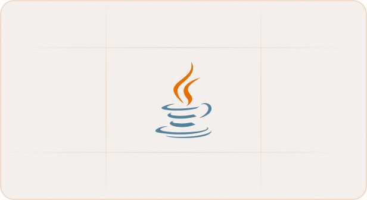
        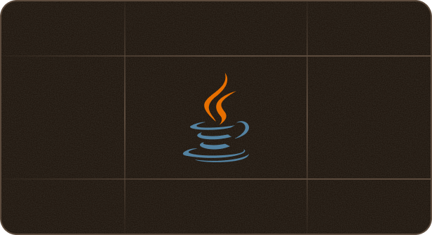
      </a>
      

        <a className="hg-tile-title hg-tile-title-sm" href="/learn/sdks/generators/java/quickstart">Java</a>
        

          v<Markdown src="/snippets/version-number-java.mdx"/>
          <a className="changelog-button" href="/learn/sdks/generators/java/changelog">
            
            
            
Changelog

          </a>
        

      

    

    

      <TileDots />
      <a className="sdk-tile-graphic" href="/learn/sdks/generators/csharp/quickstart" aria-label=".NET">
        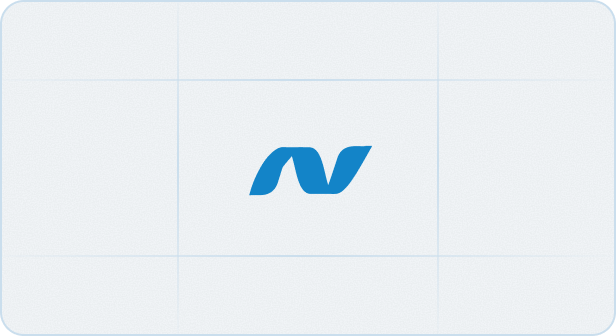
        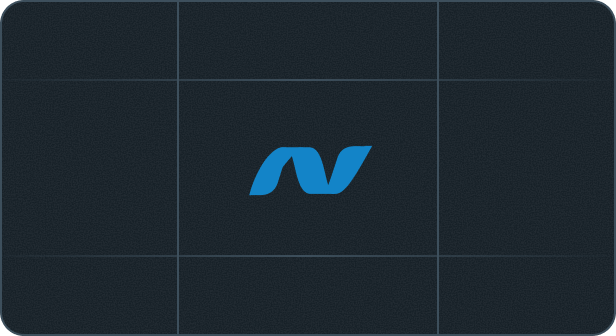
      </a>
      

        <a className="hg-tile-title hg-tile-title-sm" href="/learn/sdks/generators/csharp/quickstart">.NET</a>
        

          v<Markdown src="/snippets/version-number-csharp.mdx"/>
          <a className="changelog-button" href="/learn/sdks/generators/csharp/changelog">
            
            
            
Changelog

          </a>
        

      

    

    

      <TileDots />
      <a className="sdk-tile-graphic" href="/learn/sdks/generators/php/quickstart" aria-label="PHP">
        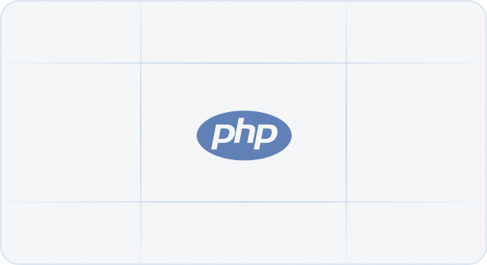
        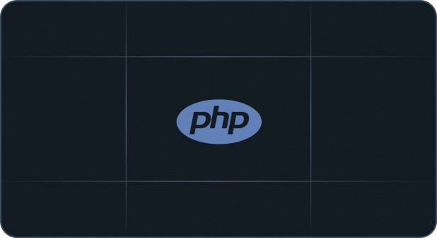
      </a>
      

        <a className="hg-tile-title hg-tile-title-sm" href="/learn/sdks/generators/php/quickstart">PHP</a>
        

          v<Markdown src="/snippets/version-number-php.mdx"/>
          <a className="changelog-button" href="/learn/sdks/generators/php/changelog">
            
            
            
Changelog

          </a>
        

      

    

    

      <TileDots />
      <a className="sdk-tile-graphic" href="/learn/sdks/generators/ruby/quickstart" aria-label="Ruby">
        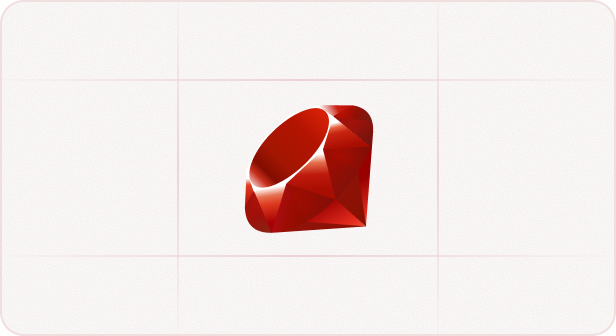
        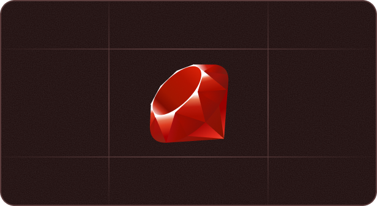
      </a>
      

        <a className="hg-tile-title hg-tile-title-sm" href="/learn/sdks/generators/ruby/quickstart">Ruby</a>
        

          v<Markdown src="/snippets/version-number-ruby.mdx"/>
          <a className="changelog-button" href="/learn/sdks/generators/ruby/changelog">
            
            
            
Changelog

          </a>
        

      

    

    

      <TileDots />
      <a className="sdk-tile-graphic" href="/learn/sdks/generators/swift/quickstart" aria-label="Swift">
        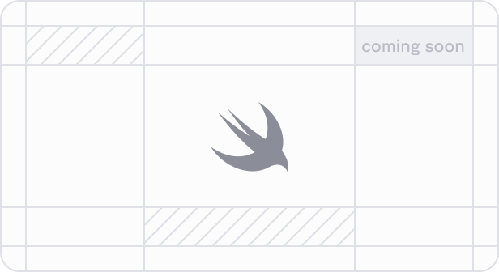
        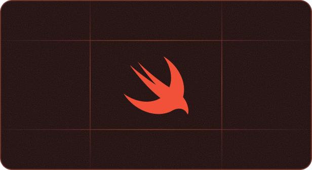
      </a>
      

        <a className="hg-tile-title hg-tile-title-sm" href="/learn/sdks/generators/swift/quickstart">Swift</a>
        

          v<Markdown src="/snippets/version-number-swift.mdx"/>
          <a className="changelog-button" href="/learn/sdks/generators/swift/changelog">
            
            
            
Changelog

          </a>
        

      

    

    

      <TileDots />
      <a className="sdk-tile-graphic" href="/learn/sdks/generators/rust/quickstart" aria-label="Rust">
        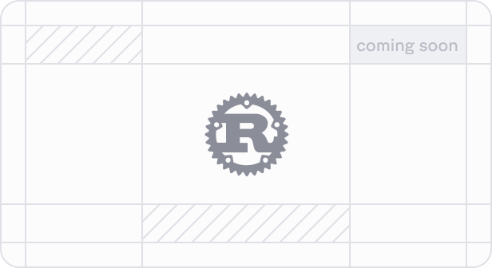
        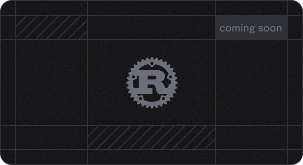
      </a>
      

        <a className="hg-tile-title hg-tile-title-sm" href="/learn/sdks/generators/rust/quickstart">Rust</a>
        

          v<Markdown src="/snippets/version-number-rust.mdx"/>
          <a className="changelog-button" href="/learn/sdks/generators/rust/changelog">
            
            
            
Changelog

          </a>
        

      

    

    

      <TileDots />
      <a className="sdk-tile-graphic" href="https://buildwithfern.com/book-demo?type=language-request" aria-label="C++">
        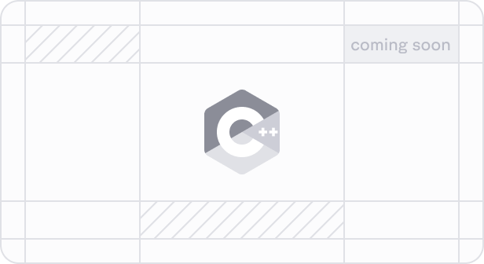
        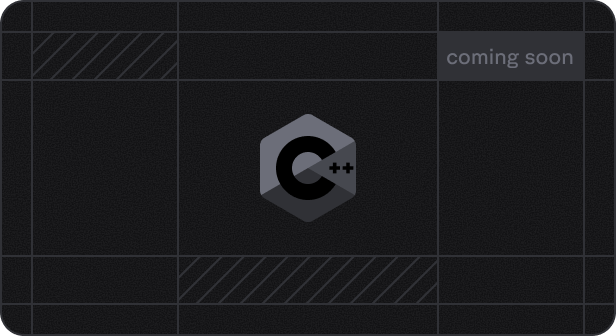
      </a>
      

        <a className="hg-tile-title hg-tile-title-sm" href="https://buildwithfern.com/book-demo?type=language-request">C++</a>
        Request access
      

    

    

      <TileDots />
      <a className="sdk-tile-graphic" href="https://buildwithfern.com/book-demo?type=language-request" aria-label="Kotlin">
        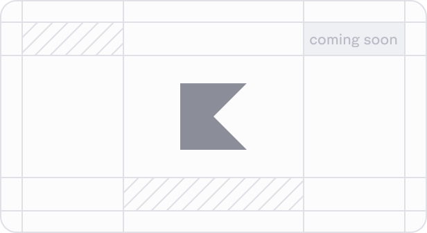
        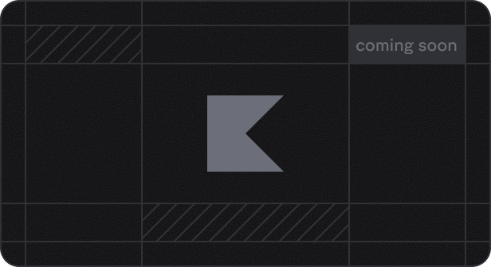
      </a>
      

        <a className="hg-tile-title hg-tile-title-sm" href="https://buildwithfern.com/book-demo?type=language-request">Kotlin</a>
        Request access
      

    

    

      <TileDots />
      

        
Need another language?

        
Tell us which language your users need and we'll prioritize it.

      

      <a className="fern-button minimal normal gap-1 a-btn w-fit" href="https://buildwithfern.com/book-demo?type=language-request">
        Request a language
        
        
      </a>
    

  

</llms-ignore>

<llms-only>
Generate client libraries in multiple languages from your API definition.

- [TypeScript](/learn/sdks/generators/typescript/quickstart): Quickstart guide for generating a TypeScript SDK.
- [Python](/learn/sdks/generators/python/quickstart): Quickstart guide for generating a Python SDK.
- [Go](/learn/sdks/generators/go/quickstart): Quickstart guide for generating a Go SDK.
- [Java](/learn/sdks/generators/java/quickstart): Quickstart guide for generating a Java SDK.
- [.NET](/learn/sdks/generators/csharp/quickstart): Quickstart guide for generating a .NET SDK.
- [PHP](/learn/sdks/generators/php/quickstart): Quickstart guide for generating a PHP SDK.
- [Ruby](/learn/sdks/generators/ruby/quickstart): Quickstart guide for generating a Ruby SDK.
- [Swift](/learn/sdks/generators/swift/quickstart): Quickstart guide for generating a Swift SDK.
- [Rust](/learn/sdks/generators/rust/quickstart): Quickstart guide for generating a Rust SDK.
- [C++](https://buildwithfern.com/book-demo?type=language-request): Request access for C++ SDK generation.
- [Kotlin](https://buildwithfern.com/book-demo?type=language-request): Request access for Kotlin SDK generation.
</llms-only>

<llms-only>

## Frequently Asked Questions

### What programming languages does Fern support for SDK generation?
Fern generates SDKs in TypeScript, Python, Go, Java, .NET (C#), PHP, Ruby, Swift, and Rust.

### How do I generate an SDK with Fern?
Define your API using OpenAPI or another supported spec, configure a generator in `generators.yml`, and run `fern generate`. Fern produces an idiomatic client library for each configured language.

### Are Fern-generated SDKs production-ready?
Yes. Fern-generated SDKs include type safety, error handling, automatic retries, pagination helpers, and follow the idiomatic conventions of each language. Many companies ship Fern-generated SDKs directly to their customers.

### Can I publish Fern-generated SDKs to package registries?
Yes. Fern can publish generated SDKs directly to npm (TypeScript), PyPI (Python), Maven (Java), NuGet (.NET), Packagist (PHP), RubyGems (Ruby), and other registries as part of the generation pipeline.

### Does Fern keep SDKs in sync with my API?
Yes. Every time you update your API definition and run `fern generate`, Fern regenerates the SDKs to reflect the latest changes. You can automate this with GitHub Actions so SDKs are always up to date.

</llms-only>
