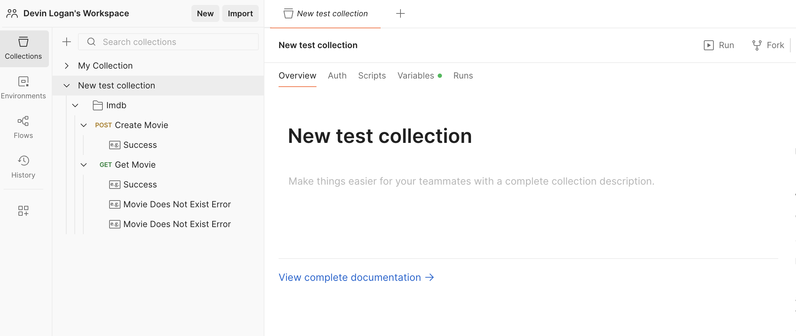
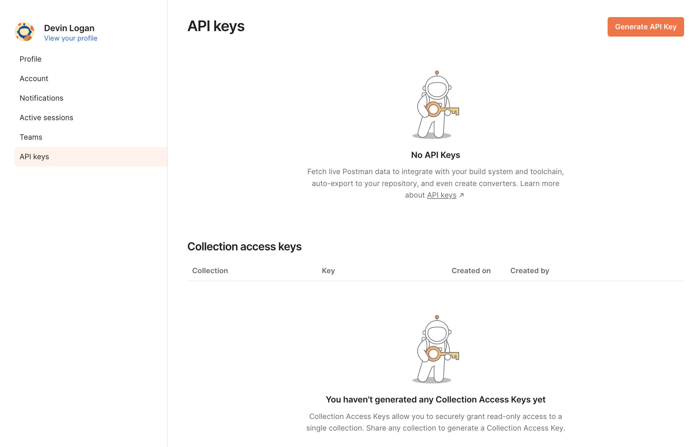

<Warning>The Postman collection generator is no longer actively maintained. Instead, import your OpenAPI specification directly into Postman. See [Postman's OpenAPI import docs](https://learning.postman.com/docs/integrations/available-integrations/working-with-openAPI/).</Warning>

Publish your Postman collection directly to Postman workspaces, making it easy for your team and API consumers to discover and test your endpoints.

<Frame>
  
</Frame>

<Info>
  This page assumes that you have:

  * An initialized `fern` folder. See [Set up the `fern`
  folder](/sdks/overview/quickstart).
  * A GitHub repository for your Postman collection. See [Project structure](/sdks/overview/project-structure).
  * A Postman generator group in `generators.yml`. See [Postman
  Quickstart](quickstart#add-the-sdk-generator).

  </Info>

## Generate an API key

<Steps>

  <Step title="Log into Postman">

  Log into [Postman](https://www.postman.com/) or create a new account. 

  </Step>

  <Step title="Navigate to API Keys">

  1.    Click on your profile picture. 
  1.    Select **Settings**.
  1.    Select **API Keys**. 

  <Frame>
    
  </Frame>

  </Step>

  <Step title="Generate key">
  Click on **Generate API Key**. Name your key, then click **Generate**.

  <Warning>Save your new token – it won't be displayed after you leave the page.</Warning>

  </Step>

</Steps>

## Configure Postman publication

You'll need to update your `generators.yml` file to configure the output location, repository, publishing mode, and authentication credentials for Postman publishing. Your `generators.yml` [should live in your source repository](/sdks/overview/project-structure) (or on your local machine), not the repository that contains your Postman collection file. 
<Steps>
  <Step title="Configure `output` location">

    In the `group` for your Postman collection, change the output location from `local-file-system` (the default) to `postman` to indicate that Fern should publish your collection directly to Postman:

    ```yaml {6-7} title="generators.yml"
    groups: 
      postman: # Group name for your Postman collection
        generators:
          - name: fernapi/fern-postman
            version: <Markdown src="/snippets/version-number-postman.mdx"/>
            output:
              location: postman
    ```

  </Step>
<Step title="Add repository location">

  Add the path to the GitHub repository containing your Postman collection:

  ```yaml {8-9} title="generators.yml"
groups: 
  postman:
    generators:
      - name: fernapi/fern-postman
      version: <Markdown src="/snippets/version-number-postman.mdx"/>
      output:
        location: postman
      github: 
        repository: your-org/company-postman
  ```

</Step>
<Step title="Choose your publishing mode">

Optionally set the mode to control how Fern handles Postman publishing:

- `mode: release` (default): Fern generates code, commits to main, and tags a release automatically
- `mode: pull-request`:  Fern generates code and creates a PR for you to review before release
- `mode: push`: Fern generates code and pushes to a branch you specify for you to review before release

You can also configure other settings, like the reviewers or license. Refer to the [full `github` (`generators.yml`) reference](/sdks/reference/generators-yml#github) for more information. 

```yaml {10} title="generators.yml"
groups: 
  postman:
    generators:
      - name: fernapi/fern-postman
      version: <Markdown src="/snippets/version-number-postman.mdx"/>
      output:
        location: postman
      github: 
        repository: your-org/company-postman
        mode: push
        branch: your-branch-name
```
</Step>
<Step title="Configure Postman API key">

Add `api-key: ${POSTMAN_API_KEY}` to `generators.yml` to tell Fern to use your API key for authentication when publishing to a Postman collection. 

  ```yaml {8} title="generators.yml"
groups: 
  postman:
    generators:
      - name: fernapi/fern-postman
      version: <Markdown src="/snippets/version-number-postman.mdx"/>
      output:
        location: postman
        api-key: ${POSTMAN_API_KEY}
      github: 
        repository: your-org/company-postman
  ```
</Step>
</Steps>

## Choose your versioning approach

Fern's Postman publishing uses a simple versioning approach based on whether you specify a `collection-id`:

- **Update existing collection:** Specify `collection-id`. Fern updates the same collection each time. Use this option to keep your workspace clean with one collection that is always current. 
- **Create new collections:** Omit `collection-id`. Fern creates a new collection with each publish. Use this option to maintain historical versions or separate environment collections.

<AccordionGroup>
<Accordion title="Publish as a new collection">
<Steps>
<Step title="Specify the workspace ID">
<Markdown src="/products/sdks/snippets/postman-workspace.mdx"/>

</Step>
<Step title="Specify the collection name">
Set the name for your new collection. Each time you publish, Fern creates a new collection with this name in the specified workspace.

```yaml title="generators.yml" {10-11}
groups:
  postman:
    generators:
      - name: fernapi/fern-postman
        version: <Markdown src="/snippets/version-number-postman.mdx"/>
        output:
          location: postman
          api-key: ${POSTMAN_API_KEY}
          workspace-id: your-workspace-id
        config:
          collection-name: My collection name # Creates new collection called "My collection name"
        github: 
          repository: your-org/company-postman
```
</Step>
</Steps>
</Accordion>

<Accordion title="Publish to an existing collection">

To publish to a existing collection, specify the workspace ID, existing collection ID, and name of the existing collection.

<Steps>
<Step title="Specify the workspace ID">
<Markdown src="/products/sdks/snippets/postman-workspace.mdx"/>

</Step>

<Step title="Specify the collection name and ID">

You can get your collection name and ID by navigating to your workspace and either:
- Copying the ID from the URL: `https://user-name.postman.co/workspace/workspace-name~workspace-id/collection/COLLECTION-ID`
- Making a GET request to `https://api.getpostman.com/collections`. You must also enter your API key in the **Auth** tab. Send the request. This request returns configuration, including IDs and names, for all of your collections.

```yaml title="generators.yml" {10-12}
groups:
  postman:
    generators:
      - name: fernapi/fern-postman
        version: <Markdown src="/snippets/version-number-postman.mdx"/>
        output:
          location: postman
          api-key: ${POSTMAN_API_KEY}
          workspace-id: your-workspace-id
          collection-id: your-collection-id
        config:
          collection-name: Your collection name # Name of the existing collection
        github: 
          repository: your-org/company-postman
```
</Step>
</Steps>
</Accordion>
</AccordionGroup>

## Publish your collection

Decide how you want to publish your collection to Postman. You can use GitHub workflows for automated releases or publish directly via the CLI. 

<AccordionGroup>

<Accordion title="Release via a GitHub workflow">

Set up a release workflow via [GitHub Actions](https://docs.github.com/en/actions/get-started/quickstart) so you can trigger new Postman collection releases directly from your source repository. 

<Steps>
  <Step title="Set up authentication">

  Open your source repository in GitHub. Click on the **Settings** tab. Then, under the **Security** section, open **Secrets and variables** > **Actions**. 

  You can also use the url `https://github.com/<your-repo>/settings/secrets/actions`.

  </Step>
  <Step title="Add secret for your API key">

  1. Select **New repository secret**. 
  1. Name your secret `POSTMAN_API_KEY`.
  1. Add the corresponding API key you generated above.
  1. Click **Add secret**. 

  </Step>
  <Step title="Add secret for your Fern Token">

  1. Select **New repository secret**. 
  1. Name your secret `FERN_TOKEN`.
    1. Add your Fern token. If you don't already have one, generate one by
       running `fern token`. By default, the `fern_token` is generated for the
       organization listed in `fern.config.json`.
  1. Click **Add secret**. 

  </Step>
  <Step title="Set up a new workflow">

  Set up a CI workflow that you can manually trigger from the GitHub UI. In your repository, navigate to **Actions**. Select **New workflow**, then **Set up workflow yourself**. Add a workflow that's similar to this: 

  ```yaml title=".github/workflows/publish.yml" maxLines=0
  name: Publish Postman collection

  on:
    workflow_dispatch:
      inputs:
        version:
          description: "The version of the Postman collection that you would like to release"
          required: true
          type: string

  jobs:
    release:
      runs-on: ubuntu-latest
      steps:
        - name: Checkout repo
          uses: actions/checkout@v4

        - name: Install Fern CLI
          run: npm install -g fern-api

        - name: Release Postman collection
          env:
            FERN_TOKEN: ${{ secrets.FERN_TOKEN }}
            POSTMAN_API_KEY: ${{ secrets.POSTMAN_API_KEY }}
          run: |
            fern generate --group postman --version ${{ inputs.version }} --log-level debug
  ```
  <Note>
    You can alternatively configure your workflow to execute `on: [push]`. See Vapi's [npm publishing GitHub Action](https://github.com/VapiAI/server-sdk-typescript/blob/main/.github/workflows/ci.yml) for an example. 
  </Note>
  </Step>

  <Step title="Regenerate and release your collection"> 

  Navigate to the **Actions** tab, select the workflow you just created, specify a version number, and click **Run workflow**. This regenerates your collection.

  <Note>
  Specifying the version number will update the release number in your GitHub repository, but won't version your collection.
  </Note>

  <Markdown src="/products/sdks/snippets/generate-postman.mdx"/>

  </Step>

</Steps>

</Accordion>

<Accordion title="Release via CLI and environment variables">
<Steps>

<Step title="Set Postman environment variable">

Set the `POSTMAN_API_KEY` environment variable on your local machine:

```bash
export POSTMAN_API_KEY=your-actual-postman-api-key
```

</Step>
<Step title="Regenerate and release your collection">

Regenerate your collection. 

<Note>
The `--version` parameter in `fern generate --version X.X.X` creates a GitHub release tag but doesn't affect Postman collection naming or versioning. Collection versioning is controlled by the `collection-id` configuration.
</Note>

```bash
fern generate --group postman --version <version>
```

<Markdown src="/products/sdks/snippets/generate-postman.mdx"/>

</Step>

</Steps>
</Accordion>
</AccordionGroup>


