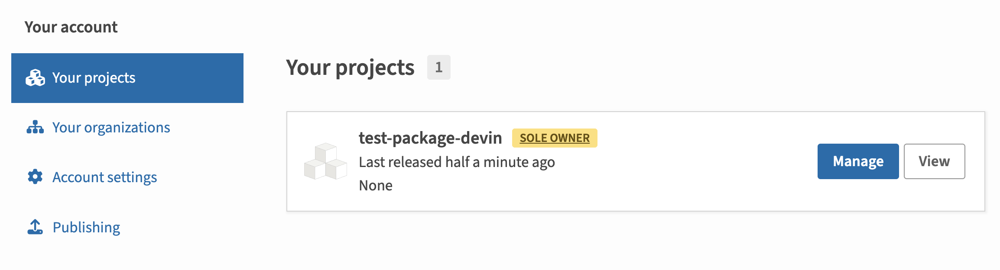

Publish your public-facing Fern Python SDK to the [PyPI
registry](https://pypi.org/). After following the steps on this page,
you'll have a versioned package published on PyPI.

<Frame>
	
</Frame>

<Markdown src="/products/sdks/snippets/setup-fern-folder-callout.mdx"/>

## Configure `generators.yml`

<Steps>

	  <Step title="Configure `output` location">

		Next, change the output location in `generators.yml` from `local-file-system` (the default) to `pypi` to indicate that Fern should publish your package directly to the PyPI registry:

	    ```yaml title="Python" {6-7}
	    groups: 
	      python-sdk:
	        generators:
	          - name: fernapi/fern-python-sdk
	            version: <Markdown src="/snippets/version-number-python.mdx"/>
	            output:
	              location: pypi

	    ```
	  </Step>

	  <Step title="Add a unique package name">

	     Your package name must be unique in the PyPI repository, otherwise publishing your SDK to PyPI will fail. Update your package name if you haven't done so already:


```yaml title="Python" {8}
groups: 
  python-sdk:
    generators:
      - name: fernapi/fern-python-sdk
        version: <Markdown src="/snippets/version-number-python.mdx"/>
        output:
          location: pypi
          package-name: your-package-name
```
	    
	  </Step>

	<Step title="Configure `client-class-name`">

	     The `client-class-name` option controls the name of the generated client. This is the name customers use to import your SDK (`import { your-client-name } from 'your-package-name';`). 


```yaml title="Python" {9-10}
groups: 
  python-sdk:
    generators:
      - name: fernapi/fern-python-sdk
        version: <Markdown src="/snippets/version-number-python.mdx"/>
        output:
          location: pypi
          package-name: your-package-name
        config:
          client_class_name: YourClientName # must be PascalCase
```
	    
	  </Step>

	  <Step title="Add repository location">

	  Add the path to your GitHub repository to `generators.yml`: 

```yaml title="Python" {11-12}
groups: 
  python-sdk:
    generators:
      - name: fernapi/fern-python-sdk
        version: <Markdown src="/snippets/version-number-python.mdx"/>
        output:
          location: pypi
          package-name: your-package-name
        config:
          client_class_name: YourClientName
        github: 
          repository: your-org/company-python
```
	  
	  </Step>
  </Steps>

## Set up PyPi publishing authentication

<Steps>

	<Step title="Log into PyPi">

	Log into [PyPi](https://pypi.org/) or create a new account. 

	</Step>

	<Step title="Navigate to Account settings">

	1.    Click on your profile picture. 
	1.    Select **Account settings**.
	1.    Scroll down to **API Tokens**. 

	</Step>

	<Step title="Add New Token">

	1.    Click on **Add API Token**
  	1.    Name your token and set the scope to the relevant projects.
    1.    Click **Create token**

	<Frame>
	
	</Frame>

    <Warning>Save your new token –  it won’t be displayed after you leave the page.</Warning>

	</Step>

</Steps>

## Release your SDK to PyPI

  At this point, you're ready to generate a release for your SDK.
<AccordionGroup>
<Accordion title="Release via a GitHub workflow (recommended)">

Set up a release workflow via [GitHub Actions](https://docs.github.com/en/actions/get-started/quickstart) so you can trigger new SDK releases directly from your source repository. 

<Steps>
	<Step title="Set up authentication">

	Open your Fern repository in GitHub. Click on the **Settings** tab in your repository. Then, under the **Security** section, open **Secrets and variables** > **Actions**. 

	<Frame>
	
	</Frame>

	You can also use the url `https://github.com/<your-repo>/settings/secrets/actions`.

	</Step>
	<Step title="Add secret for your PyPi Token">

	1. Select **New repository secret**. 
	1. Name your secret `PYPI_TOKEN`.
	1. Add the corresponding token you generated above.
	1. Click **Add secret**. 

	<Frame>
	
	</Frame>

	</Step>
	<Step title="Add secret for your Fern Token">

	1. Select **New repository secret**. 
	1. Name your secret `FERN_TOKEN`.
    1. Add your Fern token. If you don't already have one, generate one by
       running `fern token`. By default, the `fern_token` is generated for the
       organization listed in `fern.config.json`.
	1. Click **Add secret**. 

	</Step>
	<Step title="Configure PyPi authentication token">

	Add `token: ${PYPI_TOKEN}` to `generators.yml`.

	```yaml {9} title="generators.yml"
groups: 
  python-sdk:
    generators:
      - name: fernapi/fern-python-sdk
        version: <Markdown src="/snippets/version-number-python.mdx"/>
        output:
          location: pypi
          package-name: your-package-name
          token: ${PYPI_TOKEN}
        config:
          client_class_name: YourClientName
        github: 
          repository: your-org/company-python
	```
	</Step>
	<Step title="Set up a new workflow">

	Set up a CI workflow that you can manually trigger from the GitHub UI. In your repository, navigate to **Actions**. Select **New workflow**, then **Set up workflow yourself**. Add a workflow that's similar to this: 

	```yaml title=".github/workflows/publish.yml" maxLines=0
	name: Publish Python SDK

	on:
	  workflow_dispatch:
	    inputs:
	      version:
	        description: "The version of the Python SDK that you would like to release"
	        required: true
	        type: string

	jobs:
	  release:
	    runs-on: ubuntu-latest
	    steps:
	      - name: Checkout repo
	        uses: actions/checkout@v4

	      - name: Install Fern CLI
	        run: npm install -g fern-api

	      - name: Release Python SDK
	        env:
	          FERN_TOKEN: ${{ secrets.FERN_TOKEN }}
	          PYPI_TOKEN: ${{ secrets.PYPI_TOKEN }}
	        run: |
	          fern generate --group python-sdk --version ${{ inputs.version }} --log-level debug
	```

	</Step>

	<Step title="Run your workflow"> 

		Navigate to the **Actions** tab, select the workflow you just created, specify a version number, and click **Run workflow**. 
		
		This regenerates your SDK, tags the new release with the version number you specified, and initiates a Fern-generated publishing workflow in your Python SDK repository that publishes your release to PyPi. 

		<Frame>
			
		</Frame>
	
		Once your workflow completes, log back into PyPi and navigate to **Packages** to see your new release. 
	
	</Step>
</Steps>

</Accordion>
<Accordion title="Release via CLI and environment variables">
<Steps>

	<Step title="Configure PyPI authentication token">

	Add `token: ${PYPI_TOKEN}` to `generators.yml` to tell Fern to use the `PYPI_TOKEN` environment variable for authentication when publishing to the PyPI registry.

	```yaml title="Python" {9}
	groups: 
	python-sdk:
		generators:
		- name: fernapi/fern-python-sdk
			version: <Markdown src="/snippets/version-number-python.mdx"/>
			output:
			location: pypi
			package-name: your-package-name
			token: ${PYPI_TOKEN}
			config:
			client_class_name: YourClientName
			github: 
			repository: your-org/company-python
	```
	</Step>
 
	<Step title="Set PyPI environment variable">

	Set the `PYPI_TOKEN` environment variable on your local machine:

	```bash
	export PYPI_TOKEN=your-actual-pypi-token
	```

	</Step>

	<Step title="Generate your release">

	Regenerate your SDK and publish it on PyPI:

	```bash
	fern generate --group python-sdk --version <version>
	```
    Local machine output will verify that the release is pushed to your
    repository and tagged with the version you specified. Log back into PyPI and
    navigate to **Your projects** to see your new release. 
    </Step>

</Steps>
</Accordion>
</AccordionGroup>