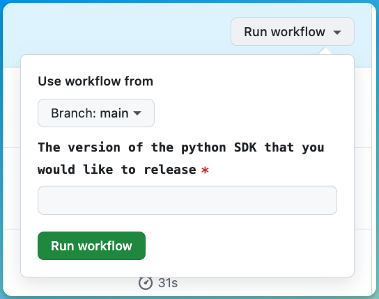

Publish your public-facing Fern Typescript SDK to the [npm registry](https://www.npmjs.com/). Once you've followed the steps on this page to connect your npm account to your SDK, Fern will automatically publish the latest version of your SDK.  

<Info>This guide assumes that you've already generated a TypeScript SDK by following the instructions in [TypeScript Quickstart](quickstart.mdx).</Info>

## Configure your GitHub integration

  1.   Create a new GitHub repository for your SDK, if you haven't done so already.
  1.   Install the [Fern GitHub App](https://github.com/apps/fern-api) on your repository.
  1.   Add your TypeScript SDK files (`fern` and `sdks` folders) to your repository.
  

## Configure `generators.yml`

<Steps>

	<Step title="Run `fern add <generator>`">

	  Navigate to your `generators.yml`. Your `generators.yml` lives inside of your `fern` folder and contains all the configuration for your Fern generators. 

	  In order to generate the SDK, add the generator to your `generators.yml` using the `fern <add>` command:


	    ```bash
	    fern add fern-typescript-node-sdk --group ts-sdk
	    ```

	  Once the command completes, you'll see a new group created in your `generators.yml`:
	  
	  ```yaml {1-3}
	    groups: 
	    ...
	      ts-sdk:
	        generators:
	          - name: fernapi/fern-typescript-node-sdk
	            version: 1.0.0
	            output:
	              location: local-file-system
	              path: ../sdks/typescript
	    ```

	  <Info>Here are the [latest versions of each generator](https://github.com/fern-api/fern?tab=readme-ov-file#-generators).</Info>

	  </Step>

	  <Step title="Configure `output` location">

		Next, change the output location in `generators.yml` to `npm`:

	    ```yaml title="TypeScript" {6-7}
	    groups: 
	      ts-sdk:
	        generators:
	          - name: fernapi/fern-typescript-node-sdk
	            version: 1.0.0
	            output:
	              location: npm

	    ```
	  </Step>

	  <Step title="Add a unique package name">

	     Your package name must be unique in the npm repository, otherwise releasing your SDK to npm will fail. Update your package name if you haven't done so already:


	    ```yaml title="TypeScript" {8}
	    groups: 
	      ts-sdk:
	        generators:
	          - name: fernapi/fern-typescript-node-sdk
	            version: 1.0.0
	            output:
	              location: npm
	              package-name: name-of-your-package
	    ```
	    
	  </Step>


	  <Step title="Add repository location">

	  Add the path to your GitHub repository to `generators.yml`: 

	  ```yaml title="TypeScript" {10-11}
	  groups: 
	    ts-sdk:
	      generators:
	        - name: fernapi/fern-typescript-node-sdk
	          version: 0.9.5
	          output:
	            location: npm
	            package-name: name-of-your-package
	          github: 
	            repository: your-org/your-repository
	  ```
	  
	  </Step>
  </Steps>

## Create an npm token

<Steps>

	<Step title="Log In">

	Log into [npm](https://www.npmjs.com/) or create a new account. 

	</Step>

	<Step title="Navigate to Access Tokens">

	Click on your profile picture and select **Access Tokens**. 

	</Step>

	<Step title="Generate Token">

	1.    Click on **Generate New Token**.
	1.    Select **Classic Token**. 
	1.    Name your token and select **Automation** as the token type. 
	1.    Once finished, click **Generate Token**.

	<Frame>
	
	</Frame>

	<Warning>When you click **Generate Token**, you’ll be returned to the **Access Token** dashboard. A box on the top of the dashboard will confirm that your token creation was a success and prompt you to copy your token id. Make sure you save this id, as you'll need to add it to your GitHub repository in the later on.</Warning>

	</Step>
</Steps>

## Add NPM and Fern Tokens to your GitHub Tepository

<Info>
Using GitLab? Follow [these steps](/learn/docs/developer-tools/gitlab#add-a-token-to-gitlab). 
</Info>

<Steps>
 
	<Step title="Open Repository">

	Open your Fern repository in GitHub.

	</Step>

	<Step title="Navigate to Actions in Settings">

	Click on the **Settings** tab in your repository. Then, under the **Security** section, open **Secrets and variables** > **Actions**. 

	<Frame>
	
	</Frame>

	You can also use the url `https://github.com/<your-repo>/settings/secrets/actions`.

	</Step>

	<Step title="Add secret for your NPM Token">

	1.    Select **New repository secret**. 
	1.    Name your secret `NPM_TOKEN`.
	1.    Add the corresponding token you generated above.
	1.    Click **Add secret**. 

	</Step>

	<Step title="Generate and Add Secret for your Fern Token">

	1.    Generate a Fern token by running `fern token` and saving the token id. 
	1.    Select **New repository secret**. 
	1.    Name your secret `FERN_TOKEN`.
	1.    Add the corresponding token you generated above.
	1.    Click **Add secret**. 

	</Step>

</Steps>

## Configure GitHub Actions

<Steps>
	<Step title="Update Workflow Action Settings">

		Change your workflow permissions to allow GitHub to run workflows:

		1.    Click on the **Settings** tab in your repository. 
		1.    Navigate to **Actions**. Under **Actions permissions**, select **Allow all actions and reusable workflows**.
		1.    **Save** your settings. Now GitHub can run the action you just configured. 

	</Step>
	<Step title="Set up a GitHub Action">

		Add a GitHub Action to trigger releases for your SDK. Add a new file called `publish-typescript-sdk.yml` (or something similar) to a new `.github/workflows` directory. Your file should look like this:


		```yaml title="TypeScript" maxLines=0
			name: Publish TypeScript SDK

			on:
			  workflow_dispatch:
			    inputs:
			      version:
			        description: "The version of the TypeScript SDK that you would like to release"
			        required: true
			        type: string

			jobs:
			  release:
			    runs-on: ubuntu-latest
			    steps:
			      - name: Checkout repo
			        uses: actions/checkout@v4

			      - name: Install Fern CLI
			        run: npm install -g fern-api

			      - name: Release TypeScript SDK
			        env:
			          FERN_TOKEN: ${{ secrets.FERN_TOKEN }}
			          NPM_TOKEN: ${{ secrets.NPM_TOKEN }}
			        run: |
			          fern generate --group ts-sdk --version ${{ inputs.version }} --log-level debug
		```

	The group name in the `run` command (`ts-sdk`) must match the name of your group in `generators.yml`:

		```yaml {2}
		groups:
		  ts-sdk:
		    generators:
		      - name: fernapi/fern-typescript-node-sdk
		        version: 1.10.3
		        output:
		          location: npm
		          package-name: name-of-your-package
		          token: ${NPM_TOKEN}
		        github: 
		          repository: your-org/your-repository
		 ```
	</Step>
</Steps>

## Release your SDK to NPM

  At this point, you're ready to generate a release for your SDK. You can do this by either:
  *   Running `fern generate --version <version>` to regenerate your SDK.
  *   Manually triggering your SDK generation workflow from your GitHub repository by navigating to **Actions** and selecting your workflow. Once you initiate the workflow, you'll be prompted to enter the version number of your release.

  	

  When your workflow executes, you'll receive an email from npm notifying you that your SDK has been successfully published!