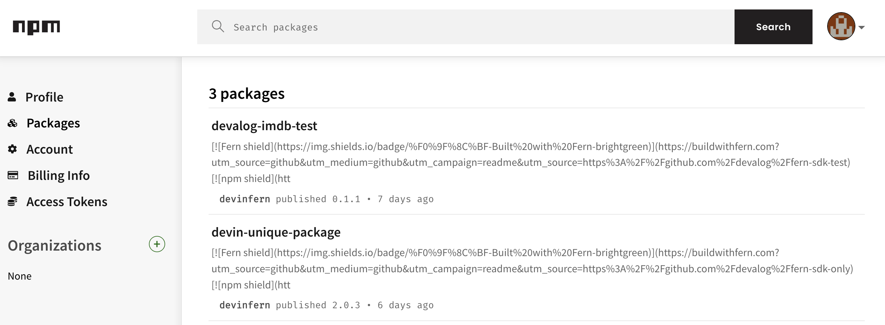
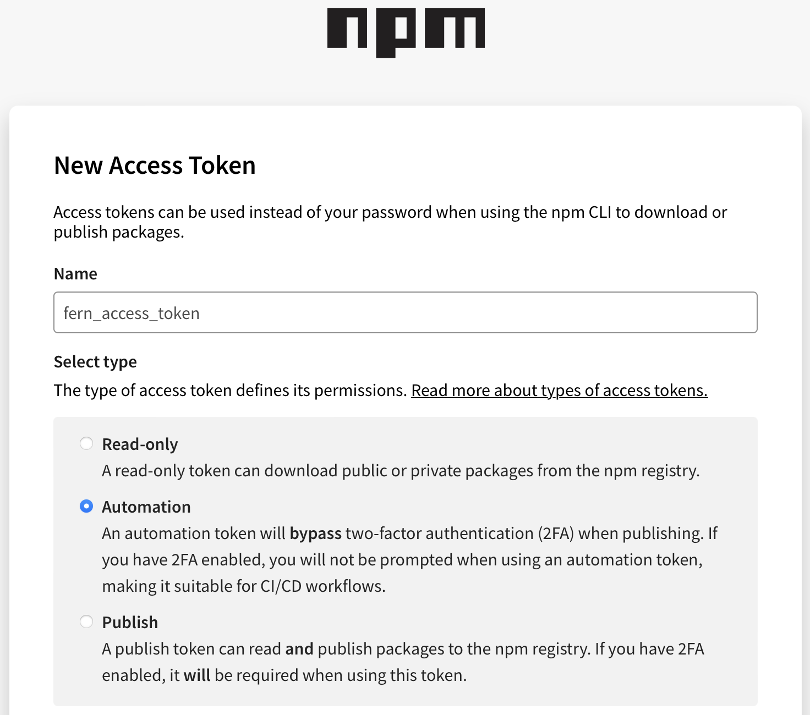
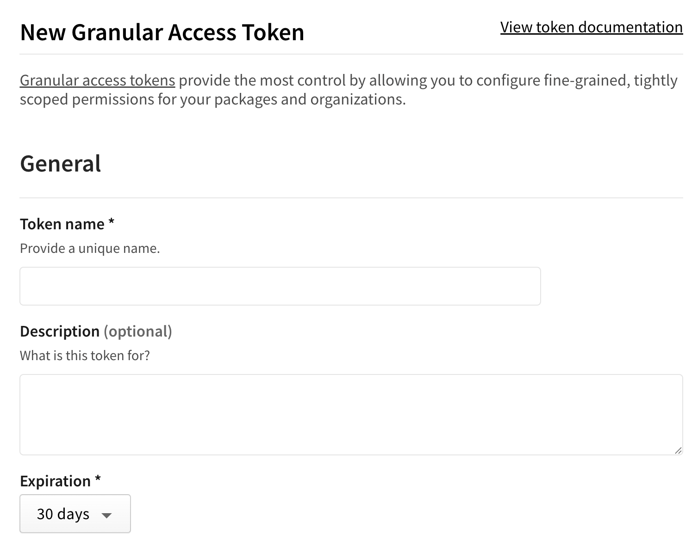
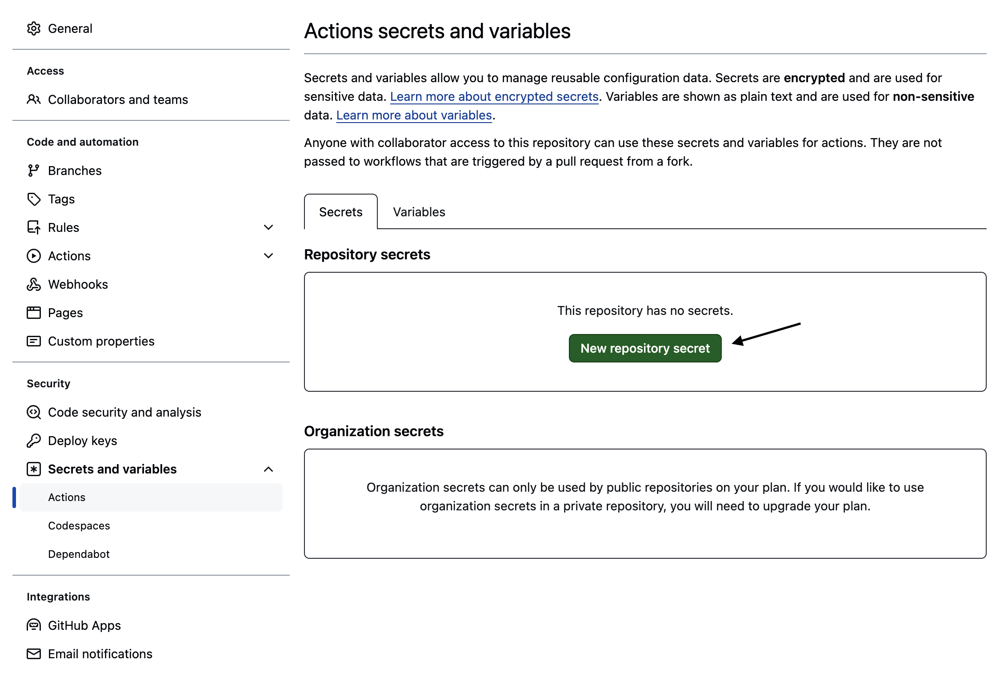
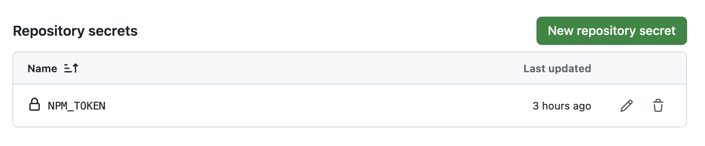
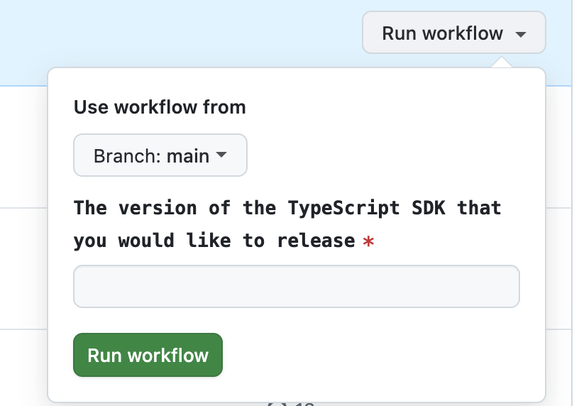

Publish your public-facing Fern TypeScript SDK to the [npm
registry](https://www.npmjs.com/). After following the steps on this page,
you'll have a versioned package published on npm.

<Frame>
	
</Frame>

<Info>
	This page assumes that you have:

	* An initialized `fern` folder. See [Set up the `fern`
	folder](/sdks/overview/quickstart).
	* A GitHub repository for your TypeScript SDK. See [Project structure](/sdks/overview/project-structure).
	* A TypeScript generator group in `generators.yml`. See [TypeScript
	Quickstart](quickstart#add-the-sdk-generator).

  </Info>

## Configure SDK package settings

You'll need to update your `generators.yml` file to configure the package name, output location, and client naming for npm publishing. Your `generators.yml` [should live in your source repository](/sdks/overview/project-structure) (or on your local machine), not the repository that contains your TypeScript SDK code.

<Steps>
	<Step title="Configure `output` location">

		In the `group` for your TypeScript SDK, change the output location in from `local-file-system` (the default) to `npm` to indicate that Fern should publish your package directly to the npm registry:

		```yaml {6-7} title="generators.yml"
		groups: 
		  ts-sdk: # Group name for your TypeScript SDK
		    generators:
		      - name: fernapi/fern-typescript-sdk
		        version: <Markdown src="/snippets/typescript-sdk-version.mdx"/>
		        output:
		          location: npm
		```

	</Step>

	<Step title="Add a unique package name">

		Your package name must be unique in the npm repository, otherwise publishing your SDK to npm will fail. 

		```yaml {8} title="generators.yml"
		groups: 
		  ts-sdk:
		    generators:
		      - name: fernapi/fern-typescript-sdk
		        version: <Markdown src="/snippets/typescript-sdk-version.mdx"/>
		        output:
		          location: npm
		          package-name: your-package-name
		```

	</Step>

	<Step title="Configure `namespaceExport`">

		The `namespaceExport` option controls the name of the generated client. This is the name customers use to import your SDK (`import { your-client-name } from 'your-package-name';`). 

		```yaml {9-10} title="generators.yml"
		groups: 
		  ts-sdk:
		    generators:
		      - name: fernapi/fern-typescript-sdk
		        version: <Markdown src="/snippets/typescript-sdk-version.mdx"/>
		        output:
		          location: npm
		          package-name: your-package-name
		        config:
		          namespaceExport: YourClientName # must be PascalCase
		```

	</Step>

  </Steps>

## Generate an npm token

<Steps>

	<Step title="Log into npm">

	Log into [npm](https://www.npmjs.com/) or create a new account. 

	</Step>

	<Step title="Navigate to Access Tokens">

	1.    Click on your profile picture. 
	1.    Select **Edit Profile**.
	1.    Select **Access Tokens**. 

	</Step>

	<Step title="Generate Token">

	Click on **Generate New Token**, then choose the appropriate token type. 
	
	<Info>For more information on access tokens and which type to choose, see npm's [About access tokens](https://docs.npmjs.com/about-access-tokens) documentation. </Info>

	<AccordionGroup>
  <Accordion title="Option 1: Classic Token">

  	1.    Select **Classic Token**
  	1.    Name your token and select **Automation** as the token type. 
	1.    Click **Generate Token**.

	<Warning>Save your new token –  it won’t be displayed after you leave the page.</Warning>

	<Frame>
	
	</Frame>

  </Accordion>
  <Accordion title="Option 2: Granular Access Token">
	1.    Select **Granular Access Token**. 
	1.    Name your token.
	1.    Set an expiration.
	1.    Configure your token's access to packages and scopes.
	1.    Configure your token's access to organizations. In order to fill this out, you must have at least one organization already configured in npm. See [Creating an organization](https://docs.npmjs.com/creating-an-organization) for more information.
	1.    Optionally fill out additional permissions according to your organization's requirements. 
	1.    Click **Generate Token**.

	<Warning>Save your new token –  it won’t be displayed after you leave the page.</Warning>

	<Frame>
	
	</Frame>

	</Accordion>
	</AccordionGroup>
	
	</Step>

</Steps>

## Configure npm publication

<Steps>
<Step title="Add repository location">

	Add the path to the GitHub repository containing your TypeScript SDK:

	```yaml {11-12} title="generators.yml"
	groups: 
		ts-sdk:
		generators:
			- name: fernapi/fern-typescript-sdk
			version: <Markdown src="/snippets/typescript-sdk-version.mdx"/>
			output:
				location: npm
				package-name: your-package-name
			config:
				namespaceExport: YourClientName
			github: 
				repository: your-org/company-typescript
	```

</Step>
<Step title="Configure npm authentication token">

Add `token: ${NPM_TOKEN}` to `generators.yml` to tell Fern to use the `NPM_TOKEN` environment variable for authentication when publishing to the npm registry.

```yaml title="generators.yml" {9}
groups: 
  ts-sdk:
	generators:
	  - name: fernapi/fern-typescript-sdk
		version: <Markdown src="/snippets/typescript-sdk-version.mdx"/>
		output:
		  location: npm
		  package-name: name-of-your-package
		  token: ${NPM_TOKEN}
		config:
		  namespaceExport: YourClientName
		github: 
		  repository: your-org/your-repository
```
</Step>
<Step title="Choose your publishing mode">

Optionally set the mode to control how Fern handles SDK publishing:

- `mode: release` (default): Fern generates code, commits to main, and tags a release automatically
- `mode: pull-request`:  Fern generates code and creates a PR for you to review before release
- `mode: push`: Fern generates code and pushes to a branch for you to review before release

```yaml title="generators.yml" {14}
groups: 
  ts-sdk:
	generators:
	  - name: fernapi/fern-typescript-sdk
		version: <Markdown src="/snippets/typescript-sdk-version.mdx"/>
		output:
		  location: npm
		  package-name: name-of-your-package
		  token: ${NPM_TOKEN}
		config:
		  namespaceExport: YourClientName
		github: 
		  repository: your-org/your-repository
		  mode: pull-request
```
You can also configure other settings, like the reviwers or license. Refer to the [full `github` reference](/sdks/reference/generators-yml#github) for more information. 

</Step>
</Steps>

## Publish your SDK

Decide how you want to publish your SDK to npm. You can use GitHub workflows for automated releases or publish directly via the CLI. 

<AccordionGroup>

<Accordion title="Release via a GitHub workflow">

Set up a release workflow via [GitHub Actions](https://docs.github.com/en/actions/get-started/quickstart) so you can trigger new SDK releases directly from your source repository. 

<Steps>
	<Step title="Set up authentication">

	Open your Fern repository in GitHub. Click on the **Settings** tab in your repository. Then, under the **Security** section, open **Secrets and variables** > **Actions**. 

	<Frame>
	
	</Frame>

	You can also use the url `https://github.com/<your-repo>/settings/secrets/actions`.

	</Step>
	<Step title="Add secret for your npm Token">

	1. Select **New repository secret**. 
	1. Name your secret `NPM_TOKEN`.
	1. Add the corresponding token you generated above.
	1. Click **Add secret**. 

	<Frame>
	
	</Frame>

	</Step>
	<Step title="Add secret for your Fern Token">

	1. Select **New repository secret**. 
	1. Name your secret `FERN_TOKEN`.
    1. Add your Fern token. If you don't already have one, generate one by
       running `fern token`. By default, the `fern_token` is generated for the
       organization listed in `fern.config.json`.
	1. Click **Add secret**. 

	</Step>
	<Step title="Set up a new workflow">

	Set up a CI workflow that you can manually trigger from the GitHub UI. In your repository, navigate to **Actions**. Select **New workflow**, then **Set up workflow yourself**. Add a workflow that's similar to this: 

	```yaml title=".github/workflows/publish.yml" maxLines=0
	name: Publish TypeScript SDK

	on:
	  workflow_dispatch:
	    inputs:
	      version:
	        description: "The version of the TypeScript SDK that you would like to release"
	        required: true
	        type: string

	jobs:
	  release:
	    runs-on: ubuntu-latest
	    steps:
	      - name: Checkout repo
	        uses: actions/checkout@v4

	      - name: Install Fern CLI
	        run: npm install -g fern-api

	      - name: Release TypeScript SDK
	        env:
	          FERN_TOKEN: ${{ secrets.FERN_TOKEN }}
	          NPM_TOKEN: ${{ secrets.NPM_TOKEN }}
	        run: |
	          fern generate --group ts-sdk --version ${{ inputs.version }} --log-level debug
	```
	<Note>
		You can alternatively configure your workflow to execute `on: [push]`. See Vapi's [npm publishing GitHub Action](https://github.com/VapiAI/server-sdk-typescript/blob/main/.github/workflows/ci.yml) for an example. 
	</Note>
	</Step>

	<Step title="Regenerate and release your SDK"> 

		Navigate to the **Actions** tab, select the workflow you just created, specify a version number, and click **Run workflow**. This regenerates your SDK. 

		<Frame>
			
		</Frame>

		<Markdown src="/products/sdks/snippets/release-sdk.mdx"/>
	
	</Step>

</Steps>

</Accordion>

<Accordion title="Release via CLI and environment variables">
<Steps>

<Step title="Set npm environment variable">

Set the `NPM_TOKEN` environment variable on your local machine:

```bash
export NPM_TOKEN=your-actual-npm-token
```

</Step>
<Step title="Regenerate and release your SDK">

Regenerate your SDK, specifying the version:

```bash
fern generate --group ts-sdk --version <version>
```

<Markdown src="/products/sdks/snippets/release-sdk.mdx"/>
</Step>

</Steps>
</Accordion>
</AccordionGroup>
