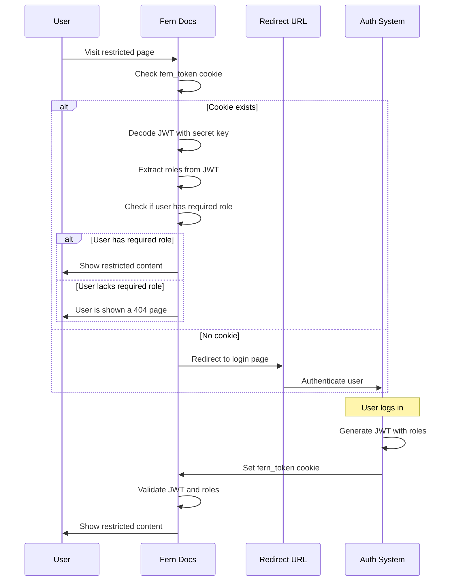

```mermaid
sequenceDiagram
    participant U as User
    participant F as Fern Docs
    participant R as Redirect URL
    participant A as Auth System

    U->>F: Visit restricted page
    F->>F: Check fern_token cookie
    
    alt Cookie exists
        F->>F: Decode JWT with secret key
        F->>F: Extract roles from JWT
        F->>F: Check if user has required role
        
        alt User has required role
            F->>U: Show restricted content
        else User lacks required role
            F->>U: User is shown a 404 page
        end
    else No cookie
        F->>R: Redirect to login page
        R->>A: Authenticate user
    end
    
    Note over A: User logs in
    
    A->>A: Generate JWT with roles
    A->>F: Set fern_token cookie
    F->>F: Validate JWT and roles
    F->>U: Show restricted content
```